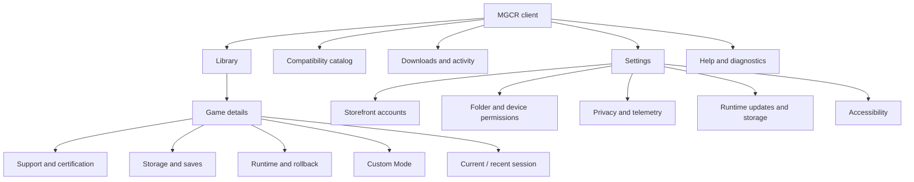
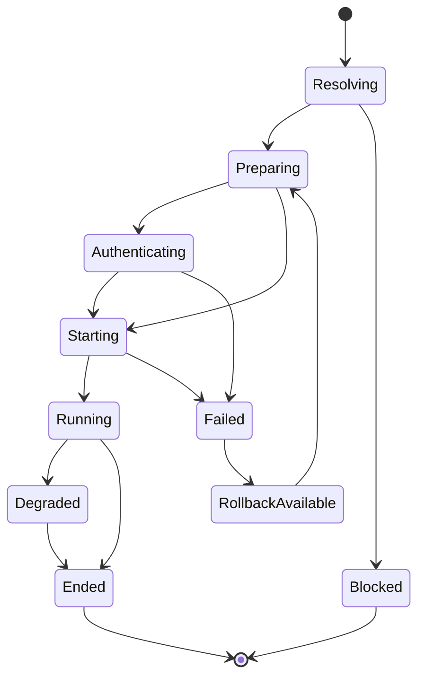

# MGCR UX and User Journey Specification

**Version:** 1.0  
**Status:** Proposed  
**Date:** 20 July 2026  
**Owner:** Product Design  
**Related:** [PRD](02_PRD.md) · [Runtime profile specification](05_RUNTIME_PROFILE_AND_MANIFEST_SPEC.md) · [Diagnostics architecture](04_TECHNICAL_ARCHITECTURE.md)

---

## 1. UX objective

The client must make a complex compatibility system feel like a dependable native Mac gaming platform. The player should make decisions about games, storage, permissions, and privacy—not about Wine versions, prefixes, DLL loading, synchronization primitives, shader compilers, or graphics translation backends.

The default interaction model is:

```text
Know exact support → Install safely → Launch confidently
→ Understand changes → Recover without losing saves
```

## 2. Design principles

1. **Show evidence, not mystery.** Compatibility status includes exact build, host scope, test date, and limitations.
2. **Hide implementation, not truth.** Technical details are collapsed by default but always available.
3. **Every failure has a safe next step.** Errors distinguish retry, repair, rollback, permission, unsupported, and support-needed conditions.
4. **Saves are visibly separate.** Destructive actions state whether saves, settings, caches, game payload, or runtime layers are affected.
5. **Certified and Custom are unmistakable.** Color is never the only distinction; labels, icons, copy, and integrity details differ.
6. **Progress reflects real stages.** “Installing” is decomposed into download, verify, materialize, storefront action, and ready.
7. **The player remains in control of data.** Telemetry and diagnostic upload are understandable, previewable, and revocable.
8. **Controller and accessibility are first-class.** Core flows work with keyboard, VoiceOver, and supported controllers.

## 3. Information architecture



## 4. Navigation model

The primary sidebar contains:

- **Library**
- **Discover compatibility**
- **Downloads**
- **Diagnostics**
- **Settings**

The currently running game receives a persistent compact session surface. The client does not add a permanent menu-bar item unless user research shows clear value.

Search matches game title, publisher, storefront, status, and installed location. It does not expose internal profile IDs by default.

## 5. Compatibility language

### 5.1 Public status labels

The canonical compatibility status model (nine statuses) is defined in PRD §14. This section defines only the presentation labels the client shows for that model; it introduces no additional certification status. **Update under test** is a transient presentation of *Certification stale* shown specifically when the detected cause is a build change with a retest already scheduled. **Custom** is an orthogonal mode indicator, not a certification status — it can accompany any underlying status and never replaces it.

| Label | Player-facing meaning |
| --- | --- |
| Certified | Tested for the listed build and Mac classes; full defined journey passes |
| Competitive Certified | Certified plus approved multiplayer integrity path |
| Playable | Tested gameplay path works; limitations may remain |
| Launches | Installs and reaches the initial application; gameplay not fully verified |
| Experimental | Engineering configuration exists but reliability is not promised |
| Update under test | Your installed build changed and certification is being refreshed |
| Certification stale | Previous evidence no longer matches or has expired |
| Untested | No applicable evidence for this build/Mac |
| Unsupported | A known blocker is outside current support |
| Custom | User-modified runtime; certified guarantees do not apply |
| Quarantined | A serious regression or security issue is active |

### 5.2 Copy rules

- Never say simply “Compatible” without scope.
- Never call an untested host “Certified” because a nearby model passed.
- Never use “should work” as a status.
- State whether a limitation affects installation, launcher, gameplay, performance, media, input, online services, mods, or multiplayer.
- Distinguish an MGCR problem from a storefront outage or publisher restriction.
- Avoid “bottle,” “prefix,” “winetricks,” “DLL override,” and backend acronyms in primary copy.
- Technical details may include those terms in an expandable panel for advanced users and support.

## 6. Game card specification

A library card displays:

- game artwork and title;
- installed/not installed;
- storefront badge;
- primary compatibility status;
- update-under-test or rollback badge when applicable;
- Play/Install/Resume action;
- last played;
- running session state.

A card must not show performance promises that are not tied to the user’s host class and configured display mode.

## 7. Game details specification

### 7.1 Header

- title, publisher, storefront;
- primary action;
- exact installed build;
- compatibility level;
- “Tested on this Mac” or explicit host-scope warning;
- last certification date.

### 7.2 Compatibility summary

The first screen answers:

1. Will this exact build launch?
2. What gameplay path was tested?
3. What limitations exist?
4. Does multiplayer work?
5. Which controller/display features were tested?
6. What changed since the last status?
7. Is rollback available?

Example:

> **Certified for your Mac**  
> Tested with game build 1.4.2 on macOS 15.x, Apple GPU family A9, 16–32 GB memory. Main story through Chapter 3, controller, 60 Hz presentation, cutscenes, save/load, and offline second launch passed. Ray tracing is disabled. Competitive multiplayer is unsupported because the title requires a Windows kernel driver.

### 7.3 Technical details disclosure

Collapsed by default:

- game/launcher fingerprints;
- runtime generation;
- profile revision;
- CPU provider;
- graphics provider by process;
- synchronization policy;
- capability mask;
- cache epoch;
- certification matrix digest;
- known workaround IDs.

The panel offers **Copy technical summary**, not editable controls.

## 8. Installation flow

### 8.1 Preflight

The preflight sheet includes:

- game payload state and source;
- runtime download size;
- final additional disk use;
- temporary working space;
- rollback-retention space;
- save location;
- required folder grants;
- known limitations;
- whether third-party authentication will appear.

Actions:

- **Install and play**
- **Install only**
- **Cancel**

### 8.2 Progress states

```text
Checking build
Resolving certified runtime
Downloading runtime objects
Verifying signatures and content
Preparing Windows runtime
Installing required dependencies
Waiting for storefront
Validating first launch
Ready
```

Each state has a stable operation code. Progress may be indeterminate only when the third-party launcher provides no useful total.

### 8.3 Failure states

| Failure class | Primary action | Secondary action |
| --- | --- | --- |
| Insufficient space | Review storage | Change install location |
| Signature/content mismatch | Retry verified download | View security details |
| Permission denied | Grant folder access | Choose another location |
| Unsupported game build | View status | Try Custom Mode |
| Storefront authentication | Open storefront | Retry |
| Dependency licensing required | Review source/license | Cancel |
| Candidate health failure | Use previous runtime | View diagnostics |
| Unknown | Create diagnostic report | Contact support |

The UI never recommends deleting saves as a generic troubleshooting step.

## 9. Launch flow

### 9.1 State model



### 9.2 Player-visible progress

The primary launch surface uses plain language:

- Checking your game version
- Preparing the certified runtime
- Opening Steam / Epic / other storefront
- Starting the launcher
- Starting the game
- Waiting for the first frame
- Running

Technical process names appear only in details.

### 9.3 Launch timeout behavior

A timeout is not immediately called a crash. The UI distinguishes:

- storefront waiting for sign-in;
- launcher update;
- process running without visible window;
- shader compilation;
- process unresponsive;
- process exited;
- health check failed.

The player can **Keep waiting**, **Stop safely**, or **Create diagnostics** according to policy.

## 10. In-session experience

The client should not cover the game. A compact optional overlay or secondary-window view may show:

- session duration;
- active status;
- shader-cache warming;
- degraded health warning;
- controller/audio device change;
- diagnostic capture state.

The stable product does not inject a general overlay into the game unless a title-specific and security-reviewed implementation is required.

## 11. End-of-session experience

After clean exit:

- update last played;
- commit relevant settings/save metadata;
- evaluate candidate health;
- compact caches asynchronously;
- offer no unnecessary modal.

After abnormal exit:

- state whether the game, launcher, graphics device, runtime, or host pressure appears responsible;
- show whether saves are believed safe;
- offer **Play with previous runtime** when available;
- offer **Repair disposable caches** only when evidence supports it;
- provide **Create diagnostic report**.

## 12. Update and certification-change flows

### 12.1 Runtime update

The details view shows:

- current generation;
- candidate generation;
- relevant improvements/fixes;
- affected title only;
- retained rollback generation;
- download/storage impact.

Stable updates are automatic by default but may be delayed while a game is running.

### 12.2 Game update

When the storefront changes the build:

> **This game updated and the new build is being tested.**  
> Your previous certification applied to build X. The installed build is now Y. You may continue provisionally / use an available prior build / wait for testing, depending on this title’s policy.

The UI must not blame MGCR for a publisher update or imply that certification remains current.

### 12.3 macOS update

Before a major macOS upgrade, the client may show:

- current installed-title coverage for the target OS;
- titles still under test;
- known blockers;
- recommendation to retain the current OS only as informational guidance, never as an unsupported system-modification instruction.

## 13. Rollback UX

Rollback is framed as selecting a previously verified runtime, not downgrading the game unless a separate storefront-supported action is involved.

The confirmation states:

- what runtime components change;
- what does not change;
- save/settings treatment;
- expected additional storage;
- whether certification status changes.

Rollback must remain available from a failed-launch screen and game details.

## 14. Storage and save management

The storage view separates:

| Category | Deletable? | Default behavior |
| --- | --- | --- |
| Runtime shared layers | Yes when unreferenced | Managed automatically |
| Game-specific runtime generation | Yes | Keep active + rollback |
| Game payload | Storefront policy | Explicit uninstall |
| Shader/PSO caches | Yes | Rebuildable |
| CPU translation cache | Yes | Rebuildable |
| Session scratch | Yes | Automatic cleanup |
| Settings | Yes, with warning | Preserve by default |
| Saves | Yes, destructive | Preserve and back up by default |
| Diagnostic bundles | Yes | User-managed or retention policy |

The user can see which data is shared across titles so reclaimed space is not overstated.

## 15. Permissions UX

Permissions are requested just in time:

- access to an existing game folder;
- access to a selected save/import folder;
- controller/input monitoring only when required by the chosen implementation;
- microphone only for voice chat or explicit test;
- screen recording only for a user-initiated capture feature, never for normal compatibility;
- network access follows normal application behavior and per-process runtime policy.

The permissions page shows each active grant, purpose, affected game, date, and **Revoke** action.

## 16. Diagnostics UX

### 16.1 Summary

The diagnostic page presents:

- what failed;
- likely subsystem;
- safe remediation;
- whether the issue is known;
- affected build/runtime;
- save-risk assessment;
- support code.

### 16.2 Privacy preview

Before export/upload:

```text
Included
✓ macOS and Mac capability class
✓ game and launcher version identifiers
✓ runtime/profile/provider versions
✓ process lifecycle and crash information
✓ performance and memory-pressure summary

Excluded by default
— save contents
— credentials and tokens
— chat or voice content
— screenshots/gameplay video
— unrelated file contents
— full personal home-directory paths
```

Users may inspect a file manifest and redaction summary.

### 16.3 Remediation rules

A remediation is offered only if it is:

- safe;
- reversible;
- applicable to the detected failure class;
- recorded as a user action;
- clear about save/settings impact.

“Delete everything and reinstall” is never the default support path.

## 17. Custom Mode UX

Entering Custom Mode requires:

- explicit selection from game details;
- concise explanation of support and anti-cheat consequences;
- choice to create from the current certified generation or a clean base;
- a distinct badge and persistent state;
- a one-action path to reset.

Advanced settings may include provider selection, environment settings, DLL policy, feature masks, resolution/display overrides, and mod/overlay configuration. Dangerous or integrity-sensitive choices may require Developer Mode rather than Custom Mode.

## 18. Publisher portal UX

Publisher partner workflow, portal capability requirements, and confidentiality boundaries are specified in [17_PUBLISHER_AND_ANTI_CHEAT_INTEGRATION.md](17_PUBLISHER_AND_ANTI_CHEAT_INTEGRATION.md) (§4 onboarding, §21 portal requirements, §20 confidentiality). This document governs only the player-facing client; publisher-portal wireframes remain a tracked design deliverable (§23).

## 19. Accessibility requirements

Critical flows must support:

- VoiceOver labels, headings, and progress announcements;
- full keyboard navigation and visible focus;
- text scaling without clipped status or action text;
- contrast that meets the adopted standard;
- no status represented by color alone;
- reduced motion;
- captions/transcripts for instructional media;
- controller navigation where feasible;
- accessible diagnostic and compatibility tables.

Third-party launchers may remain less accessible; MGCR should minimize unnecessary exposure and disclose unavoidable barriers.

## 20. Localization requirements

- User-facing status and limitations are localizable content separate from machine codes.
- Profile-authored explanations use approved message keys and parameter sets, not arbitrary production prose.
- Dates, storage, durations, keyboard layouts, and decimal formats follow locale.
- Technical identifiers remain invariant and copyable.
- Layout is tested at defined expansion factors.
- Right-to-left support is planned before adding applicable languages.

## 21. UX analytics

Subject to privacy settings, measure:

- library-to-play task completion;
- install abandonment by stage;
- launch failures by player-visible class;
- remediation selection and success;
- rollback selection and subsequent success;
- support-status comprehension;
- Custom Mode entry/reset;
- permission denial and recovery;
- diagnostic preview and upload conversion;
- accessibility feature usage only when collected without sensitive inference.

Analytics never replace lab evidence for certification.

## 22. Usability test plan

### MVP tasks

- identify whether a specific installed build is certified;
- install and launch without technical help;
- understand a stale certification after update;
- distinguish game payload, caches, runtime, and saves;
- rollback after a seeded runtime failure;
- create and preview a diagnostic bundle;
- deny then recover a folder permission;
- explain the difference between Certified and Custom Mode.

### Success criteria

- ≥ 90% completion for supported install/launch without facilitator intervention;
- no participant believes a stale/untested game is certified;
- no participant expects default uninstall/rollback to delete saves;
- users can identify the next safe action in every P0 error state;
- technical users can find exact runtime details without those details blocking mainstream users.

## 23. Design deliverables

Before implementation lock, Design must provide:

- navigable prototype for all MVP journeys;
- state inventory and content matrix;
- component library and accessibility annotations;
- error/remediation copy catalog;
- permission and privacy copy;
- empty, loading, degraded, stale, quarantined, and offline states;
- controller-navigation specification;
- analytics event mapping;
- publisher portal wireframes for the GA planning track.

## 24. UX acceptance checklist

A feature is not complete until:

- happy, loading, empty, offline, denied, stale, degraded, rollback, and failure states are designed;
- technical IDs and user messages are separate;
- save impact is explicit;
- accessibility and keyboard behavior are specified;
- telemetry/diagnostic data collection is disclosed;
- the state maps to a stable product and error code;
- the flow has at least one automated or manual acceptance test;
- the screen never requires undocumented compatibility knowledge.
