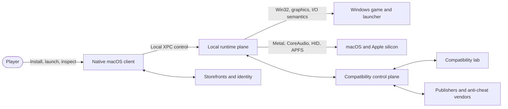
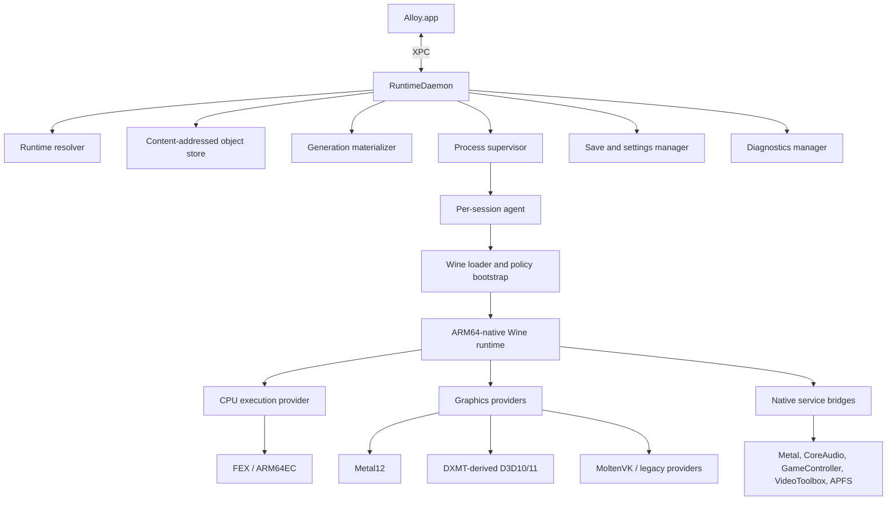
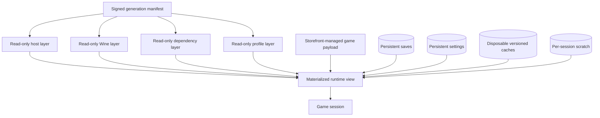
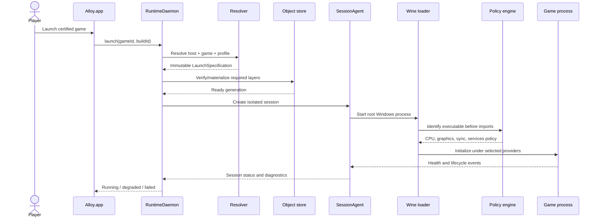
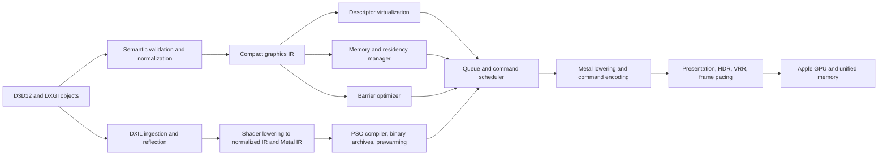
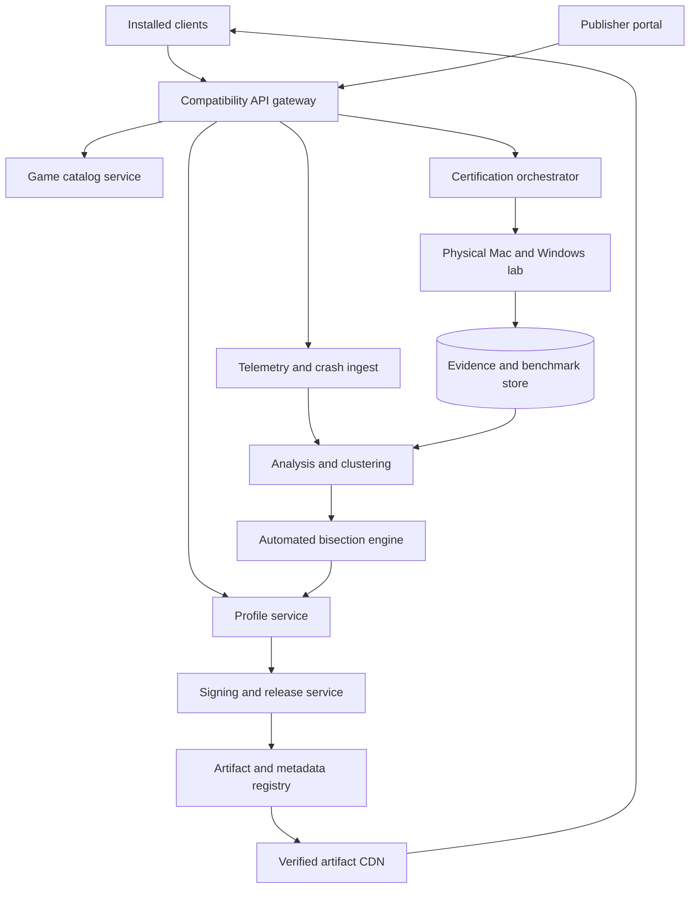
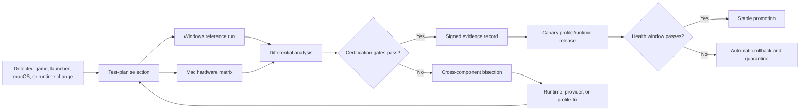
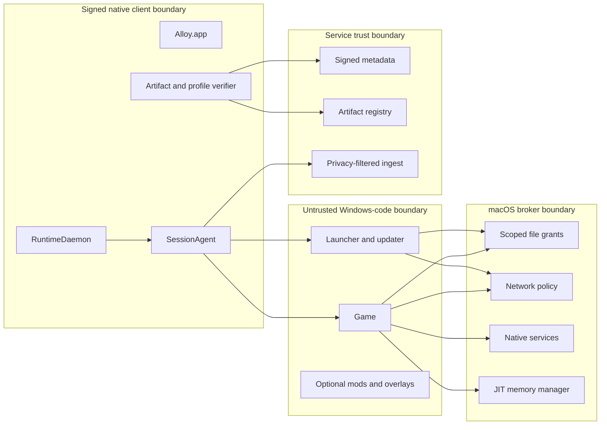

# Apple-Silicon Windows Gaming Runtime

## Technical Architecture Specification

**Document version:** 1.0  
**Status:** Proposed architecture  
**Technology baseline:** 20 July 2026  
**Audience:** platform engineers, graphics engineers, compatibility engineers, security engineers, technical leadership, publisher-integration teams, and investors conducting technical diligence  
**System name:** Alloy — the product brand (adopted 23 July 2026, D-021; trademark clearance pending ⚖️).

**Related documents:** [PRD](02_PRD.md) · [Runtime profile specification](05_RUNTIME_PROFILE_AND_MANIFEST_SPEC.md) · [Certification specification](07_COMPATIBILITY_CERTIFICATION_SPEC.md) · [Security and privacy](09_SECURITY_PRIVACY_THREAT_MODEL.md) · [Roadmap](11_ROADMAP_TEAM_AND_DELIVERY.md)

---

## Document control

| Field | Value |
|---|---|
| Architecture owner | Chief Architect / Runtime Platform Lead |
| Approval authorities | CTO; Graphics Lead; Security Lead; Compatibility Lead |
| Review cadence | At every architecture milestone and before each stable runtime generation |
| Normative language | MUST, MUST NOT, SHOULD, SHOULD NOT, and MAY are used as requirements terms |
| Primary artifact | This document plus the versioned JSON schemas and example profile included with it |
| Intended distribution | Internal engineering and approved technical partners |

### Revision history

| Version | Date | Description |
|---|---|---|
| 1.0 | 2026-07-19 | Initial full-system architecture: local runtime, graphics, CPU execution, compatibility control plane, security, certification, and delivery roadmap |
| 1.1 | 2026-07-20 | Integrated into the product documentation set; diagrams converted to portable Mermaid; cross-document governance added |

# Executive summary

Alloy is a gaming-only compatibility platform that runs supported Windows games on Apple-silicon Macs. It is not a general Windows desktop, not a virtual machine, and not a user-facing Wine-prefix manager. Its primary product object is a **certified game runtime generation**: an exact game build, launcher build, host capability class, runtime component set, process policy, and validation record that can be installed, launched, observed, upgraded, and rolled back deterministically.

The architecture changes the compatibility abstraction in five fundamental ways.

1. **Per-game immutable generations replace mutable bottles.** Host binaries, Wine, dependencies, compatibility rules, and caches are separated into explicit layers. Every activated generation has content hashes and provenance. Updates create a new generation; they do not mutate the currently working one. Activation is atomic and rollback is a reference change.
2. **Per-process policy replaces bottle-wide backend selection.** The launcher may use a Direct3D 11 Metal provider, the game may use an owned Direct3D 12-to-Metal provider, the updater may receive conservative synchronization, and a crash reporter may have networking disabled. Policy is resolved before normal Windows DLL import, not after the process has already initialized incorrectly.
3. **A Metal-native graphics core replaces dependence on a single opaque external translation path.** The long-term strategic component is an owned Direct3D 12 implementation over Metal, designed around Apple GPU queues, unified memory, argument buffers, heaps, fences, binary archives, presentation, and current Metal feature tiers. Direct3D 10/11 initially uses a maintained DXMT-derived provider. Vulkan and older APIs remain explicit compatibility providers rather than the architecture’s center.
4. **A continuous compatibility system replaces predominantly reactive manual support.** Physical Mac fleets and Windows reference machines run deterministic test plans. The system compares functional behavior, graphics output, feature queries, performance, memory, audio, input, and process lifecycles. Regressions are clustered and automatically bisected across game builds, launcher builds, profiles, runtime components, macOS builds, and hardware classes.
5. **Certification and trust replace best-effort configuration.** Signed declarative profiles, signed artifacts, a transparent support matrix, health gates, canary activation, and publisher/anti-cheat enablement define what the product promises. Modified and uncertified environments remain possible in a separate Custom Mode, but they are never represented as equivalent to Certified Mode.

The local execution platform is entirely ARM64-native at the host layer. Wine remains a thin, upstream-oriented fork. x86 and x64 Windows instructions execute through a provider interface whose production target is a macOS-adapted FEX-derived engine integrated with Wine’s ARM64EC architecture. Rosetta can accelerate early feasibility work while available, but it is not a strategic dependency because Apple has published a constrained future for Rosetta after macOS 27 [R04].

The platform is distributed outside the Mac App Store under Developer ID signing and notarization because it executes user-installed Windows code, requires dynamic code generation for instruction translation, and needs controlled access to game directories. It does not install a kernel extension or privileged root daemon. The native UI, runtime daemon, per-session agent, translated guest processes, and cloud control path are separated. Windows code receives a brokered drive view rather than a default mapping of the user’s entire filesystem.

This design deliberately reuses strong open-source infrastructure where differentiation would be wasteful: Wine for Win32/NT behavior, a FEX-derived core for CPU execution, a DXMT-derived provider for Direct3D 10/11, and MoltenVK for Windows games that are natively Vulkan. It owns the components that create a durable Mac-gaming advantage: deterministic runtime composition, pre-initialization per-process routing, the D3D12-to-Metal core, Apple-specific memory and synchronization policy, diagnostics, compatibility data, automated certification, and publisher trust.

## Architecture outcome

A supported launch is reproducible as the following immutable identity:

```text
Game build + launcher build + storefront branch
+ Mac architecture / GPU family / memory class / macOS build
+ runtime generation
+ signed game-profile revision
+ process-policy compilation revision
+ shader / PSO cache compatibility epoch
+ certification matrix digest
```

When a title stops working, engineering can answer precisely whether the causal change was game content, launcher content, macOS, the CPU provider, Wine, a graphics provider, a native service, a profile, or cached derived data. The same identity can be recreated in the lab and rolled back on the user’s Mac.

# 1. Scope, goals, and non-goals

## 1.1 Product scope

Alloy supports Windows games on Apple-silicon Macs. It includes:

- game and storefront discovery;
- game installation and update coordination;
- Win32 and NT user-mode API compatibility through Wine;
- x86 and x64 CPU execution on ARM64;
- Direct3D, Vulkan, and legacy graphics routing to macOS graphics providers;
- Windows audio, input, media, storage, networking, filesystem, registry, timing, and presentation behavior;
- deterministic game-specific compatibility profiles;
- content-addressed runtime distribution, activation, and rollback;
- crash, performance, and compatibility diagnostics;
- a cloud control plane and automated compatibility laboratory;
- publisher and anti-cheat integration for explicitly enabled titles.

The architecture supports commercial games acquired through legitimate storefronts or directly from publishers. It does not bypass ownership checks, DRM, anti-cheat policy, or protected media systems.

## 1.2 Primary goals

**G-01 — One-click deterministic launch.** A certified title MUST launch from the native library without requiring the player to understand Wine prefixes, DLL overrides, environment variables, registry edits, or graphics backend selection.

**G-02 — Game-build reproducibility.** A problem report MUST identify and reproduce the exact game, launcher, host, runtime, profile, and derived-cache generation.

**G-03 — Failure containment.** A runtime update for one game MUST NOT silently change another game. A failed activation MUST leave the last healthy generation launchable.

**G-04 — Mac-native performance.** Strategic graphics, synchronization, memory, input, audio, and presentation code SHOULD model Apple-silicon behavior directly rather than force every workload through a generic cross-platform abstraction.

**G-05 — Explainable compatibility.** Every non-default workaround MUST have an identifier, owner, reason, scope, expiry or review condition, and test evidence.

**G-06 — Upstream leverage.** Generic Windows behavior fixes SHOULD be contributed upstream. The Wine fork MUST remain rebasing-friendly, with differentiated behavior moved to versioned providers and profiles.

**G-07 — Continuous certification.** Supported games MUST be retested after relevant game, launcher, runtime, operating-system, and hardware changes.

**G-08 — No privileged kernel dependency.** The product MUST NOT require a kernel extension. The default install MUST NOT require a persistent root daemon.

**G-09 — Honest multiplayer support.** Kernel anti-cheat compatibility MUST NOT be claimed unless the publisher and anti-cheat vendor have explicitly enabled and certified the runtime.

**G-10 — Privacy by construction.** Essential operation MUST work without gameplay recording or file-content upload. Diagnostic detail beyond minimal health telemetry MUST require clear user consent.

## 1.3 Secondary goals

- Support offline play after required storefront authentication and metadata are cached.
- Allow advanced users to create isolated custom profiles without corrupting certified generations.
- Provide publishers with pre-release compatibility reports and a low-effort path to Mac availability.
- Permit multiple runtime generations to coexist with high storage deduplication.
- Support remote support workflows using privacy-filtered diagnostic bundles.
- Produce auditable software bills of materials and provenance for shipped runtime components.

## 1.4 Non-goals

**NG-01 — General Windows application compatibility.** Office suites, enterprise applications, device utilities, and arbitrary desktop software are outside the product contract.

**NG-02 — Windows kernel emulation.** The system does not load Windows kernel drivers. Kernel anti-cheat, kernel DRM, hardware drivers, and kernel filter drivers require vendor alternatives or remain unsupported.

**NG-03 — Full Windows virtual machine.** No Windows license, Windows kernel, or full guest OS is required for normal execution. A VM may exist only as an optional test or high-isolation research path.

**NG-04 — Universal day-zero compatibility.** Unknown builds may run provisionally, but only exact tested combinations receive certification.

**NG-05 — Transparent substitution of proprietary upscalers or frame-generation systems.** MetalFX or other reconstruction paths are enabled only when their inputs and semantics are validated, usually through a title profile or publisher integration.

**NG-06 — DRM or anti-cheat circumvention.** Unsupported protection technology is reported as such; it is not patched around covertly.

**NG-07 — App Store distribution as an architectural constraint.** The first-party distribution model is Developer ID and notarization. App Store constraints do not drive the runtime design.

# 2. Technology baseline and external constraints

This section records constraints that shape the architecture. It is not a promise that every external component is redistributable; licensing and redistribution are explicit release gates.

## 2.1 Apple-silicon-only host

The host application, daemon, session agent, host bridges, and owned graphics providers are ARM64 Mach-O binaries. Intel Macs are intentionally excluded. This removes duplicated JIT, ABI, graphics, and testing paths and permits the system to depend on Apple-silicon unified memory, current Metal capabilities, and ARM64-native host services.

The compatibility target is x64 Windows games only. Under the modern baseline (ADR-0011), 32-bit x86 game executables are permanently out of certification scope; a narrow translated-WoW64 allowance exists solely for auxiliary launcher/installer helper processes required by supported x64 titles. ARM64 and ARM64EC PE modules execute natively when the Wine architecture and module permit it.

## 2.2 macOS support policy

The prototype baseline is macOS 14.4 or later because it provides a useful minimum for modern Apple-silicon systems and exposes address-waiting primitives relevant to Windows synchronization [R05]. Production support is expressed by signed capability metadata rather than hard-coded version checks:

```text
Minimum host OS for the core runtime
+ minimum OS for each graphics feature tier
+ denied OS builds with known regressions
+ tested OS/GPU/memory combinations in the certification record
```

The stable product supports a rolling window of the current macOS major and the previous major (ADR-0011); wider coverage requires an explicit evidence-based exception. New Metal features are capability-gated. A title that requires a newer feature tier may have a higher minimum OS without raising the minimum for every title.

## 2.3 Rosetta transition

Rosetta is useful for an early x86_64 Wine bootstrap and as a performance/correctness reference. It is not the production foundation. Apple states that Rosetta remains generally available through macOS 27 and becomes limited beginning with macOS 28 for selected older software categories [R04]. The runtime therefore treats Rosetta as an optional `ExecutionProvider`, never as an unreplaceable service.

## 2.4 Wine and ARM64EC

Wine supplies decades of user-mode Windows API behavior and remains the correct base rather than being rewritten. Wine’s ARM64EC and modern WoW64 work makes a mixed native-ARM64 and translated-x64 process architecture possible [R06, R16]. Alloy maintains a thin fork containing only changes that cannot yet be upstreamed, plus stable hooks for process policy, host services, diagnostics, and execution providers.

## 2.5 CPU translation

FEX is the preferred starting point for x86/x64-to-ARM64 translation [R07]. The architecture assumes a macOS adaptation layer is required; it does not assume the upstream project is a drop-in macOS runtime. Host-specific work includes Mach exception handling, memory mappings, W^X-compliant JIT allocation, thread integration, code-cache persistence, and Wine ARM64EC call boundaries.

## 2.6 Graphics

Apple’s Game Porting Toolkit, Metal tooling, and current Metal feature sets demonstrate that demanding Windows graphics workloads can be mapped to Metal and provide useful tools for evaluation and shader conversion [R01, R02]. GPTK/D3DMetal’s license scopes distribution to non-commercial evaluation and testing, so it is used only as a lab/reference tool during development and is never a shipped or bundled runtime provider (SPIKE-LEGAL-001). There is no commercial bootstrap D3D12 provider: the strategic Direct3D 12 runtime is Metal12, an owned component with its own test suite, diagnostics, release cadence, and capability database, and D3D12 titles enter the catalog only through it (ADR-0006, ADR-0012).

DXMT is the initial Direct3D 10/11 Metal-native provider [R08]. MoltenVK is the primary compatibility provider for games that expose Vulkan directly, subject to its feature mapping and title certification [R09]. Neither Vulkan nor MoltenVK is required as an intermediate representation for the owned D3D12 provider.

## 2.7 Anti-cheat and publisher enablement

User-mode compatibility does not make Windows kernel anti-cheat drivers portable. Official Proton guidance likewise distinguishes publisher-enabled anti-cheat paths from unsupported kernel-space designs [R10]. Alloy supports competitive multiplayer only through explicit vendor enablement, runtime measurement, signed certified mode, and title-specific test evidence.

## 2.8 Distribution, signing, and dynamic code

The product is distributed outside the Mac App Store using Developer ID signing, notarization, the hardened runtime, and the minimum entitlements required for translated code. Dynamic code must obey W^X: executable pages are not writable while executing, and the JIT implementation uses supported mappings and entitlements. Runtime components are signed and verified independently of game files.

# 3. Architectural drivers and quality attributes

## 3.1 Compatibility correctness

Compatibility correctness means reproducing game-observable Windows behavior, not merely avoiding crashes. Relevant behavior includes API return values, feature queries, thread ordering, file sharing, timing, resource hazards, shader results, window and input semantics, media timestamps, audio device transitions, and network behavior.

Correctness takes precedence over enabling an advertised feature. When a Metal or runtime capability is semantically incomplete, the virtual Windows adapter MUST report a lower feature tier or apply a scoped title workaround. Over-reporting creates failures that are harder to debug than an explicit unsupported result.

## 3.2 Determinism

A certified session is determined by immutable inputs. Mutable state is divided into explicit categories:

- **save state:** persistent and protected;
- **user settings:** persistent, migratable, and versioned where practical;
- **storefront/game payload:** mutable only through coordinated update transactions;
- **derived caches:** disposable, version-keyed, and safe to rebuild;
- **session scratch:** deleted after clean shutdown or retained only for diagnosis;
- **runtime layers:** immutable.

The system MUST NOT hide behavior-changing state in an unversioned prefix.

## 3.3 Performance and frame pacing

Average frames per second is insufficient. The platform optimizes for:

- median, 95th, 99th, and 99.9th percentile frame times;
- shader and PSO compilation stalls;
- CPU time in instruction translation and host/guest transitions;
- GPU idle time caused by barrier or queue decisions;
- synchronization wait latency;
- memory pressure over long sessions;
- input-to-present latency;
- audio underruns and device-change recovery.

Performance regressions are release-blocking for certified titles even when launch correctness remains intact.

## 3.4 Reliability and recoverability

The runtime MUST tolerate interrupted downloads, application termination, daemon restart, low disk space, corrupt caches, failed game updates, and a crashing candidate generation. Runtime state transitions are journaled. Every activation has a known rollback target. Saves are not stored inside disposable or rollback-only layers.

## 3.5 Security

Windows games and launchers execute as untrusted user-level code. The architecture minimizes host exposure through drive allowlists, file brokering, no root service, no default host-root drive, scoped credentials, signed policy, and a split control plane. Because macOS does not expose a general supported kernel sandbox tailored to arbitrary translated Windows processes, application-level confinement is not represented as a perfect security boundary. This limitation is explicit in the threat model.

## 3.6 Operability

Every session has a globally unique session identifier that correlates native processes, Wine process IDs, Windows process IDs, CPU-translation events, graphics objects, crash records, and cloud test results. Logs are structured. Workarounds are named. Diagnostics can be collected without reproducing the issue under a debugger.

## 3.7 Evolvability

CPU, graphics, synchronization, media, input, audio, storage, and presentation are provider interfaces. A profile can select a provider per process without changing Wine globally. Component versions are independently addressable, but only tested combinations are promoted as a runtime generation.

# 4. Architecture principles and key decisions

## 4.1 The game runtime generation is the unit of support

A generation is a signed manifest referencing exact runtime layers and a signed game-profile revision. It is selected against a game build and a host capability class. Support statements apply to generations, never to an unspecified “latest runtime.”

## 4.2 Policy is data, not shell automation

Compatibility profiles are declarative, schema-validated, signed, and capability-scoped. Standard profiles cannot execute arbitrary shell commands. Installation mutations are represented as bounded operations: registry values, file copies from verified layers, environment variables, DLL routes, process policies, drive grants, service providers, and health checks.

Rare dynamic installation logic MAY be expressed as signed WebAssembly executed by an interpreter or ahead-of-time runtime with no ambient network, process, or filesystem access. Its capabilities are explicit in the profile and included in certification evidence.

## 4.3 No cloud dependency on the launch hot path

Profile resolution, executable fingerprints, capability selection, and policy matching are precompiled locally. A user can launch an already installed game while the control plane is unavailable, subject to storefront requirements. Cloud services distribute signed state and receive opted-in observations; they do not make synchronous per-process decisions.

## 4.4 Keep Wine thin; own the Mac-gaming layers

Generic Wine fixes are upstream candidates. The local fork contains stable extension points and the minimum required platform deltas. Competitive differentiation resides in:

- runtime composition and rollback;
- per-process policy bootstrap;
- owned Metal12 provider;
- Mac-specific CPU host adaptation;
- unified-memory, synchronization, presentation, and native service policy;
- diagnostics and deterministic certification;
- publisher and anti-cheat trust.

## 4.5 Prefer explicit providers over hidden fallback chains

The selected graphics, CPU, synchronization, media, and input providers appear in the resolved launch plan and diagnostic output. A provider may have a documented fallback only when semantic equivalence is established. Silent fallback that changes rendering or protection behavior is prohibited for Certified Mode.

## 4.6 Certified Mode and Custom Mode are separate products states

**Certified Mode** uses only signed runtime components, signed profiles, approved DLL routes, and known content fingerprints. Debug injection and arbitrary mods are disabled. It is the only mode eligible for competitive anti-cheat attestation.

**Custom Mode** permits user layers, mod managers, experimental profiles, and additional drive grants. It remains isolated from certified generations and is clearly marked unsupported for competitive attestation. Saves may be shared only after the user accepts compatibility and integrity risks.

## 4.7 Build versus reuse

| Area | Decision | Rationale |
|---|---|---|
| Win32 / NT user-mode APIs | Reuse and upstream Wine | Reimplementation has low differentiation and extreme compatibility cost |
| x86/x64 execution | Adapt a FEX-derived core; retain provider interface | Strong existing translator base; Mac host work remains differentiating but bounded |
| D3D10/11 | Start from DXMT and contribute where possible | Metal-native, active foundation; avoids rebuilding mature D3D11 immediately |
| D3D12 | Own the Metal backend and semantic test system | Critical control point, performance moat, and largest external-dependency risk |
| Vulkan games | Use MoltenVK as an explicit provider | Vulkan is the game API in this case; no reason to translate it through D3D |
| Older D3D/OpenGL | Out of product scope (ADR-0011) | Legacy surface ceded to general-purpose suites; removes providers, conformance subsets, and lab dimensions |
| Runtime manager, profiles, lab, control plane | Build and own | Core product abstraction and data moat |
| Anti-cheat | Partner and certify | Cannot be solved credibly through covert emulation |

# 5. System context



*Figure 1 — System context.*

## 5.1 Actors

**Player.** Installs the native application, connects storefronts, installs games, launches sessions, selects display and controller preferences, chooses telemetry level, approves filesystem grants, and requests diagnostics or rollback.

**Support engineer.** Reads compatibility status, analyzes privacy-filtered diagnostic bundles, compares sessions to known signatures, and may assign a signed remedial profile revision after review.

**Compatibility engineer.** Creates test plans, triages failures, adjusts profiles, develops Wine/provider fixes, and promotes certified combinations.

**Graphics engineer.** Implements and validates graphics semantics, shader translation, queue scheduling, memory behavior, presentation, and GPU diagnostics.

**Publisher.** Supplies pre-release builds or test branches, approves launcher and anti-cheat behavior, reviews certification evidence, and may ship title-side compatibility improvements.

**Anti-cheat vendor.** Approves runtime identity, signed modules, measurement flow, and allowed operation in Certified Mode.

## 5.2 External systems

- storefront APIs and desktop launchers;
- publisher authentication and content services;
- Apple platform APIs and code-signing services;
- CDN and object storage for runtime artifacts;
- crash-symbol and source hosting;
- physical Windows reference systems;
- physical Apple-silicon test systems;
- optional cloud-save providers.

## 5.3 System boundary

Alloy owns native runtime components, Wine integration, profiles, runtime distribution, observability, certification, and the owned Metal12 provider. It does not own game code, storefront services, macOS, anti-cheat policy, or external DRM. Failures at those boundaries are modeled and surfaced rather than hidden.

# 6. Core domain model

## 6.1 Identifiers

| Identifier | Meaning |
|---|---|
| `GameId` | Canonical title identity independent of storefront |
| `StoreAppId` | Storefront-specific application identity and branch |
| `GameBuildId` | Exact content build; derived from storefront manifest plus required file fingerprints |
| `LauncherBuildId` | Exact launcher or embedded-web-runtime version when it affects compatibility |
| `HostClassId` | Architecture, macOS range/build, Apple GPU family, RAM class, and relevant capabilities |
| `RuntimeGenerationId` | Signed set of exact runtime component objects |
| `ProfileId` / revision | Signed compatibility policy for selected builds and hosts |
| `SessionId` | Unique launch attempt spanning local and cloud diagnostics |
| `TestRunId` | One execution of a test plan on a specific target |
| `CertificationId` | Signed statement that a build/runtime/profile matrix met a defined level |

## 6.2 Game build identity

Storefront version strings alone are insufficient. A `GameBuildId` combines:

- storefront content-manifest identifiers where available;
- branch or channel;
- size, PE machine type, timestamp, and SHA-256 of critical executables;
- hashes of translation-sensitive shaders or modules when required;
- launcher build and embedded browser build;
- anti-cheat module identity;
- optional publisher-provided build GUID.

Full-file hashes are computed at install or update time and cached against filesystem identity and metadata. Launch-time matching uses cached fingerprints and revalidates only changed files. This avoids hashing multi-gigabyte content on every launch.

## 6.3 Runtime generation

A runtime generation is immutable. It references:

- ARM64 host services;
- Wine build and patch set;
- CPU execution providers;
- graphics providers;
- native service providers;
- licensed dependencies;
- symbols and provenance;
- compatibility-profile compiler version;
- cache compatibility epochs;
- minimum host requirements;
- activation and rollback metadata.

The generation does not contain user saves. It may reference optional components that are downloaded only when a selected profile requires them.

## 6.4 Game profile

The game profile is a signed declarative document. It selects a runtime generation and defines process policies, filesystem grants, registry overlays, dependency recipes, feature masks, health checks, telemetry defaults, known limitations, and certification evidence. The complete version-one JSON schema is supplied with this document.

## 6.5 Host capability class

The resolver does not branch only on marketing model names. It computes capabilities such as:

```text
architecture = arm64
macOS semantic version and build
Metal language / feature availability
Apple GPU family and optional ray-tracing tier
total physical memory class
supported display color spaces and refresh behavior
available address-wait primitive
available media codecs
input device classes
filesystem case mode
```

The resolved `HostClassId` is stable for the session and included in all diagnostics.

# 7. Top-level architecture



*Figure 2 — Local component architecture.*

The system has two major halves.

## 7.1 Local execution platform

The local platform owns launch correctness. It is composed of:

- `Alloy.app`, the native UI;
- `RuntimeDaemon`, the single writer for local state;
- `ContentStore`, `ProfileResolver`, `UpdateManager`, and `DiagnosticsAgent` services;
- one `SessionAgent` per launch;
- a pre-DLL guest policy bootstrap integrated with Wine;
- ARM64-native Wine and wineserver components;
- pluggable CPU, graphics, synchronization, audio, input, media, storage, and presentation providers;
- versioned writable volumes for game content, saves, settings, caches, and scratch data.

## 7.2 Compatibility control plane

The cloud side owns distribution and evidence, not real-time gameplay decisions. It contains:

- game catalog and build identity;
- profile authoring, validation, review, and signing;
- artifact registry and CDN metadata;
- certification orchestration and physical device scheduling;
- telemetry, crash ingestion, symbolication, and clustering;
- differential analysis and automated bisection;
- publisher portal and anti-cheat integration;
- release rings, revocation, and rollback metadata.

## 7.3 Control and data paths

**Control path:** UI → RuntimeDaemon → resolved launch specification → SessionAgent → Wine policy bootstrap → provider initialization.

**Game data path:** Windows code → Wine/user-mode API implementation → execution and native service providers → macOS APIs. Cloud services are absent from the frame loop.

**Update path:** control plane signing service → TUF metadata/CDN → local verifier → content-addressed store → materialized candidate generation → health gate → atomic activation.

**Diagnostic path:** providers and Wine emit local structured events → SessionAgent correlation → local redaction → encrypted diagnostic bundle or sampled telemetry → cloud ingest → symbolication, clustering, and regression detection.

# 8. Local control plane

## 8.1 Alloy.app

`Alloy.app` is a native Swift/AppKit or SwiftUI application. It is a presentation client, not the source of truth. It MUST NOT directly edit runtime files, Wine registry hives, or content-store references. All mutating operations use authenticated XPC calls to `RuntimeDaemon`.

Responsibilities:

- library and storefront account presentation;
- install, update, launch, stop, and rollback commands;
- display, audio, input, and accessibility preferences;
- explicit filesystem-grant UI;
- certification and limitation display;
- telemetry consent and diagnostic review;
- publisher-support and compatibility status;
- Custom Mode entry with clear integrity boundaries.

The UI can crash or be upgraded without terminating an active session.

## 8.2 RuntimeDaemon

`RuntimeDaemon` is an ARM64 launch agent running as the logged-in user. It is the sole writer for the local catalog, generation references, profile cache, grants, and session journal. It is not root and does not expose a network listener.

Primary responsibilities:

- validate commands and user authorization context;
- resolve game build and host capability identity;
- download and verify signed metadata and artifacts;
- materialize immutable runtime generations;
- coordinate storefront installation and updates;
- compile signed profiles into local policy snapshots;
- create and monitor per-session agents;
- perform atomic generation activation and rollback;
- manage disk quotas and cache garbage collection;
- coordinate diagnostics and upload consent;
- preserve save volumes during every runtime operation.

Local metadata is stored in SQLite with WAL mode, foreign keys, checksums for critical blobs, and explicit schema migrations. Every mutating workflow has a transaction identifier and an append-only journal record sufficient for crash recovery.

## 8.3 Service decomposition

The daemon may be one deployable binary initially, but its internal boundaries are stable interfaces:

| Service | Responsibilities | Failure consequence |
|---|---|---|
| Catalog | installed games, storefront bindings, build fingerprints | library may be stale; existing pinned sessions remain launchable |
| ProfileResolver | selector evaluation, precedence, conflict detection, capability gates | launch is blocked rather than using an ambiguous policy |
| ContentStore | object verification, extraction, materialization, reference counting | candidate install fails; active generation remains intact |
| UpdateManager | TUF metadata, download planning, activation, rollback | no new activation; current generation remains active |
| SessionManager | launch plan, SessionAgent lifecycle, health state | only affected session fails |
| GrantBroker | scoped file bookmarks and drive mappings | access denied; no fallback to whole-host drive |
| DiagnosticsAgent | log routing, redaction, bundle creation | gameplay continues with reduced diagnostics |
| StorefrontAdapters | discovery and launcher coordination | affected storefront operations degrade independently |

## 8.4 Local API

The UI-facing API uses XPC because it supplies process identity, structured messages, cancellation, and native lifecycle integration. Mutating requests contain an idempotency key. Long operations return an operation identifier and stream state transitions.

```text
LibraryService.listGames(filter) -> [GameSummary]
InstallService.plan(gameId, storeBinding) -> InstallPlan
InstallService.execute(planId, idempotencyKey) -> OperationId
RuntimeService.launch(gameId, launchOptions, idempotencyKey) -> SessionId
RuntimeService.stop(sessionId, mode) -> OperationId
RuntimeService.rollback(gameId, targetGeneration?) -> OperationId
DiagnosticsService.preview(sessionId) -> RedactionSummary
DiagnosticsService.export(sessionId, consent) -> DiagnosticBundleRef
```

Authorization is based on the signed client identity and active user session. There is no public local TCP API in the default product.

## 8.5 SessionAgent

Each launch receives a dedicated ARM64 `SessionAgent`. This narrows failure scope and provides a stable parent for the Wine server, host bridges, translated processes, and graphics services.

The agent receives a fully resolved, immutable `LaunchSpecification`. It does not call the profile service during launch. Its responsibilities are:

- preflight disk, memory, OS, display, and input capabilities;
- open only approved directories and pass scoped descriptors/bookmarks;
- establish process and provider environment;
- start wineserver and host bridges;
- launch the bootstrap process;
- correlate Windows, Wine, Unix, and macOS process identities;
- enforce session network and file policy where implementable;
- capture crashes, hangs, command-buffer errors, and health probes;
- flush saves and derived caches in defined order;
- produce a signed local health result;
- terminate the process group on stop or unrecoverable failure.

The agent runs until all tracked guest processes exit or the stop policy expires. Orphan processes are terminated unless the profile explicitly marks them as a persistent storefront service.

# 9. Immutable runtime and storage architecture



*Figure 3 — Runtime layers and writable volumes.*

## 9.1 Storage objectives

The storage system MUST provide:

- content integrity and provenance;
- fast materialization without copying every shared file;
- multiple coexisting generations;
- atomic activation and rollback;
- strict separation of runtime, game, save, settings, cache, and scratch state;
- safe recovery after interruption;
- predictable garbage collection;
- no dependency on a kernel extension or unsupported filesystem driver.

## 9.2 Content-addressed object store

Every distributed layer is an object identified by SHA-256. A layer package uses a canonical manifest plus independently hashed chunks. Compression is Zstandard. The extractor rejects absolute paths, `..` traversal, device nodes, unsafe symlinks, unexpected ownership, setuid bits, and metadata outside the package specification.

The local layout is conceptually:

```text
~/Library/Application Support/Alloy/
  metadata/catalog.sqlite
  metadata/journal/
  objects/sha256/ab/cdef...        # immutable compressed objects
  unpacked/sha256/ab/cdef...       # verified immutable trees
  generations/<game-id>/<gen-id>/  # materialized generation metadata
  volumes/<game-id>/
    payload/<build-id>/
    saves/
    settings/
    caches/<cache-epoch>/
    sessions/<session-id>/
  logs/
  diagnostics/
```

Object insertion is atomic: download to a temporary file, verify length and digest, verify signed metadata, fsync, then rename into the object namespace. Existing objects are never overwritten.

## 9.3 Layer format

A layer contains:

```text
layer.json
files/...
metadata/file-table.cbor
metadata/license.spdx.json
metadata/provenance.dsse.json
metadata/symbols.ref
```

`layer.json` records media type, schema version, target architecture, minimum host capability, file-tree digest, source revision, build recipe, and allowed composition roles. Native code is separately Developer ID signed and its signature is verified after extraction.

## 9.4 APFS materialization

The first implementation uses APFS clone-on-write operations for file-tree materialization. Immutable unpacked trees are cloned into a generation staging directory. Profile overlays and licensed dependencies are applied only through deterministic, journaled operations. The resulting runtime tree is sealed by recording a canonical file-tree digest and making runtime-owned files non-writable.

This approach avoids a custom filesystem driver and performs well on normal APFS installations. When the target volume does not support clone-on-write, the system falls back to verified copying and reports the storage cost before installation.

A future user-space union filesystem MAY reduce materialization cost further, but it is not a prerequisite and MUST NOT intercept game I/O in a way that adds unpredictable frame-time latency.

## 9.5 Writable volumes

### Game payload

Storefront-managed game content is versioned separately from the compatibility runtime. The system records the storefront manifest and critical fingerprints before launch. Storefront updaters write into a candidate payload generation where possible. When a launcher only supports in-place updates, the daemon creates an APFS clone of the last known payload generation before allowing mutation.

### Saves

Saves are the highest-value local state. They reside outside runtime and cache generations. Save paths are declared by profile and discovered through monitored first-run behavior when necessary. The save manager supports:

- periodic atomic snapshots of known save files;
- conflict detection with storefront cloud saves;
- opt-in backup retention;
- migration between profile revisions;
- protection from runtime rollback and cache deletion.

The runtime never uploads save contents as diagnostics without a separate, explicit file-level user selection.

### Settings

Settings can affect compatibility and therefore have a versioned metadata envelope. The raw files remain user-owned, while the daemon records their fingerprints and compatibility migrations. A profile may declare known-safe transformations, such as changing a renderer flag after a backend migration. Destructive changes require confirmation or an automatic backup.

### Derived caches

Shader, PSO, translated-code, launcher web, font, media, and pipeline caches are disposable. Every cache namespace includes all compatibility inputs that can invalidate it. A cache key never relies only on the game name.

Example shader/PSO key:

```text
sha256(
  game shader bytecode
  + root signature
  + complete graphics state
  + Metal12 compiler version
  + profile feature-mask revision
  + Apple GPU family
  + macOS build compatibility epoch
  + Metal language version
)
```

### Session scratch

Temporary files, crash dumps, traces, and install scratch are scoped to a session. A clean session deletes ordinary scratch after required data is committed. Failed sessions retain a quota-limited diagnostic subset until redaction or expiry.

## 9.6 Generation activation

Activation is a database transaction plus an atomic reference update:

```text
candidate downloaded
→ signatures and hashes verified
→ candidate materialized
→ schema and dependency checks passed
→ optional offline smoke checks passed
→ candidate reference recorded
→ active reference atomically switched
→ health observation window begins
```

The previous active reference remains retained until the candidate satisfies its health window and rollback policy. A daemon or system crash between any two steps is recovered by replaying the operation journal. Incomplete staging directories are never treated as active.

## 9.7 Garbage collection

Objects are reference-counted from active generations, rollback generations, installed candidates, retained diagnostics, and pinned Custom Mode environments. Garbage collection uses mark-and-sweep from signed manifests rather than trusting mutable reference counts alone. Deletion is rate-limited and suspended during gameplay or low-battery conditions.

Quota policy is category-aware:

1. remove expired session scratch;
2. remove old diagnostic traces not explicitly retained;
3. remove regenerable caches by least-recently-used score;
4. remove inactive candidate generations;
5. request user approval before removing rollback generations or game payloads;
6. never automatically remove saves.

# 10. Process lifecycle and per-process policy engine



*Figure 4 — Launch sequence.*

## 10.1 Why policy must run before normal DLL initialization

A backend decision made after `dxgi.dll`, `d3d11.dll`, `d3d12.dll`, Media Foundation, or synchronization primitives have initialized is too late. The policy bootstrap therefore participates in Wine process startup before normal import resolution. It determines the effective process policy using a local compiled snapshot and supplies that policy to the loader, Wine Unix libraries, execution provider, and host bridges.

No network request is permitted in this path.

## 10.2 Process identity

A process match can use:

- normalized Windows image path;
- SHA-256 and PE metadata cached during build fingerprinting;
- PE machine type;
- product name and file version from version resources;
- parent policy identity;
- command-line pattern;
- required module fingerprint;
- storefront launch context;
- profile-declared role.

Path-only matches are considered weak because launchers often reuse generic executable names. Exact hashes or a combination of path, publisher metadata, and parent identity are required for high-impact policies in Certified Mode.

## 10.3 Policy compilation

Signed JSON profiles are never interpreted repeatedly in guest processes. `ProfileResolver` validates them, resolves inheritance, verifies selectors, rejects conflicts, and compiles a compact binary snapshot. The snapshot contains:

- ordered match automata;
- pre-resolved provider identifiers;
- interned strings and environment entries;
- registry overlay handles;
- DLL route tables;
- service-policy identifiers;
- file and network capabilities;
- diagnostic sampling and health probes;
- profile and signature digests.

The snapshot is read-only and memory-mapped by the SessionAgent and Wine host bridge. Typical process lookup SHOULD complete in less than one millisecond without file hashing.

## 10.4 Precedence and conflict rules

Policy rules have explicit numeric priority. More specific selectors do not implicitly override lower-priority rules; the profile compiler computes specificity only to detect suspicious ambiguity. Two matching rules at the same priority that assign different values to the same non-mergeable field are a compilation error.

Mergeable values include environment dictionaries and additive diagnostic labels. Non-mergeable values include CPU provider, graphics provider, feature mask, synchronization provider, and network mode.

The resolution order is:

```text
runtime defaults
→ game-profile defaults
→ process rule by ascending priority
→ host capability adaptation declared by that rule
→ user preference, only for fields marked user-overridable
→ emergency signed deny or rollback rule
```

Certified Mode does not accept arbitrary environment or DLL overrides from the UI.

## 10.5 Loader integration

The thin Wine fork adds a stable `alloy_policy_bootstrap` hook at process initialization. Its responsibilities are intentionally narrow:

1. receive the session snapshot handle and process launch token;
2. compute or retrieve normalized executable identity;
3. match the process rule;
4. expose selected policy to Wine loader and Unix libraries;
5. select builtin/native DLL routes before imports resolve;
6. initialize CPU-provider thread context;
7. register process identity with the SessionAgent;
8. continue normal Wine initialization.

The hook does not contain title names or hard-coded workarounds. It consumes versioned policy data.

## 10.6 DLL routing

Graphics and selected native-service providers are packaged as versioned Windows DLL fronts plus ARM64 host libraries. The effective per-process DLL table can select:

```text
dxgi         → Metal12 DXGI front end
d3d12        → Metal12 device implementation
d3d11        → DXMT-derived implementation
d3dcompiler  → selected compiler compatibility module
mfplat       → Wine implementation with native media bridge
xinput1_4    → native GameController-backed implementation
```

Loader search paths are process-local. A launcher and its game can therefore use different `dxgi.dll` implementations while sharing one runtime generation and wineserver.

Cross-process shared objects are used only when providers explicitly support mixed clients. Otherwise, provider state is isolated per process or per compatible process group.

## 10.7 Environment and registry overlays

Process environment is constructed from immutable layers plus policy. Sensitive values such as storefront tokens are passed through short-lived handles or broker calls where feasible, not copied into broadly inherited environment variables.

Registry behavior is layered:

```text
read-only base hives
+ game-profile overlay
+ per-process overlay
+ writable game registry hive
```

Per-process values are resolved in Wine’s registry path rather than physically rewriting shared hives before each launch. Writable mutations are journaled and can be diffed for diagnostics.

## 10.8 Process groups and launcher boundaries

The profile declares roles such as `storefront`, `launcher`, `updater`, `game`, `crash-reporter`, `anti-cheat-bootstrap`, and `helper`. Role affects lifecycle and privileges.

Examples:

- an updater may write the game payload but cannot access save backups;
- a crash reporter may read its own dump but have network disabled unless the user opts in;
- a launcher may remain alive after the game exits if the storefront requires it;
- a browser helper may use a conservative graphics provider;
- a game process may receive high-resolution timing and low-latency audio policies;
- a competitive session may reject unexpected child processes.

## 10.9 Launch state machine

```text
IDLE
  → RESOLVING
  → PREFLIGHT
  → MATERIALIZING_SESSION
  → STARTING_HOST_SERVICES
  → STARTING_WINESERVER
  → LAUNCHING_BOOTSTRAP
  → RUNNING
  → STOP_REQUESTED | GUEST_EXITED | FAILED
  → DRAINING
  → COMMITTING_USER_STATE
  → EVALUATING_HEALTH
  → HEALTHY | DEGRADED | QUARANTINED
  → IDLE
```

Every transition is persisted with a reason code. Timeouts are profile-defined and classified: expected long shader compilation is different from a hung launcher.

## 10.10 Unknown process behavior

An unknown child process is handled according to profile mode:

- **Certified strict:** block or launch under a minimal no-network/no-host-file policy, then mark the session degraded;
- **Certified permissive:** inherit a conservative declared default and emit an unknown-process event;
- **Custom:** inherit user environment within the Custom Mode boundary.

The default for competitive certification is strict.

# 11. Wine integration architecture

## 11.1 Fork policy

The Wine fork is rebased frequently and contains a machine-readable patch inventory. Every patch has:

- owner and subsystem;
- upstream issue or merge request where applicable;
- reason it cannot yet be upstreamed;
- affected tests;
- expected removal condition;
- compatibility-risk classification.

No game-specific executable hash or title name is embedded in generic Wine code unless required for an upstream-compatible application quirk mechanism. Most game behavior resides in signed profiles.

## 11.2 ARM64-native process model

Host Wine binaries, wineserver, Unix libraries, and supported PE modules are built for ARM64/ARM64EC. The process may contain:

- native ARM64EC Wine system modules;
- translated x64 game modules;
- translated x86 modules through WoW64;
- native ARM64 host service libraries reached through Wine Unix-call interfaces.

The architecture avoids translating the entire Wine implementation, reducing CPU overhead and making host integration easier to profile.

## 11.3 Stable host extension points

Alloy adds versioned extension points rather than ad hoc hooks:

```c
struct alloy_process_policy_v1;
struct alloy_execution_provider_v1;
struct alloy_host_service_v1;
struct alloy_diagnostics_sink_v1;
struct alloy_clock_provider_v1;
```

ABI versions are explicit. Unsupported fields are rejected rather than silently ignored. Provider interfaces live at process boundaries or Wine Unix-library boundaries so they do not expose unstable internal C++ objects.

## 11.4 Wineserver

Wineserver remains responsible for Windows object and process semantics. Alloy additions include:

- session and policy identity tags;
- process-role events;
- high-resolution wait metrics;
- optional synchronization-provider handles;
- clean shutdown and orphan classification;
- diagnostic snapshot requests;
- strict process-tree enforcement for competitive sessions.

These additions MUST be optional and testable without the native UI.

## 11.5 WoW64 and 32-bit helper processes

The modern baseline (ADR-0011) permanently excludes 32-bit x86 game executables from certification. Modern Wine WoW64 with x86-to-ARM64 translation is reserved for auxiliary helper processes — launcher, installer, or DRM helpers — that a supported x64 title requires. Helpers receive conservative per-process policy, are excluded from gameplay certification evidence, and a title whose gameplay depends on 32-bit code is out of catalog scope rather than a future tier.

## 11.6 Windows services and background processes

Only services required by a game profile are enabled. The base runtime does not emulate a full desktop boot. Service startup is declarative and lazy. Persistent launcher services are associated with a storefront scope and receive separate resource and network policies.

## 11.7 Testing Wine deltas

Every Wine rebase runs:

- upstream Wine tests for relevant architectures;
- Alloy process-policy and host-bridge tests;
- install and launcher smoke tests;
- differential file, registry, process, synchronization, and networking tests;
- the certified game canary set;
- performance comparison against the previous generation.

A rebase is not promoted globally. It becomes one candidate component in per-game runtime certification.

# 12. CPU execution subsystem

## 12.1 Provider architecture

CPU translation is selected through an `ExecutionProvider` service provider interface. The interface supports native ARM64EC, a FEX-derived x86/x64 translator, and an optional Rosetta-based bootstrap path.

Conceptual operations:

```c
provider_create_process_context(image_info, policy, host_caps)
provider_create_thread_context(initial_cpu_state)
provider_enter_guest(thread_context, guest_pc)
provider_invalidate_guest_range(address, length, reason)
provider_handle_guest_exception(exception_record)
provider_query_guest_features()
provider_flush_persistent_cache(scope)
provider_collect_metrics(session_id)
```

The provider owns guest register state and translated blocks. Wine owns Windows process semantics. The boundary is designed so translator upgrades do not require game-profile schema changes.

## 12.2 FEX-derived production provider

The production provider adapts FEX concepts to macOS. Required host work includes:

- Mach exception and signal translation;
- Windows structured-exception integration through Wine;
- page-fault handling for self-modifying code and write-watch behavior;
- W^X-compliant JIT allocation and dual mappings where supported;
- thread creation, TLS, and suspension semantics;
- precise floating-point, x87, SIMD, and flag behavior;
- ARM64EC thunking and mixed-module calls;
- code invalidation on executable writes and DLL unload;
- persistent translated-code cache validation;
- macOS timer and performance-counter integration;
- debugger and crash-symbol support.

The macOS adaptation SHOULD be separable from the upstream translator core so generic fixes can be shared.

## 12.3 Rosetta bootstrap provider

A Rosetta provider may run an x86_64 Wine stack in early prototypes or selected fallback configurations while the operating system supports it. It serves three purposes:

- reduce initial product risk;
- provide a behavior and performance comparison for the FEX-derived provider;
- allow the compatibility lab to separate CPU-provider failures from graphics and Wine failures.

It is not eligible as the sole provider for the long-term stable product. Profiles record whether a certification used Rosetta so results cannot be conflated.

## 12.4 ARM64EC boundary management

ARM64EC permits native ARM64 code to participate in processes containing x64 code under an x64-compatible ABI model. The runtime maintains generated thunks for:

- x64 game → ARM64EC Wine function;
- ARM64EC Wine → x64 callback;
- translated exception/unwind paths;
- function pointers stored in game-visible memory;
- COM and vtable calls crossing architecture boundaries;
- thread entry points and asynchronous procedure calls.

Thunk code is versioned and included in the execution-provider cache epoch. Boundary transitions are instrumented because excessive transitions can dominate CPU time in API-heavy games.

## 12.5 Guest feature exposure

The virtual CPU feature set is profile-controlled and stable. It MUST NOT expose an x86 instruction merely because one translator build can execute it slowly or incompletely. CPUID leaves, cache topology, timer behavior, and feature flags are selected from certified presets.

Profiles may hide problematic features or choose conservative behavior for titles with CPU-dispatch bugs. The guest-visible processor identity does not change during a game update unless a new runtime generation is activated.

## 12.6 JIT code cache

Translated blocks may be persisted after a successful session. Cache keys include:

- executable or code-page content hash;
- guest virtual address context where required;
- translator build and optimization tier;
- guest CPU feature mask;
- ARM64 host feature mask;
- macOS compatibility epoch;
- relevant Wine/ARM64EC ABI epoch;
- title policy flags.

Cache loading verifies all keys and bounds. A corrupt cache is deleted and rebuilt, never treated as game data. Pages produced by the cache are still installed under W^X rules.

## 12.7 Tiered translation

The provider uses tiered execution:

1. fast decode and baseline translation for startup;
2. counter-based hot-block detection;
3. optimized translation for sustained hot regions;
4. optional profile-guided pretranslation from lab traces;
5. deoptimization and invalidation for self-modifying code.

Optimization MUST preserve precise exceptions at required boundaries. Profile-guided artifacts are signed derived data and can be discarded independently of the runtime.

## 12.8 Memory mapping and page semantics

Windows games depend on reserve/commit separation, guard pages, write-watch, executable transitions, large address spaces, and exact failure behavior. Wine and the execution provider cooperate through a virtual-memory manager that maps Windows semantics to Mach VM without exposing translator internals to the game.

Special attention is required for:

- 64 KiB allocation granularity versus host page size;
- image-section sharing;
- copy-on-write mappings;
- placeholder reservations;
- executable writes and cache invalidation;
- memory-mapped files;
- stack guards and overflow;
- anti-tamper code that observes page protections.

Unsupported anti-tamper behavior is not weakened silently; it is reported as a compatibility limitation.

## 12.9 Exception and unwind correctness

The provider translates ARM64 faults and traps into the x86/x64 architectural exception expected by Wine. It preserves guest instruction pointer, flags, vector state, and memory-access metadata. Windows unwind metadata, vectored exception handlers, and structured exception handling receive differential tests against native Windows.

Crash diagnostics store both guest and host stacks where available:

```text
Windows module!guest_rva
translated block id
ARM64 host address
Wine / provider native frame
source revision and symbol object
```

## 12.10 CPU observability

Metrics include:

- translated instructions and blocks;
- baseline/optimized code-cache hit rates;
- code invalidations;
- host/guest and ARM64EC/x64 transitions;
- time in exception handling;
- synchronization wait and wake latency;
- top translated blocks by CPU time;
- translation memory footprint;
- fallback or unimplemented instruction events.

Per-block data remains local by default. Uploaded diagnostics use module-relative identifiers and redaction.

# 13. Synchronization and timing subsystem

## 13.1 Objectives

Windows games create heavy contention through SRW locks, condition variables, events, semaphores, keyed-event-like mechanisms, thread pools, and `WaitOnAddress`. A single universal mapping is unlikely to be optimal across macOS versions and contention patterns. Alloy therefore treats synchronization as a measured provider.

## 13.2 Adaptive synchronization provider

The adaptive provider offers:

- userspace uncontended fast paths;
- address-based wait/wake using supported macOS primitives where semantics match;
- Mach semaphore or equivalent kernel-wait fallback;
- conservative wineserver-mediated behavior for difficult cases;
- title or process overrides when evidence requires them.

`os_sync_wait_on_address` is evaluated as one address-wait primitive on supported macOS versions [R05]. Its presence does not imply semantic equivalence for every Windows wait; mapping decisions are validated by conformance and stress tests.

## 13.3 Wait identity and metrics

Each important wait site is assigned a stable diagnostic identifier based on guest module and relative call location. The provider records sampled:

- contention count;
- wait duration distribution;
- wake-to-run latency;
- spurious wake behavior;
- timeout rate;
- provider path chosen;
- cross-process versus same-process waits.

Profiles can select conservative behavior for a known deadlock without changing every process in the runtime.

## 13.4 High-resolution clocks

`QueryPerformanceCounter`, multimedia timers, waitable timers, and frame pacing use a monotonic host clock derived from Mach continuous time. The clock provider defines frequency, suspend behavior, conversion, and drift tests. Guest-visible timer resolution is stable per profile and not tied directly to incidental host scheduler behavior.

## 13.5 Thread priority and QoS

Windows thread priorities and multimedia characteristics map to bounded macOS QoS and scheduling hints. The runtime MUST avoid granting untrusted game threads system-critical priority. Audio and presentation threads use native real-time mechanisms only through controlled host services. Priority mappings are observable and profile-versioned.

# 14. Graphics architecture overview



*Figure 5 — Direct3D 12 to Metal pipeline.*

## 14.1 Graphics provider matrix

| Guest API | Primary provider | Secondary provider | Strategic status |
|---|---|---|---|
| Direct3D 12 / DXGI | `Metal12` owned provider | none (lab/reference bootstrap only, non-redistributable — SPIKE-LEGAL-001) | Core proprietary technology |
| Direct3D 10/11 | DXMT-derived Metal provider | DXVK/MoltenVK or WineD3D for scoped titles | Reuse plus targeted contribution |
| Direct3D 9 and earlier / DirectDraw | Out of product scope (ADR-0011) | none | Excluded legacy tier |
| Vulkan | MoltenVK | none unless title-specific | Explicit Vulkan compatibility path |
| OpenGL | Out of product scope (ADR-0011) | none | Excluded legacy tier |

The selected route is part of the process policy and diagnostic identity. “Auto” is a resolver result, not an opaque runtime guess.

## 14.2 Shared graphics services

Providers share host services where semantics permit:

- adapter and display enumeration;
- CAMetalLayer creation and window integration;
- HDR and color-management policy;
- frame-latency and presentation timing;
- shader and PSO artifact store;
- memory-pressure notification;
- GPU error and command-buffer diagnostics;
- session-level capture and object labeling;
- Metal device and capability database.

They do not share mutable API state across incompatible provider versions.

## 14.3 Metal capability database

The graphics host computes a capability record from Apple GPU family, OS build, Metal language version, display, and runtime probes. The signed runtime contains a tested mapping from host capability to guest feature presets.

The database distinguishes:

- host API availability;
- implemented translator semantics;
- validated correctness;
- title certification.

A Metal feature can exist but remain unavailable to a game until the translator implementation and title tests are complete.

## 14.4 Graphics process isolation

Graphics translation executes primarily in-process for low latency. Expensive compilation and cache services may run in native helper processes. A shader compiler helper receives bounded intermediate inputs and returns signed or hashed artifacts; a compiler crash does not terminate the control daemon. Metal command encoding remains in the game process or a tightly coupled host library to avoid per-call IPC.

## 14.5 Debug versus release paths

Validation, full object tracking, API tracing, and deterministic command capture are compile-time or launch-policy options. Certified retail sessions use low-overhead checks and retain enough identity for postmortem analysis. Lab sessions enable validation and may intentionally trade performance for observability.

# 15. Metal12: owned Direct3D 12-to-Metal provider

## 15.1 Component boundaries

`Metal12` consists of:

1. **DXGI front end** — adapters, outputs, swap chains, colorspaces, frame latency, fullscreen behavior.
2. **D3D12 COM front end** — devices, queues, resources, heaps, descriptors, root signatures, command allocators/lists, fences, queries, pipeline state.
3. **Capability and quirk engine** — exact feature responses and per-build masks.
4. **Resource manager** — heap mapping, GPU virtual addresses, residency, mapping, sparse resources, memory pressure.
5. **Descriptor system** — CPU descriptor shadow state and GPU-visible argument-buffer virtualization.
6. **Command/state compiler** — compact recording, state elimination, render-pass planning, barrier graph, queue scheduling.
7. **Shader compiler** — DXBC/DXIL ingestion, semantic lowering, MSL generation, diagnostics.
8. **Pipeline system** — PSO keys, asynchronous work, Metal binary archives, prewarming.
9. **Query and predication system** — timestamps, occlusion, pipeline queries, conditional execution where supported.
10. **Presentation system** — CAMetalLayer, drawable lifecycle, HDR, variable refresh, frame pacing.
11. **Capture and replay** — API/object trace, resource snapshots under policy, deterministic replay.

## 15.2 API front-end correctness

COM identity, object lifetime, threading, error codes, feature queries, private data, naming, and debug interfaces are observable by games and middleware. The front end has its own differential suite against Windows. Unsupported interfaces return documented Windows-compatible failures rather than null behavior.

Debug-layer behavior is not required in retail mode, but validation APIs used by engines must behave sufficiently to avoid false capability detection.

## 15.3 Virtual adapter model

The provider exposes a stable virtual adapter preset selected by host class and game profile. It defines:

- vendor/device identity policy;
- dedicated and shared memory values;
- feature level and shader model;
- wave-lane constraints;
- resource binding tier;
- tiled-resource tier;
- ray-tracing, mesh-shader, VRS, sampler-feedback, and enhanced-barrier support;
- timestamp and queue capabilities;
- format-support tables;
- protected-resource behavior.

The virtual adapter MUST NOT claim dedicated VRAM merely equal to total unified memory. Reported budgets derive from a pressure-aware policy described below.

## 15.4 Root signatures and binding model

Root signatures are parsed into a canonical internal form. Descriptor tables, root descriptors, root constants, static samplers, visibility, and flags map to an argument-buffer layout and fast root-state block.

The compiler creates a binding contract shared by command encoding and shader translation:

```text
D3D root parameter index
→ descriptor table / root value class
→ argument-buffer page and offset
→ Metal resource index or encoded GPU address
→ visibility and dynamic-offset rules
```

Root-signature compatibility is part of the PSO key. Hash collisions are not tolerated; canonical serialized content is retained for verification.

## 15.5 Descriptor virtualization

D3D12 applications may treat large shader-visible descriptor heaps as mutable indexed arrays. Metal argument buffers provide related functionality but different allocation, update, and lifetime semantics. The descriptor system uses:

- a CPU shadow table containing canonical descriptor metadata;
- dirty-range tracking for descriptor writes and copies;
- paged GPU argument buffers;
- versioned page instances to protect in-flight command buffers;
- stable descriptor indices visible to translated shaders;
- separate sampler and CBV/SRV/UAV domains;
- fast root-descriptor encoding for common cases;
- title- and GPU-family-tuned page sizing.

A heap switch binds a logical heap identity, not necessarily a newly encoded physical buffer. The encoder uploads only dirty pages required by the command list. Copy operations preserve D3D12 overlap and ordering semantics.

### In-flight safety

When the CPU modifies a descriptor referenced by submitted work, the implementation must preserve the version visible to that work. The page allocator uses copy-on-write or ring-versioning, tagged with the last consuming queue fence. Pages are recycled only after all relevant queues have completed.

## 15.6 Resource and heap model

### Committed resources

Committed resources select a Metal allocation strategy based on dimensions, usage, CPU access, alias requirements, and pressure. The host may use `MTLHeap`, standalone resources, or shared buffers. The selection is hidden from the guest but included in diagnostics.

### Placed resources

D3D12 heaps map to managed allocation arenas, preferably backed by `MTLHeap` where alignment and resource options permit. The provider records every placed range and alias set. Resource creation validates overlap and alignment using D3D rules even when Metal would allow a different layout.

### Reserved and tiled resources

Reserved resources are implemented only on capability tiers with validated sparse-resource support. Tile mappings are compiled into host sparse mappings and synchronized with queue operations. Titles that query tiled resources receive an unsupported tier unless the complete required path is certified.

### GPU virtual addresses

The provider assigns stable guest GPU virtual addresses for buffers. A GPU-address table maps ranges to Metal buffer identity and offset. Shader lowering converts address operations to the supported Metal representation. Address lifetime, aliasing, and out-of-range behavior are validated. Indirect command and ray-tracing paths use the same address service.

## 15.7 Unified-memory budget and residency

Apple silicon uses unified physical memory, while D3D12 exposes local and non-local budgets and explicit residency concepts. The provider presents a virtual local budget computed from:

- installed memory class;
- current system pressure;
- foreground status;
- game working-set history;
- profile minimum reserve for macOS and host services;
- GPU-family behavior;
- user-selected performance or multitasking mode.

The policy is stable enough that games do not see violent budget oscillation. Budget changes are rate-limited and exposed through normal DXGI notifications where applicable.

The resource manager tracks:

- committed bytes by resource class;
- mapped and resident bytes;
- duplicate staging bytes;
- transient render targets;
- descriptor and metadata overhead;
- shader and PSO memory;
- pressure-triggered eviction candidates;
- allocation growth by call site.

Eviction first targets recreatable or inactive resources when D3D semantics permit. The provider does not claim to evict a resource if Metal or the application can still access it incorrectly. Under critical pressure it may fail new allocations with the appropriate error, request a profile-defined quality reduction, or terminate the session cleanly before the operating system kills unrelated applications.

## 15.8 Storage modes and transfers

On Apple silicon, shared physical memory does not eliminate the performance differences among Metal storage modes and resource options. The allocator chooses among shared, private, and managed behavior supported by the host, considering:

- frequency and direction of CPU mapping;
- GPU-only render/compute use;
- upload/readback patterns;
- hazard tracking mode;
- compression and tile behavior;
- expected lifetime;
- alias requirements.

Upload and readback batching minimizes command-buffer boundaries. Persistent mappings preserve D3D visibility rules. The provider detects games that repeatedly map resources in a way that causes serialization and reports the call sites.

## 15.9 Resource states and barriers

Legacy resource barriers and enhanced barriers are normalized into a common hazard model. The state tracker maintains state at the minimum required granularity—whole resource for common cases, subresource or plane where the application observes it.

The barrier compiler builds dependencies among:

- prior accesses;
- current access and layout intent;
- queue ownership;
- alias sets;
- split barriers;
- UAV ordering points;
- render-pass boundaries;
- host resource synchronization.

It then emits the least expensive correct Metal mechanism: encoder transition, fence, shared event, command-buffer boundary, synchronization operation, or no operation. Redundant D3D barriers are removed only when proof is local and deterministic.

### Aliasing barriers

Placed resources sharing memory require explicit lifetime transitions. The provider invalidates incompatible cached views, updates the alias generation, and ensures preceding writes are complete before the new interpretation becomes visible.

### UAV barriers

UAV barriers order relevant unordered accesses without over-serializing unrelated resources. The command compiler tracks UAV access sets and uses scoped synchronization when Metal permits it.

## 15.10 Command recording and compilation

D3D12 command lists are recorded into a compact `GfxIR` optimized for sequential writes and low allocation overhead. It contains draw, dispatch, copy, resolve, barrier, query, marker, root-state, pipeline, and render-target records.

The design has two encoding modes:

- **Fast path:** records map nearly directly to Metal commands; minimal analysis is performed.
- **Optimizing path:** used when barriers, render-pass merging, queue collapse, or known title patterns justify analysis.

The compiler may eliminate redundant state and merge compatible render passes, but it MUST preserve ordering at API-visible boundaries. Optimization decisions are deterministic for a given runtime generation.

Command allocator reset and command list reuse follow D3D lifetime rules. Internal storage is pooled per thread and capped to prevent runaway command recording.

## 15.11 Queue and fence model

D3D12 direct, compute, and copy queues map to logical queues. The scheduler selects one or more Metal command queues based on host capability and observed benefit. It may collapse logical queues onto fewer physical queues while preserving D3D fence and ordering semantics.

Cross-queue fences map to host events and submission dependencies. The scheduler records:

- CPU submission latency;
- queue depth;
- inter-queue wait time;
- command-buffer completion latency;
- GPU idle gaps;
- collapsed versus concurrent execution decisions.

A title profile can force conservative queue mapping if a host driver or game pattern is unstable.

## 15.12 Shader compiler architecture

The long-term compiler is owned at the semantic-lowering and Metal-backend layers. It supports DXBC and DXIL ingestion, validates inputs, and converts them to a canonical SSA-based intermediate representation. The pipeline is:

```text
DXBC / DXIL
→ validated source IR
→ HLSL semantic and resource normalization
→ root-signature binding lowering
→ wave / subgroup and memory-model lowering
→ Metal feature legalization
→ optimization
→ MSL generation
→ Metal library compilation
→ pipeline integration
```

Open-source compiler components such as LLVM-related infrastructure may be reused under compatible licenses, but game-specific semantic behavior, resource binding, validation, diagnostics, and Metal code generation remain under project control.

Apple’s Metal Shader Converter MAY be used as a development-time aid, invoked behind the same compiler interface [R01]; only its compiled output ships, never the tool itself as a runtime component, and the tool’s own redistribution terms remain a pending legal-review item (SPIKE-LEGAL-001). This is independent of the D3D12 runtime question: there is no commercial bootstrap D3D12 provider, and D3D12 titles are certified only through Metal12 (ADR-0006, ADR-0012). Artifacts record which compiler produced them; certification cannot silently switch compilers.

### Required shader semantics

The test program covers:

- scalar, vector, matrix, and precision behavior;
- structured, byte-address, typed, and raw buffers;
- texture sampling, gathers, comparison, gradients, and LOD;
- atomics and memory ordering;
- derivatives and helper lanes;
- wave intrinsics and lane-size assumptions;
- 16-, 32-, and 64-bit integer and floating behavior;
- UAV counters;
- conservative rasterization interactions;
- geometry, hull, domain, mesh, and amplification stages as supported;
- ray-tracing shader tables and payloads on supported tiers;
- bindless indexing and non-uniform resource access;
- NaN, denormal, rounding, and fast-math policy.

Compiler errors include guest shader hash, stage, root signature, feature preset, and a minimized internal diagnostic. Raw proprietary shader code is not uploaded without publisher permission or explicit user consent.

## 15.13 Pipeline-state system

A D3D12 PSO key includes canonical:

- all shader bytecode hashes;
- root signature;
- blend, raster, depth/stencil, sample, primitive, stream-output, and render-target state;
- input layout;
- formats and sample count;
- feature-mask revision;
- compiler and Metal backend versions;
- GPU family and OS compatibility epoch.

Metal render and compute pipelines are stored in a local artifact cache and, where supported, Metal binary archives. The system distinguishes:

- **certified prewarm map:** PSOs observed in lab test plans and publisher traces;
- **local observed map:** PSOs seen on the user’s machine;
- **compiled artifact:** host-specific binary result;
- **negative cache:** known compilation failure tied to exact inputs.

D3D12 calls that require a completed PSO cannot return an unusable placeholder. Stutter reduction therefore comes from prewarming, parallel compilation where the API permits, fast deterministic cache lookup, and publisher-supplied pipeline libraries—not from violating creation semantics.

## 15.14 Presentation and swap chains

The DXGI presentation system maps supported swap effects and frame-latency behavior to CAMetalLayer and display services. It handles:

- drawable acquisition and back-pressure;
- resize, occlusion, minimized windows, and display changes;
- borderless fullscreen and macOS Spaces behavior;
- logical versus backing-pixel dimensions;
- variable refresh where supported;
- frame-latency waitable objects;
- color-space and HDR negotiation;
- gamma and tone-mapping policy;
- screenshot and overlay composition;
- clean device/display reconfiguration.

Exclusive fullscreen is virtualized as a controlled borderless presentation mode unless exact exclusive behavior is required and supported. The game receives consistent mode enumeration selected by profile.

## 15.15 HDR and color

HDR support is a complete path, not a swap-chain flag. Certification includes:

- guest color-space and format mapping;
- display capability detection;
- mastering and metadata behavior where available;
- extended dynamic range configuration;
- SDR-to-HDR and HDR-to-SDR transitions;
- screenshots and overlays in the correct space;
- desktop/display changes during a session;
- visual comparison using calibrated capture where practical.

A profile disables HDR rather than shipping a washed-out or clipped result.

## 15.16 Queries, predication, and timestamps

Occlusion and timestamp queries map to Metal visibility and counter facilities where accurate. Pipeline statistics are exposed only if the required counters can reproduce the expected contract. Predication may be implemented by indirect arguments or command restructuring; if correctness or performance is unacceptable, the capability preset reports the limitation.

Timestamp frequency and calibration are stable and integrated with session tracing so CPU, Wine, and GPU events can be correlated.

## 15.17 Ray tracing, mesh shaders, VRS, and sparse features

Advanced features are delivered as independent capability tiers. A feature is enabled only when:

1. Metal and hardware expose the necessary mechanisms;
2. `Metal12` implements the complete guest-observable semantics required by the title;
3. shader/compiler support is validated;
4. memory and synchronization behavior is tested;
5. the title’s test plan passes on the target host class.

Ray tracing maps acceleration-structure builds, shader tables, dispatch, resource residency, and synchronization to Metal ray-tracing facilities. Mesh and amplification shaders map only when topology, payload, threadgroup, and resource semantics are preserved. Variable-rate shading and sampler feedback are never inferred from a vaguely similar host feature.

## 15.18 Upscaling and frame interpolation

MetalFX integration is a host service exposed only through explicit adapters. Three modes are possible:

- publisher or engine integration supplying validated motion vectors, depth, jitter, and exposure;
- title-specific profile adapter with verified resource identification and lifetime;
- no substitution, leaving the game’s native FSR/XeSS/other path unchanged.

Transparent replacement of proprietary vendor APIs is not a default architecture feature. Frame interpolation is disabled unless UI composition, input latency, pacing, and artifact behavior are certified.

## 15.19 Device loss and GPU errors

Metal command-buffer errors, allocation failures, compiler crashes, and system GPU resets are normalized into diagnostic categories. Where D3D semantics permit, the provider returns device-removed behavior and records a `DRED`-like breadcrumb stream containing command-list identity, labels, resources, queues, and the last completed markers.

A GPU failure does not corrupt the active runtime generation. Derived caches associated with the failure may be quarantined and rebuilt on the next launch.

## 15.20 Graphics capture and differential replay

Lab mode can capture:

- API object creation and feature queries;
- command-list records;
- shader and root-signature hashes;
- selected resource contents under publisher/test policy;
- presentation frames;
- GPU timing and memory events;
- provider decisions and barriers.

The capture format is versioned and content-addressed. Replay can target the same or candidate graphics provider. Sensitive game assets are encrypted, access-controlled, and subject to publisher agreements.

# 16. Direct3D 10/11 and Vulkan providers

## 16.1 DXMT-derived Direct3D 10/11 provider

The D3D10/11 provider starts from DXMT and is integrated into Alloy’s runtime, policy, presentation, cache, and diagnostic contracts [R08]. The project SHOULD upstream generic fixes and maintain a small integration layer for:

- process-policy selection;
- shared host capability records;
- session identifiers and diagnostics;
- common presentation and HDR policy;
- shader artifact storage;
- memory-pressure signals;
- title capability masks;
- publisher certification traces.

The provider remains independently versioned. A Metal12 update does not force a DXMT update.

## 16.2 D3D11 immediate and deferred contexts

D3D11 behavior includes implicit hazard management, resource renaming, deferred contexts, queries, and driver-threading assumptions. The provider tracks title-visible ordering while batching Metal work. It records implicit synchronization hot spots so a profile or provider fix can target them.

Shader compilation should converge on a common shader IR and Metal artifact service over time, but the initial product MUST NOT delay DXMT integration until the D3D12 compiler can serve every shader model.

## 16.3 D3D9 and older Direct3D — out of scope

Direct3D 9 and earlier and DirectDraw are out of product scope under the modern baseline (ADR-0011). No D3D9-on-11 front end, WineD3D route, or legacy layered provider ships; titles requiring these APIs are excluded at catalog selection rather than deferred. This section is retained as a pointer for any future strategy revision, which would require superseding ADR-0011 with quantified matrix-cost evidence.

## 16.4 Vulkan games

Windows games that use Vulkan directly load a versioned Windows Vulkan ICD backed by MoltenVK [R09]. The profile selects an advertised Vulkan capability set based on the exact MoltenVK build, Metal host, and title tests. Extension presence, feature structures, queue families, memory types, and format properties are deterministic.

The runtime does not force D3D12 through Vulkan. Vulkan remains an explicit API route, which reduces semantic layering and makes limitations visible.

## 16.5 OpenGL games — out of scope

OpenGL guest titles are out of product scope under the modern baseline (ADR-0011). No OpenGL provider ships (native macOS GL, Zink, or otherwise); Vulkan-native titles use the MoltenVK route in §16.4.

## 16.6 Provider interoperability

Some launchers render with D3D11 while the game renders with D3D12. Separate processes make this straightforward. A single process that loads multiple graphics APIs requires an explicitly certified provider combination sharing window and presentation state. Unvalidated combinations fail with a diagnostic rather than racing to own the same native surface.

# 17. Native platform service architecture

## 17.1 Host-service bridge

Translated PE modules access native services through Wine Unix libraries and a stable binary wire contract. High-frequency calls remain in-process through native ARM64 code where ARM64EC/Wine permits it. Lower-frequency privileged or stateful operations use a Unix-domain socket to the SessionAgent or a dedicated helper.

The bridge contract uses fixed-width types, explicit endianness, bounded messages, version negotiation, and capability handles. Guest pointers are never trusted by a native helper; buffers are copied or mapped only after range validation.

## 17.2 Input subsystem

The input system maps Windows input APIs to GameController, HID, and AppKit event services. It supports:

- XInput 1.x device model and stable user indices;
- DirectInput devices and legacy axis semantics;
- Raw Input device enumeration and high-rate events;
- keyboard scan codes, virtual keys, layouts, dead keys, and IME interaction;
- relative mouse capture, cursor clipping, acceleration policy, and high-polling-rate mice;
- controller hot-plug, disconnect, reconnect, and battery state;
- rumble, haptics, gyroscope, touch surfaces, and adaptive controls where semantics are known;
- Steam Input coexistence without duplicate virtual devices;
- per-title dead zones, trigger ranges, and axis corrections.

Certification scope under the modern baseline (ADR-0011) is XInput/GameInput-class devices; DirectInput continues to function only through Wine's own native implementation and is permanently excluded from certification evidence.

A virtual device identity is stable across sessions unless hardware changes. The input path timestamps events at capture and records guest delivery and present correlation in lab mode.

### Input focus and capture

Window focus, Mission Control, notification overlays, and display changes can invalidate capture. The presentation and input services share an explicit focus state machine. A game receives Windows-compatible activation and capture messages in defined order. Emergency escape from a captured cursor remains available at the native layer.

## 17.3 Audio subsystem

The audio service maps XAudio2, WASAPI, and selected spatial-audio behavior to CoreAudio through a certified in-process low-latency path plus a native device manager. Legacy DirectSound continues to function through Wine's own native implementation but is permanently outside certification scope under the modern baseline (ADR-0011).

Responsibilities:

- endpoint enumeration and stable identity;
- shared-mode format negotiation;
- buffer scheduling and clock correlation;
- sample-format and channel-layout conversion;
- resampling with bounded latency;
- device arrival, removal, and default-device changes;
- Bluetooth and aggregate-device behavior;
- microphone permission and voice capture;
- underrun/overrun detection;
- voice-chat echo and privacy constraints;
- spatial or object audio only on validated mappings.

The service records callback deadline misses and buffer fill levels. A profile can increase latency to stabilize a specific title without changing every game.

## 17.4 Media Foundation and video

Game launchers and cutscenes use Media Foundation, DirectShow, proprietary codecs, embedded browsers, and protected media. Alloy provides a versioned media provider with:

- Media Foundation source, transform, sample, timestamp, and topology behavior required by games;
- native decode through VideoToolbox or AVFoundation when codec and semantics permit;
- software codec modules under valid redistribution licenses;
- color, range, rotation, and synchronization handling;
- texture upload or zero-copy surfaces where supported;
- fallback and explicit unsupported errors for protected or unavailable codecs;
- per-process selection so launcher video and game rendering can use different paths.

Codec distribution is a legal release gate. The runtime does not download unlicensed redistributables from arbitrary sources.

## 17.5 Embedded browser runtimes

Launchers often use Chromium Embedded Framework, WebView2, or proprietary browser bundles. These are treated as launcher dependencies, not game rendering. Profiles identify the exact browser build and can select:

- DXMT or software rendering;
- media provider;
- GPU sandbox flags permitted by the launcher;
- certificate and system proxy behavior;
- cache and cookie volume;
- crash isolation.

Authentication tokens are stored by the launcher in its compatibility environment or, when an official adapter exists, in Keychain-backed native storage. Alloy never records user passwords in profiles or telemetry.

## 17.6 Networking

Wine’s Winsock mapping remains the base. Alloy adds session policy and diagnostics without proxying ordinary game payload by default.

Capabilities include:

- per-process allow, deny, or publisher-endpoint policy where technically and contractually feasible;
- IPv4/IPv6 and DNS behavior tests;
- local network permission handling;
- proxy and VPN compatibility;
- socket error and timing diagnostics;
- voice-chat device and network correlation;
- separation of game traffic from control-plane traffic.

TLS is terminated by the game or launcher unless an official native adapter exists. Alloy does not intercept encrypted traffic for diagnostics.

## 17.7 Filesystem semantics

Windows filesystem behavior includes case-insensitive lookup, alternate names, reserved characters, sharing modes, delete-pending state, byte-range locks, timestamps, reparse-like behavior, sparse files, and path normalization. Wine remains the primary implementation; Alloy supplies a constrained drive namespace and storage-generation model.

Default Certified Mode drives are:

```text
C: runtime prefix and Windows environment
G: storefront game payload
S: saves and settings view
T: session temporary storage
```

There is no automatic `Z:` mapping to `/`. Additional user directories require a native file picker and a persistent scoped grant. A profile cannot grant an arbitrary host path unless the release-signing policy explicitly allows that capability.

Case-sensitive APFS volumes use a Windows-insensitive lookup layer and collision detection. A game install containing two files that collide under Windows case rules is rejected or normalized by a publisher-approved recipe.

## 17.8 Registry

Registry hives are layered and versioned as described in the process section. The registry service supports transactions for installer recipes and records mutations by process. Profile values are read-only from the guest unless explicitly shadowed into a writable key.

Registry diagnostics show effective value provenance:

```text
HKCU\Software\Example\Renderer = "D3D12"
source: profile example.rev42 / rule game / mutation reg-17
```

## 17.9 Storage and DirectStorage-compatible path

The storage service initially preserves file and overlapped-I/O correctness through Wine. A future DirectStorage-compatible provider can map batched file reads, decompression, and GPU-resource delivery to Metal I/O and native storage APIs where the complete semantics are available.

The architecture separates:

- request scheduling;
- file-handle and range validation;
- decompression codecs;
- destination resource lifetime;
- queue/fence integration;
- telemetry for CPU copies and latency.

DirectStorage capability is not advertised until the title’s required compression and queue behavior are implemented.

## 17.10 Windowing, display, and desktop integration

The window service maps Windows top-level and child windows to macOS windows/views. It handles:

- DPI awareness contexts and per-monitor scaling;
- display enumeration and hot-plug;
- borderless fullscreen, resizing, and aspect policy;
- keyboard focus, modal dialogs, and launcher/game transitions;
- multi-window editors or launchers where required;
- accessibility labels for native chrome;
- notifications and Dock behavior;
- sleep, wake, fast user switching, and screen lock.

Game content surfaces are owned by the selected graphics provider. Native UI overlays must be composed without changing the game’s color space or frame pacing.

## 17.11 Fonts, text, locale, and IME

Profiles declare required fonts only when redistribution is permitted. Font fallback and rasterization are tested for launchers and game UI. Locale, code page, date, number, and timezone behavior are deterministic. IME and composition windows are bridged through native text input services for supported languages.

## 17.12 Native service provider interface

Each service provider declares:

- semantic version and ABI version;
- required host capabilities;
- guest API modules implemented;
- process-role compatibility;
- diagnostics schema;
- cache epoch;
- security capabilities;
- certification tests.

Profiles select provider IDs rather than library paths.

# 18. Storefront, launcher, installation, and account architecture

## 18.1 Storefront adapter model

Each storefront is isolated behind an adapter interface:

```text
Discover installed client and games
Authenticate or hand off to official client
Resolve app, branch, and build identity
Plan installation location
Observe download/update progress
Launch with required environment and URI
Read content manifest where permitted
Coordinate cloud saves where permitted
Report account or service errors without exposing secrets
```

Adapters use official local interfaces, command-line contracts, URI schemes, or publisher agreements. Screen scraping is a last-resort experimental technique and is not part of a stable certification contract.

## 18.2 Native versus Windows launcher

Three deployment patterns are supported:

1. **Windows storefront inside Alloy.** The launcher executes under Wine and installs games into the versioned payload volume.
2. **Native storefront handoff.** A native Mac client supplies content or authentication, while the Windows game executes in Alloy.
3. **Direct publisher package.** Alloy downloads or imports an entitled Windows build through a publisher integration.

Profiles declare the pattern. Credentials and update ownership are unambiguous.

## 18.3 Installation recipes

An installation recipe is a declarative state machine:

```text
PRECHECK
→ ACQUIRE_DEPENDENCIES
→ START_INSTALLER_OR_LAUNCHER
→ OBSERVE_REQUIRED_MILESTONES
→ APPLY_SCOPED_MUTATIONS
→ FINGERPRINT_BUILD
→ RUN_FIRST-LAUNCH_SETUP
→ CERTIFICATION_SMOKE_CHECK
→ READY
```

Recipes may identify windows, processes, files, registry keys, or log events as milestones. They cannot click arbitrary desktop coordinates in production. UI automation is reserved for the compatibility lab and experimental adapters.

## 18.4 Redistributables and dependencies

Visual C++ runtimes, .NET components, fonts, codecs, and other dependencies are installed only through an approved source and license path:

- bundled with redistribution rights;
- supplied by the storefront or publisher;
- downloaded by the user from an official source;
- installed by the game’s own installer.

Every dependency has an identity, digest, source, install mode, and license gate. “Winetricks-like” arbitrary internet scripts are not part of Certified Mode.

## 18.5 Launcher update containment

Launcher updates can break authentication independently of the game. Launcher payload, browser cache, and compatibility profile are separately versioned. A launcher failure can roll back its compatibility layer without rolling back saves or the game payload.

If the service refuses an old launcher version, the runtime reports an upstream service incompatibility rather than repeatedly launching a known-broken generation.

## 18.6 Account and secret handling

Alloy prefers launcher-native OAuth or device-code flows. Native integrations store refresh tokens in Keychain with access restricted to the signed daemon or adapter. Windows launchers may retain their own encrypted state inside a launcher volume; that volume is excluded from diagnostics by default.

Passwords, session cookies, authorization headers, and payment data are always redacted. Support personnel cannot request them through the diagnostic system.

# 19. Profiles, manifests, and configuration contracts

## 19.1 Signed profile envelope

Profiles use canonical JSON inside a DSSE-like signed envelope. Release metadata is distributed through The Update Framework so clients can verify root, targets, snapshot, and timestamp roles, resist freeze or rollback attacks, and revoke compromised targets [R17, R18].

Conceptual envelope:

```json
{
  "payloadType": "application/vnd.alloy.game-profile.v1+json",
  "payload": "<base64 canonical JSON>",
  "signatures": [
    {"keyid": "profile-prod-2026-02", "sig": "<base64>"}
  ]
}
```

Production profile signatures require automated schema validation, test evidence, code-owner approval, and release authorization. Emergency deny rules use a separate narrowly scoped key.

## 19.2 Profile selectors

Selectors match exact build and host facts. Broad ranges are allowed only when test evidence demonstrates compatibility. A selector can include:

- canonical game and storefront app ID;
- branch/channel;
- manifest/build ID;
- required executable fingerprints;
- launcher and anti-cheat build;
- minimum/maximum macOS and denied builds;
- Apple GPU families;
- RAM classes;
- display/HDR requirements;
- runtime client minimum version.

The resolver produces a proof explaining every matched selector and rejected candidate.

## 19.3 Process policy schema

Each process policy has a stable identifier, priority, match, execution providers, service providers, capabilities, and health rules. The companion JSON schema is normative for version one.

Example:

```yaml
- id: launcher
  priority: 100
  match:
    pathGlob: "**/Launcher.exe"
  execution:
    graphicsProvider: dxmt
    syncProvider: conservative
    debugPolicy: crash-only
  services:
    media: mf-videotoolbox-v2

- id: game
  priority: 200
  match:
    pathGlob: "**/Game/Binaries/Win64/Game.exe"
    sha256: "..."
  execution:
    graphicsProvider: metal12
    syncProvider: wait-address
    featureMask: metal12.apple9.title.rev7
```

## 19.4 Feature masks and workaround records

A feature mask is a signed graphics capability preset plus named deviations. Every deviation is a `WorkaroundRecord`:

```text
id
subsystem
symptom signature
scope selectors
behavior change
correctness rationale
performance impact
introduced revision
owner
linked test cases
expiry / review condition
```

A workaround that has no owner or test cannot be promoted to stable.

## 19.5 Runtime manifest

The runtime manifest references component digests, versions, source revisions, SBOMs, symbols, host requirements, and provenance attestations. It records the rollback generation and release ring. The companion runtime schema is normative.

## 19.6 Launch specification

The daemon compiles profile, user preference, host capability, and runtime manifest into a session-local launch specification. It contains no unresolved selectors.

```text
LaunchSpecification
  sessionId
  gameBuildId / launcherBuildId / hostClassId
  runtimeGenerationId / profile digest
  executable and arguments
  process-policy snapshot digest
  mounted volume capabilities
  provider module digests
  environment and registry snapshot handles
  health-check plan
  diagnostic and privacy policy
  expected process roles
  rollback target
```

The SessionAgent refuses a specification whose referenced objects or signatures do not match.

## 19.7 Schema evolution

Schemas use explicit major/minor versions. Clients reject unknown major versions and unknown security-sensitive fields. Additive minor fields are accepted only when marked ignorable by the schema contract. Profile compiler and runtime manifest versions are included in certification.

## 19.8 Profile authoring workflow

```text
Draft
→ schema validation
→ static policy analysis
→ dependency/license validation
→ lab test matrix
→ differential and performance gates
→ code-owner review
→ publisher/anti-cheat review when required
→ signing
→ lab ring
→ canary ring
→ stable
```

Static analysis catches broad drive grants, unbounded regex, conflicting process rules, arbitrary DLL paths, unsupported provider combinations, missing health checks, and selectors broader than evidence.

# 20. Compatibility control plane



*Figure 6 — Compatibility control-plane architecture.*

## 20.1 Service boundaries

### Game Catalog Service

Stores canonical games, storefront bindings, branches, build identities, publishers, engines, launchers, protection technologies, save paths, and support status. Build records are immutable; corrections create superseding records.

### Profile Service

Stores drafts and signed revisions, evaluates selector coverage, performs static analysis, tracks workaround ownership, and exposes profile-diff review. Production signing is isolated from ordinary authoring access.

### Artifact Registry

Stores runtime layers, compiler artifacts, symbols, SBOMs, provenance, traces, and test assets. Large objects live in object storage; metadata records digest, media type, retention, access policy, and export restrictions.

### Certification Orchestrator

Expands a change into required test matrices, schedules physical machines, records test provenance, evaluates release gates, and issues certification candidates.

### Telemetry and Crash Ingest

Accepts authenticated, rate-limited, schema-versioned events and diagnostic bundles. It enforces consent class, redaction level, payload limits, and retention policy before storage.

### Analysis Platform

Symbolicates native and guest stacks, clusters failures, computes health changes, compares performance distributions, and links affected builds and runtime components.

### Bisection Engine

Creates controlled candidate combinations and test jobs to find the smallest causal change or workaround. It never promotes a result automatically without required review.

### Publisher Portal

Provides build onboarding, pre-release test results, known limitations, profile review, artifact exchange, and anti-cheat certification status. Publisher tenants are isolated.

### Signing and Release Service

Holds online role keys in managed hardware-backed key systems, produces TUF metadata and signed envelopes, enforces approval policy, and logs every release. Offline root keys are stored and operated separately.

## 20.2 Data stores

| Store | Data | Design |
|---|---|---|
| Relational metadata DB | games, builds, profiles, tests, certifications, releases | strongly consistent, immutable history tables, row-level tenant controls |
| Object storage | layers, symbols, captures, bundles, SBOMs | content-addressed, encrypted, lifecycle policies, legal holds |
| Event stream | test and telemetry events | partitioned by product/session class, schema registry, replayable |
| Analytics store | frame-time distributions, failure clusters, fleet trends | de-identified dimensions, retention tiers |
| Search index | symbols, logs, known issues, profile rationale | access-filtered derived index |

Production control data and user telemetry are separated by account, authorization, encryption keys, and retention.

## 20.3 Availability model

The local product can launch pinned installed titles when the control plane is unavailable. Cloud SLOs focus on update freshness, new installs, telemetry, and publisher workflows. Services use regional redundancy; signing has a deliberately slower, controlled recovery path rather than unsafe automatic failover.

## 20.4 API style

Internal service-to-service APIs use versioned protobuf/gRPC or an equivalent strongly typed RPC. External publisher and client APIs use HTTPS with explicit versioning, idempotency, pagination, and signed artifact references.

Representative client calls:

```text
GET /v1/catalog/games/{gameId}/resolution?build=...&host=...
GET /v1/releases/runtime/{generationId}
GET /v1/releases/profile/{profileId}/revisions/{revision}
POST /v1/telemetry/batches
POST /v1/diagnostics/initiate-upload
POST /v1/diagnostics/{uploadId}/complete
```

The resolution response is advisory metadata. The client still verifies all signatures and selectors locally.

## 20.5 Multi-tenancy and publisher isolation

Publisher-uploaded builds, symbols, shaders, and captures may be confidential. Access is enforced at metadata and object-store layers. Test workers receive short-lived capability tokens scoped to one job and artifact set. Cross-publisher data is never used for model training or diagnostics without contract permission.

## 20.6 Release rings

- **Development:** unsigned or developer-signed local builds; no public clients.
- **Lab:** production-like signatures restricted to lab devices.
- **Canary:** selected consenting users or internal fleet; automatic rollback thresholds.
- **Stable:** certified default for matching selectors.
- **Quarantined:** blocked from new activation; retained for diagnosis and rollback only when safe.

A profile and each referenced component have compatible ring status. Stable profiles cannot reference development artifacts.

# 21. Continuous compatibility laboratory



*Figure 7 — Certification and regression pipeline.*

## 21.1 Laboratory objectives

The lab converts compatibility from anecdotal reports into repeatable evidence. It must answer:

- Does the title install, authenticate, launch, render, accept input, produce audio, load/save, network, and exit?
- Is observable behavior acceptably close to a native Windows reference?
- Did performance, frame pacing, memory, or latency regress?
- Which change caused a regression?
- Which minimal profile or component change fixes it?
- On which exact Mac classes is the result certified?

## 21.2 Fleet topology

The lab uses physical hardware because GPU, display, input, audio, memory-pressure, and anti-cheat behavior cannot be certified entirely in virtual machines.

Mac fleet dimensions include:

- Apple GPU family/generation;
- 16, 24, 32, 64 GB and relevant higher memory classes as the certified matrix (ADR-0011), plus a below-floor 8 GB reference device retained only to verify correct Experimental/Custom-only, non-certified behavior;
- supported macOS stable releases and selected beta seeds;
- internal and external displays, HDR tiers, refresh rates, and scaling;
- controllers, keyboard layouts, mice, and audio devices;
- clean-install and long-lived-upgrade states.

Windows reference fleet dimensions include publisher-recommended CPU/GPU classes and at least one stable driver baseline. The reference is not assumed visually identical at every pixel; it is the behavioral oracle for APIs and deterministic test scenes.

## 21.3 Test-plan structure

A `TestPlan` is versioned and contains:

- acquisition and installation steps;
- authentication mechanism or publisher test account policy;
- deterministic launch arguments;
- first-run and shader-compilation expectations;
- input script or publisher automation hook;
- checkpoints and acceptable visual masks;
- save/load operations;
- audio and controller assertions;
- network and multiplayer scope;
- duration and soak phases;
- expected process tree;
- performance scene boundaries;
- shutdown and second-launch checks;
- privacy and artifact-capture policy.

Plans prefer publisher automation APIs. Where unavailable, the lab may use image recognition and input automation, but such tests receive a flakiness score and human-review thresholds.

## 21.4 Windows reference oracle

For deterministic scenes, the Windows run captures:

- feature-query results;
- selected API calls and object descriptors;
- shader/PSO creation fingerprints;
- process and module lifecycle;
- reference images and depth/mask data where permitted;
- frame-time and memory distributions;
- input timestamps and audio markers;
- selected resource checksums;
- expected save outputs.

The oracle is versioned by Windows build, driver, and game build. A change in the reference may indicate a game update rather than a Mac regression.

## 21.5 Visual comparison

Visual comparison combines:

- exact checksum for deterministic offscreen tests;
- pixel difference with color-space normalization;
- structural and perceptual metrics;
- masks for timestamps, randomized particles, network UI, and anti-aliasing noise;
- geometry/edge and histogram checks;
- human review for threshold failures.

HDR uses calibrated capture or host-side linearized buffers where permitted. A visually plausible frame is not accepted when it hides systematic missing effects or synchronization corruption.

## 21.6 Functional probes

The runtime emits test-only probes for:

- first successful frame;
- window creation and focus;
- controller enumeration and rumble;
- audio endpoint and underrun state;
- media pipeline completion;
- save file creation and stable checksum;
- network session establishment;
- clean process exit;
- graphics device error;
- memory-pressure response.

Probes are disabled or minimized in retail sessions.

## 21.7 Performance methodology

Every benchmark records warm-up, shader-cache state, display mode, power state, thermal state, and background load. Results include distributions, not one average. The lab distinguishes:

- cold first launch;
- second launch with local derived caches;
- certified prewarmed launch;
- 30–60 minute sustained session;
- memory-pressure and background-app scenario;
- battery and plugged-in modes where relevant.

Performance gates are title-specific relative to the previous stable runtime and, where useful, to native Windows on comparable workload classes. A change that improves average FPS but worsens 99th-percentile stalls can be rejected.

## 21.8 Regression detection

Triggers include:

- new game or launcher manifest;
- new anti-cheat module;
- new macOS stable or beta build;
- Wine rebase;
- CPU provider change;
- graphics provider/compiler change;
- profile revision;
- native service change;
- observed user-health decline.

The orchestrator computes affected tests from dependency graphs rather than rerunning the entire catalog for every change. Stable promotion still runs a representative cross-catalog canary set.

## 21.9 Automated bisection

A failure is described by a machine-evaluable signature: crash cluster, health-check failure, image delta, frame-time regression, memory growth, or hang checkpoint. The bisection engine varies one dimension at a time where possible:

```text
Game build
Launcher build
macOS build
Wine commit range
CPU-provider commit range
Graphics runtime commit range
Shader compiler revision
Native-service revision
Profile revision / feature-mask bits
Derived-cache presence
```

For profile search, the engine can test disabling feature groups or switching providers under a bounded experiment plan. It produces candidates and evidence; an engineer owns the final change.

## 21.10 Certification levels

| Level | Meaning | Minimum evidence |
|---|---|---|
| Experimental | unreviewed or unknown build | basic launch attempt only; no reliability claim |
| Launches | reaches stable interactive UI | install/launch and short smoke test |
| Playable | representative gameplay works with documented limitations | save/load, input, audio, sustained scene, second launch |
| Certified | defined campaign/feature matrix passes on listed host classes | full plan, Windows differential, performance gates, update/rollback, soak |
| Competitive Certified | publisher and anti-cheat approved Certified Mode | integrity measurement, process policy, multiplayer tests, vendor approval |

Certification expires or becomes provisional when a selected build changes. The UI shows the last test date, exact scope, and known limitations.

## 21.11 Flaky tests

Flaky tests are measured, not ignored. A test has a pass-rate history and a flakiness budget. Promotion gates require either deterministic evidence or an approved exception with human review and replacement plan.

## 21.12 Test artifact provenance

Every result references:

- device hardware identifiers at a privacy-safe class level;
- macOS and firmware build;
- game and launcher build fingerprints;
- runtime and profile digests;
- test plan and automation revision;
- input and cache state;
- artifacts and logs by digest;
- operator or scheduler identity;
- start/end time and environment health.

# 22. Observability, diagnostics, and supportability

## 22.1 Correlation model

A `SessionId` is injected into every native component. The process table maps:

```text
session id
Windows PID / TID
Wine server object id
Unix PID / thread id
macOS process audit identity
process policy id and role
CPU provider context id
graphics device and queue ids
```

Events use a monotonic timestamp plus wall-clock timestamp. GPU timestamps are calibrated to the same trace domain when possible.

## 22.2 Structured logging

Logs use typed events rather than free-form strings for important conditions. Common fields include:

- component and version;
- severity and event code;
- session/process/policy identity;
- game/runtime/profile identity;
- host capability class;
- operation and correlation identifiers;
- privacy classification;
- error domain and causal chain.

Free-form diagnostic text is allowed as a secondary field and is redacted locally.

## 22.3 Metrics

Local metrics cover:

- launch-stage duration;
- process startup and failure;
- CPU translation/cache/transition cost;
- synchronization waits;
- shader and PSO compilation;
- frame-time distributions and present misses;
- GPU queue and memory behavior;
- audio underruns and input latency;
- media decode errors;
- payload/update and disk behavior;
- crash-free session and clean exit;
- rollback and quarantine outcomes.

The retail default uploads only sampled, aggregated, pseudonymous health metrics. Detailed traces remain local unless the user consents.

## 22.4 Crash capture

The crash system collects:

- guest exception and registers;
- guest module list and relative addresses;
- translated-block and native host stack where available;
- Wine and provider versions;
- loaded DLL routes;
- last structured events;
- memory-pressure and GPU-error state;
- optional minidump compatible with internal symbolication;
- policy and runtime digests.

It excludes account tokens, arbitrary user documents, raw save contents, and full process memory by default.

## 22.5 Hang detection

A hang can occur in launcher UI, wineserver, CPU translation, synchronization, graphics submission, drawable acquisition, network authentication, or the game itself. Health checks and sampled wait graphs classify the likely domain.

On a user-requested force quit, the SessionAgent captures a bounded snapshot before termination if doing so does not delay exit excessively. Lab mode can collect full thread stacks and GPU breadcrumbs.

## 22.6 Diagnostic bundle

The `.alloydiag` bundle contains:

```text
manifest.json
redaction-report.json
session-events.cbor.zst
process-map.json
crash/...
metrics/summary.parquet or cbor
logs/structured.ndjson.zst
profiles/resolved-summary.json
system/host-capabilities.json
attachments explicitly selected by user
```

The manifest lists every file, digest, size, privacy class, and retention request. Bundles are encrypted for the support service before upload. The UI shows a plain-language preview of categories, not only a generic consent checkbox.

## 22.7 Local explainability

The UI can render a resolved-policy explanation:

```text
Game.exe uses Metal12 because profile rev 42 matched executable hash ...
The launcher uses DXMT because its embedded browser is certified on D3D11.
Wait-address synchronization is enabled for the game process only.
HDR is disabled on this host because the display/OS combination is outside certification.
Runtime generation rtg_... replaced rtg_... after canary health passed.
```

This output is generated from resolver proof data, not hand-written support text.

## 22.8 Privacy classes and retention

| Class | Examples | Default handling |
|---|---|---|
| Essential | activation success, signed version IDs, fatal error code | minimal sampled upload, short retention |
| Diagnostic | stacks, structured logs, performance distributions | opt-in or support-session consent |
| Sensitive | file paths, command lines, account-adjacent launcher data | local redaction; upload only if specifically approved |
| Restricted | save contents, proprietary shaders/resources, credentials | prohibited by default; publisher or explicit file-level workflow only |

# 23. Security and trust architecture



*Figure 8 — Trust boundaries.*

## 23.1 Threat model

Protected assets include:

- user files and saves;
- storefront credentials and tokens;
- runtime signing keys and update integrity;
- publisher-confidential builds and symbols;
- anti-cheat trust state;
- diagnostic privacy;
- availability of the active working generation.

Adversaries include:

- a malicious or compromised Windows installer/game/launcher;
- a malicious mod or DLL;
- a compromised CDN or network path;
- a compromised profile-authoring account;
- a malicious diagnostic attachment;
- a supply-chain compromise in an open-source dependency;
- a local user attempting to impersonate Certified Mode;
- an attacker using the runtime as a generic execution vehicle.

## 23.2 Security boundaries

The strongest boundaries are cryptographic artifact verification, code signing, process identity, Keychain access controls, TCC, and the absence of root privileges. The brokered Wine drive view is an application-enforced boundary and reduces exposure substantially, but it is not described as equivalent to a hypervisor boundary.

A future high-isolation mode MAY run selected untrusted installers in a VM or other stronger container, but graphics performance and Metal integration make that unsuitable as the default game runtime.

## 23.3 No-root architecture

Normal installation and operation require no root helper, kernel extension, packet filter, or system-wide driver. The runtime runs as the logged-in user and inherits only permissions the user has granted. This limits the blast radius of both product defects and malicious guest code.

Operations that would require broad privilege are redesigned:

- filesystem access uses explicit user grants;
- network filtering is best-effort at supported user-level boundaries rather than a hidden system extension;
- updates replace user-owned application/runtime content;
- hardware access uses public macOS frameworks;
- anti-cheat is vendor-enabled rather than kernel-emulated.

## 23.4 Guest filesystem exposure

Certified Mode exposes only declared drives. Host-root, home-directory, Desktop, Documents, Downloads, browser profiles, SSH keys, and cloud folders are absent unless the user explicitly grants a required directory. Grants are represented by secure bookmarks and can be revoked.

File broker operations validate canonical paths after symlink resolution. Archive extraction and installer recipes cannot escape their target volume. Unexpected attempts are logged and may degrade certification.

## 23.5 Guest network exposure

The game typically needs direct network access. Control-plane credentials and publisher-portal credentials are held only by native services. Guest processes cannot call the local control-plane API or signing service. Local Unix sockets use unguessable session paths, peer credential checks, and capability tokens inherited only by approved processes.

## 23.6 Update and supply-chain security

Controls include:

- TUF-style signed metadata with threshold/offline root keys;
- SHA-256 content identities;
- signed native code and notarization;
- DSSE/in-toto-style provenance for builds;
- SBOMs for every runtime component;
- reproducible-build targets and variance review;
- isolated build workers;
- dependency pinning and vulnerability review;
- artifact promotion rather than rebuilding between rings;
- revocation and emergency deny metadata;
- rollback-attack protection;
- transparent release audit logs.

The client trusts no CDN response without signed metadata and digest verification.

## 23.7 Profile security

Profiles are high-impact code-equivalent policy. Production controls include:

- strict schema and canonicalization;
- no arbitrary shell;
- bounded regex and match evaluation;
- drive/network capability analysis;
- provider allowlists;
- two-person review for broader grants or competitive-mode changes;
- test-evidence linkage;
- signed revision history;
- emergency revocation;
- local rejection of expired or selector-mismatched profiles.

Optional WASM recipe modules receive only declared host functions, fixed memory limits, instruction/time budgets, and no ambient authority.

## 23.8 JIT and executable memory

The execution provider and shader compiler obey hardened-runtime requirements. JIT pages follow W^X and use the narrowest entitlements. Downloaded native code is never loaded merely because it is inside a signed profile; it must be an approved, Developer ID-signed runtime artifact with a matching digest and team identity.

Guest PE code is data from macOS’s perspective and runs only through the execution provider or ARM64EC-compatible mechanisms. The runtime records code-cache provenance and invalidates it when source pages change.

## 23.9 Secret handling

Native tokens use Keychain. Services receive short-lived access tokens scoped by operation. Logs redact:

- passwords and authorization headers;
- cookies and refresh tokens;
- email and account identifiers where unnecessary;
- filesystem paths beyond approved normalization;
- command-line secrets;
- payment and personal data.

Windows launchers that manage their own secrets remain isolated in a launcher volume excluded from ordinary support bundles.

## 23.10 Certified integrity mode

Certified Mode measurement includes:

- runtime generation and component digests;
- profile revision and compiled snapshot digest;
- critical game and anti-cheat executable fingerprints;
- loaded compatibility DLL list;
- absence of user layers and unauthorized debuggers;
- expected process tree;
- runtime code-signing identity;
- session nonce supplied by an approved vendor integration.

The measurement is signed by a device-bound key when the anti-cheat agreement requires it. This does not pretend to offer Windows kernel trust; it provides an auditable runtime state that a vendor may choose to accept.

## 23.11 Modding and overlays

Mods, ReShade-like injectors, external overlays, trainers, and custom DLLs are prohibited in Certified competitive sessions unless explicitly approved. Custom Mode can support them in separate generations. The UI makes the integrity transition explicit and prevents a modified generation from being mislabeled as certified.

## 23.12 Anti-cheat architecture

The anti-cheat program has technical and partnership tracks:

- deterministic signed runtime builds;
- stable code-signing identities and hashes;
- minimal, documented injection/translation surfaces;
- vendor test harness and pre-release access;
- process-tree and module measurement;
- secure challenge/response transport;
- no debug interfaces in competitive sessions;
- rapid revocation and update coordination;
- publisher-visible certification evidence.

User-mode anti-cheat may work when the vendor enables compatibility. Kernel driver loading is outside scope. Failure is explicit: `ANTI_CHEAT_VENDOR_NOT_ENABLED`, `UNEXPECTED_MODULE`, `UNSUPPORTED_KERNEL_DRIVER`, or another actionable code.

## 23.13 Security response

A security issue can trigger:

- profile or artifact revocation;
- stable-channel quarantine;
- forced rollback to a known-safe generation;
- disabling a network or file capability;
- credential invalidation;
- user notification with affected versions;
- publisher/anti-cheat coordination;
- preservation of forensic artifacts under access control.

Emergency rules are narrowly scoped and expire unless replaced by a reviewed release.

# 24. Reliability, health, and failure management

## 24.1 Reliability model

Alloy assumes that game code, launchers, storefronts, macOS builds, and runtime components can fail independently. Reliability comes from isolation, precise health signals, immutable generations, and rollback—not from assuming every update is safe.

A game is healthy only when its declared health plan passes. Process existence alone is insufficient.

## 24.2 Health checks

Health checks are declarative and can include:

- required process started within deadline;
- expected module loaded;
- main window created and responsive;
- first frame presented;
- frame stream remains active;
- expected log or structured event appears;
- audio endpoint starts without persistent underruns;
- controller is visible where required;
- save operation completes;
- network endpoint or publisher handshake succeeds;
- clean exit and second launch succeed.

Checks have severity: informational, degraded, or fatal. A fatal check blocks candidate promotion. A degraded check can allow launch while showing a known limitation.

## 24.3 Candidate health window

A newly activated candidate enters an observation window defined by sessions, elapsed time, or both. The daemon compares:

- crash and hang rate;
- fatal health-check rate;
- launch duration;
- shader/PSO error rate;
- graphics-device errors;
- memory-pressure termination;
- user rollback requests;
- support signature changes.

If thresholds fail, the candidate is quarantined locally and the previous generation becomes active. Aggregated canary signals can also trigger control-plane quarantine.

## 24.4 Failure taxonomy

| Domain | Examples | Recovery behavior |
|---|---|---|
| Resolution | no matching profile, ambiguous rules, unknown build | use explicit experimental path or block Certified Mode; never guess silently |
| Integrity | invalid signature, digest mismatch, revoked artifact | reject candidate, retain current generation, alert security telemetry |
| Storage | low disk, interrupted extraction, clone failure | pause/clean safe caches, resume transaction, no active-tree mutation |
| Storefront | authentication outage, update required, content missing | preserve runtime; report upstream state with retry boundary |
| Wine | process init failure, wineserver crash | terminate session group, capture stacks, keep generation available pending health result |
| CPU execution | unsupported instruction, exception mismatch, JIT denial | provider-specific error, optional certified fallback, quarantine cache |
| Graphics | shader failure, command-buffer error, device loss | capture breadcrumbs, invalidate derived artifact, return device-removed behavior where possible |
| Memory | allocation failure, sustained pressure, leak | pressure response, controlled failure, prevent host-wide instability |
| Native service | audio/input/media provider crash | restart helper if safe; degrade or terminate according to health policy |
| Update | candidate regression | automatic local rollback and cloud canary halt |
| Save | write error, sync conflict | preserve both versions, block destructive overwrite, prompt with evidence |
| Anti-cheat | vendor disabled, unexpected module, kernel driver required | explicit unsupported result; no circumvention fallback |

## 24.5 Crash consistency

Critical metadata changes use write-ahead journaling and atomic renames. Before activation:

1. all referenced objects exist and verify;
2. materialized files are fsynced as required;
3. database records and rollback reference are committed;
4. active reference is switched atomically;
5. an activation-complete journal record is written.

Recovery scans incomplete operations and either resumes or removes staging state. It never infers activation from directory timestamps.

## 24.6 Save protection and conflict resolution

Before an operation that may mutate saves or settings, the daemon records a lightweight snapshot or copy-on-write clone when supported. Cloud-save conflict resolution retains local and remote versions with timestamps and source identity. Automatic merge occurs only for declared merge-safe formats.

A runtime crash during save write is treated as a game-data event and shown separately from runtime rollback. The platform does not restore an old save automatically unless the file is demonstrably corrupt and a user-approved policy exists.

## 24.7 Watchdogs

Watchdogs are layered:

- the UI watches only operation status;
- RuntimeDaemon watches SessionAgent liveness;
- SessionAgent watches wineserver, guest process roles, frame progress, and helper heartbeats;
- helpers have bounded request deadlines;
- the cloud lab scheduler watches device agents and test checkpoints.

A watchdog timeout is diagnostic evidence, not an automatic proof of fault. Long shader compilation, game loading, and network queues use profile-aware deadlines.

## 24.8 Safe mode

After repeated startup failures the daemon offers a safe launch plan that can:

- discard derived caches;
- restore the last healthy runtime generation;
- restore certified settings backup;
- disable optional overlays and publisher plugins;
- select a conservative synchronization provider;
- run with additional local diagnostics.

Safe mode is itself generated from signed policy and does not introduce arbitrary fallback paths.

# 25. Performance architecture and engineering budgets

## 25.1 Performance philosophy

Performance targets are engineering budgets to validate, not marketing guarantees. A supported title may have title-specific thresholds based on workload and hardware class. The platform MUST preserve correctness before optimizing.

These budgets are internal engineering targets, deliberately stricter than the external product commitments in PRD §12 (NFR-PERF-*); where the two differ, the PRD value is the promise made to players and the figures below are the design margin engineering holds itself to.

## 25.2 Proposed platform budgets

| Metric | Initial engineering target | Measurement boundary |
|---|---:|---|
| Local profile lookup | p99 < 1 ms | compiled snapshot match, excluding uncached file hashing |
| Warm orchestration overhead | p95 < 250 ms | click-to-bootstrap spawn, excluding storefront/game work |
| Cold orchestration overhead | p95 < 750 ms | includes local integrity and materialization checks, not downloads |
| Per-frame graphics translation CPU | p95 < 1.5 ms at 60 Hz for certified scenes | Metal12 host CPU time excluding game CPU and Metal driver |
| Input bridge added latency | p95 < 1 ms | host capture timestamp to guest event delivery |
| Observability overhead | < 1% CPU in essential retail mode | representative sustained test |
| Shader/PSO cache hit after certified prewarm | > 95% for test-plan pipeline set | exact host/compiler epoch |
| Host runtime memory excluding game resources | < 600 MiB target for common x64 title | daemon, session agent, Wine host, translator metadata |
| Clean rollback success | > 99.9% | induced candidate failures in lab and canary |
| Crash-free certified sessions | title-specific, target ≥ 99.5% for two-hour sessions | excludes upstream service outage and user force quit |

Budgets are revisited with empirical data. A budget that encourages unsafe overcommit or hidden fallback is changed rather than gamed.

## 25.3 Frame-time pipeline

The platform traces:

```text
input captured
→ guest thread scheduled
→ game simulation / render submission
→ D3D translation
→ Metal command-buffer commit
→ GPU start / completion
→ drawable present request
→ display presentation estimate
```

This makes it possible to distinguish game CPU limits, translator overhead, shader compilation, synchronization, GPU saturation, drawable blocking, and display pacing.

## 25.4 Shader and pipeline stutter

Stutter mitigation combines:

- certified PSO discovery traces;
- publisher pipeline libraries where available;
- host-specific Metal binary archives;
- background compilation before gameplay;
- local observation and cache persistence;
- clear cache epochs and invalidation;
- prioritization of pipelines likely in the next test-plan scene;
- compiler service parallelism bounded by memory and thermals.

The product UI may show a prewarming stage when it materially improves first-session quality. It does not hide minutes of compilation behind an apparently frozen launch.

## 25.5 CPU translation optimization

Priority areas are:

- reducing ARM64EC/x64 transitions;
- persistent hot-block reuse;
- efficient indirect branch lookup;
- SIMD and x87 quality;
- exception-path cost;
- page-protection and code-invalidation cost;
- synchronization fast paths;
- native implementations of high-frequency Wine modules.

Optimization profiles are title-scoped and must pass differential correctness tests.

## 25.6 Unified-memory pressure

Memory engineering evaluates long sessions and multitasking. The runtime maintains headroom for macOS rather than consuming all reported memory. Pressure policy can:

- trim derived caches;
- reduce compilation concurrency;
- release inactive command and descriptor pools;
- signal DXGI budget changes;
- ask an approved title adapter to reduce quality;
- block additional high-memory sessions;
- terminate cleanly before uncontrolled system pressure where no safe alternative exists.

The runtime never deletes saves to recover memory or disk pressure.

## 25.7 Thermal and power behavior

Laptop sessions record thermal-state transitions and power mode. Background compiler work yields under thermal pressure. Frame-rate limiting and low-power profiles are user-visible options, not hidden changes. Certification can include plugged-in and battery profiles but does not represent them as identical.

## 25.8 Startup and update performance

APFS clone materialization, cached fingerprints, incremental object downloads, and local profile compilation minimize startup. Update work is scheduled outside gameplay when possible. Expensive signature verification is cached against immutable objects but rechecked after storage errors or trust metadata changes.

# 26. Testing strategy

## 26.1 Test pyramid

The platform uses multiple test layers:

1. pure unit tests for parsers, state machines, resource tracking, and policy resolution;
2. property and fuzz tests for binary formats, shaders, profiles, archives, and guest inputs;
3. differential API tests against Windows;
4. component integration tests across Wine/providers/native services;
5. synthetic graphics and synchronization conformance suites;
6. automated game smoke, functional, performance, and soak tests;
7. canary-user health validation;
8. publisher and anti-cheat acceptance tests.

Game tests do not replace API-level tests; API tests do not replace real games.

## 26.2 Policy and manifest tests

- JSON schema validation and canonicalization;
- signature and expiry behavior;
- selector boundary and precedence tests;
- conflict rejection;
- malicious regex and resource-limit tests;
- path traversal and drive-grant analysis;
- runtime/profile compatibility checks;
- rollback and revocation tests;
- cross-version schema tests;
- fuzzing of signed envelopes before signature verification and after payload decode.

## 26.3 Content-store tests

- interrupted download and extraction;
- digest mismatch and malicious archive entries;
- APFS clone fallback;
- low disk during each transaction phase;
- daemon crash at every journal boundary;
- concurrent install/update/launch operations;
- mark-and-sweep correctness;
- save retention under aggressive cleanup;
- object corruption detection;
- rollback after partial activation.

## 26.4 Wine and Win32 differential tests

Relevant Wine tests run on every candidate. Additional tests compare native Windows and Alloy for:

- process creation and inheritance;
- file sharing, locking, deletion, timestamps, and case behavior;
- registry overlays and transactions;
- virtual memory, exceptions, and unwind;
- waits, timers, priorities, and APC-like behavior;
- COM lifetime and threading;
- sockets and name resolution;
- window focus, input, and DPI;
- audio and media call sequences.

## 26.5 CPU translator tests

- instruction-level randomized differential execution;
- x87, SSE, AVX, flags, and exception behavior;
- self-modifying code and page invalidation;
- mixed ARM64EC/x64 callback and unwind;
- multi-threaded atomics and memory ordering;
- signal/Mach exception mapping;
- JIT W^X invariants;
- persistent-cache corruption and invalidation;
- large address-space and reserve/commit patterns;
- performance microbenchmarks and transition counters.

## 26.6 Graphics conformance

### Front-end tests

COM identity, feature queries, object lifetime, descriptor operations, resource creation, mapping, command-list rules, queue/fence behavior, and error codes are compared to D3D12 on Windows.

### Shader tests

Thousands of generated and hand-written shaders compare outputs across Windows and Metal. Shader fuzzing uses constrained generation and delta minimization. Metamorphic tests verify transformations that should preserve results.

### Resource and synchronization tests

Tests cover placed-resource aliasing, subresources, UAV ordering, queue ownership, split barriers, enhanced barriers, indirect arguments, tiled resources, residency, map/unmap, and pressure behavior.

### Visual tests

Synthetic scenes isolate blend, depth/stencil, sampling, MSAA, derivatives, tessellation, mesh, ray-tracing, and color behavior. Each test emits deterministic reference images and resource checksums.

### Performance tests

Microbenchmarks detect descriptor-copy cost, command-list recording cost, barrier inflation, pipeline compilation, queue wait, upload/readback, and frame-pacing regressions.

## 26.7 Native service tests

Input uses physical and virtual device fixtures, hot-plug, focus transitions, polling-rate tests, and haptic validation. Audio uses loopback/capture hardware and underrun injection. Media uses timestamp, seek, format, and device-change vectors. Filesystem tests run on case-insensitive and case-sensitive APFS.

## 26.8 Security tests

- malicious archives and profiles;
- guest attempts to reach denied host paths;
- symlink and race attacks against the file broker;
- local API peer spoofing;
- signature, rollback, freeze, and revocation attacks;
- JIT page-permission checks;
- diagnostic redaction and secret scanners;
- fuzzing of guest-host wire protocols;
- dependency and SBOM scanning;
- compromised canary artifact drills;
- Certified/Custom mode separation tests.

## 26.9 Chaos and fault injection

The lab can terminate daemons, helpers, wineserver, and compiler processes; fail allocations; delay disk and network; corrupt caches; exhaust disk; simulate display removal; deny microphone permission; and introduce control-plane outage. Expected recovery is asserted.

## 26.10 Release qualification

A stable runtime component must pass:

- component unit/integration and security suites;
- impacted certified-game matrices;
- cross-catalog canary set;
- performance non-regression gates;
- update/rollback drills;
- notarization and signature verification;
- SBOM/provenance checks;
- soak on each supported OS/GPU family;
- release review and rollback readiness.

# 27. Build, release, and deployment architecture

## 27.1 Source organization

A possible monorepo split is:

```text
/apps/alloy
/daemon/runtime-daemon
/daemon/session-agent
/runtime/wine
/runtime/execution-provider
/runtime/metal12
/runtime/dxmt-integration
/runtime/native-services
/runtime/guest-bridge
/runtime/profile-compiler
/runtime/content-store
/cloud/catalog
/cloud/profile-service
/cloud/certification
/cloud/telemetry
/cloud/publisher-portal
/schemas
/test/conformance
/test/game-plans
/tools/capture-replay
```

Wine, FEX-derived code, DXMT, and other large upstream projects may remain mirrored repositories with pinned revisions if licensing and contribution workflows are cleaner. The runtime manifest unifies their provenance regardless of repository layout.

## 27.2 Build reproducibility

Build workers use pinned compilers, SDKs, dependency locks, and hermetic recipes where practical. Every component emits:

- source revision and dirty-state proof;
- toolchain and SDK versions;
- build arguments;
- dependency lock digest;
- SBOM;
- test summary;
- provenance attestation;
- symbols reference;
- final artifact digest.

The release system promotes an existing digest between rings. It does not rebuild “the same version” for stable.

## 27.3 Code signing and notarization

Native artifacts are signed in an isolated signing stage after tests. Nested libraries and helpers are verified before packaging. Notarization results and ticket status are recorded in provenance. The updater verifies both cryptographic content identity and Apple signing identity.

Different trust domains use different signing keys:

- native application/runtime code;
- profile envelopes;
- TUF roles;
- publisher artifacts;
- development and lab builds.

## 27.4 Continuous integration

Pull requests run static analysis, unit tests, selected differential suites, license checks, and affected component integration tests. Mainline candidates add broader hardware tests. Release candidates run complete qualification and produce immutable artifacts.

Graphics and CPU changes use performance baselines on dedicated quiet machines; shared CI hosts are insufficient for release gating.

## 27.5 Client update flow

1. client refreshes signed timestamp and snapshot metadata;
2. resolver determines applicable target metadata;
3. client downloads missing content-addressed chunks;
4. hashes and signatures are verified;
5. candidate generation is materialized;
6. offline and optional smoke checks run;
7. activation is scheduled or user-approved;
8. local health window begins;
9. candidate is promoted locally or rolled back;
10. sampled health result informs canary promotion.

Updates never force-close an active game. Security emergency metadata may block the next launch and activate a safe rollback with clear explanation.

## 27.6 Cloud deployment

Control-plane services run in containers or managed runtimes across at least two failure zones. Relational metadata has point-in-time recovery. Object storage is versioned and encrypted. Signing services are isolated from public APIs. Test fleet control is separated from production user identity.

The architecture avoids microservice fragmentation where one service would suffice; service boundaries follow distinct trust, scaling, data-ownership, or release requirements.

## 27.7 Physical lab device management

Each test Mac boots from a known managed state or is restored between defined test classes. Device agents are signed, mutually authenticated, and receive one job capability. Game credentials are short-lived or dedicated test accounts. Confidential publisher builds are wiped according to contract after artifact retention expires.

# 28. APIs and protocol contracts

## 28.1 Local XPC contracts

XPC messages use generated Codable/Protobuf structures with explicit versions. The daemon validates client code-signing requirement and audit token. Every mutation includes:

- request ID;
- idempotency key;
- caller UI version;
- expected catalog revision where relevant;
- user-consent reference for sensitive operations.

Operation progress events are monotonic and replayable from the local journal after UI reconnect.

## 28.2 Guest-host protocol

The guest-host protocol uses a session-scoped Unix-domain socket or Wine Unix-call bridge. The wire header includes:

```c
struct alloy_wire_header_v1 {
    uint32_t magic;
    uint16_t major;
    uint16_t minor;
    uint32_t message_type;
    uint32_t flags;
    uint64_t request_id;
    uint64_t payload_length;
};
```

Rules:

- maximum payload by message type;
- no implicit guest pointer dereference;
- peer PID and session capability verification;
- cancellation and deadline support;
- deterministic error domains;
- fuzzed decoders;
- back-pressure for telemetry;
- no secret-bearing broadcast channel.

High-frequency graphics calls do not traverse this protocol.

## 28.3 Provider ABI

Provider loading requires exact ABI-major match and compatible minor range. A provider descriptor includes:

```c
name
semantic_version
abi_major / abi_minor
artifact_digest
required_host_capabilities
implemented_guest_interfaces
cache_epochs
create / destroy entry points
diagnostics schema id
```

Providers are chosen by signed IDs resolved to verified local artifacts. Profiles cannot specify arbitrary filesystem paths.

## 28.4 Cloud event envelope

Telemetry and test events use a common envelope:

```json
{
  "schema": "alloy.event.session-health.v2",
  "eventId": "...",
  "occurredAt": "...",
  "sessionId": "pseudonymous-or-lab-id",
  "productVersion": "...",
  "runtimeGeneration": "...",
  "profileDigest": "...",
  "hostClass": "...",
  "privacyClass": "essential",
  "payload": {}
}
```

The ingest service rejects unknown major versions, payloads inconsistent with consent, oversized batches, invalid clocks beyond policy, and revoked clients.

## 28.5 Error model

Errors have stable machine codes, human-readable explanations, retry class, and support hints.

```text
Alloy_PROFILE_NO_MATCH
Alloy_PROFILE_CONFLICT
Alloy_ARTIFACT_SIGNATURE_INVALID
Alloy_RUNTIME_HOST_UNSUPPORTED
Alloy_CPU_UNIMPLEMENTED_INSTRUCTION
Alloy_GRAPHICS_SHADER_COMPILE_FAILED
Alloy_GRAPHICS_DEVICE_LOST
Alloy_LAUNCHER_AUTH_REQUIRED
Alloy_ANTICHEAT_VENDOR_NOT_ENABLED
Alloy_SAVE_SYNC_CONFLICT
Alloy_UPDATE_ROLLED_BACK
```

User-visible messages do not expose internal stack traces but include a correlation code.

# 29. Certification, support, and product behavior

## 29.1 Support contract

The support matrix is exact and transparent. It displays:

- certification level;
- storefront and game build;
- tested Mac classes and macOS builds/ranges;
- runtime/profile revision;
- last automated and human-reviewed test dates;
- campaign, multiplayer, controller, HDR, ray-tracing, mod, and launcher scope;
- known limitations and workarounds;
- update state: current, provisional, regressed, or blocked.

## 29.2 Unknown build policy

When a game updates before certification:

- the daemon fingerprints the new build;
- the last profile is evaluated for selector permission;
- if the publisher or engineering marked a safe compatibility range, launch may proceed as provisional;
- otherwise Certified Mode is withheld and the user may wait for certification or launch in Experimental/Custom Mode;
- automated lab testing is prioritized based on user impact and publisher status.

The product does not silently label an untested update “certified.”

## 29.3 Rollback behavior

Rollback can target:

- runtime generation;
- profile revision;
- launcher compatibility layer;
- derived-cache epoch;
- game payload when the storefront and license permit retained versions;
- settings snapshot.

Game content rollback is not always legally or technically available. The UI distinguishes runtime rollback from game-version rollback.

## 29.4 User controls

Certified defaults minimize configuration. Exposed controls include only choices with stable semantics:

- display and resolution behavior;
- frame-rate or power profile;
- HDR when certified;
- controller mapping presets;
- audio device;
- telemetry level;
- rollback to last healthy generation;
- file grants;
- switch to isolated Custom Mode.

Raw DLL overrides and backend environment variables remain developer tools, not ordinary settings.

## 29.5 Publisher integration package

Publishers receive:

- compatibility SDK and test hooks;
- build-fingerprint API;
- pre-release lab reports;
- process-tree and launcher guidance;
- shader/PSO trace import;
- save and health-check declarations;
- anti-cheat runtime measurement documentation;
- optional title-side adapters for MetalFX or media;
- certification badge criteria and release-change notification API.

The best publisher outcome is that the same Windows build becomes certifiable without a separate Mac port while retaining an eventual native-port path.

# 30. Architecture decision records

Architecture decisions have exactly one canonical register: [`../adr/`](../adr/) (ADR-0001 through ADR-0013), indexed with status, rationale, and revisit triggers in [14_DECISION_LOG.md](14_DECISION_LOG.md). This section is a pointer only. It previously held a second, independently numbered mini-ADR list (`ADR-001`…`ADR-016`) whose IDs collided with the canonical directory — for example, its `ADR-001` and the real `ADR-0003` both describe the Apple-silicon-only decision, but under different identifiers. That local numbering is retired; the mapping below shows where each of its entries lives now.

| Real ADR | Decision |
|---|---|
| [ADR-0001](../adr/ADR-0001-runtime-generation-unit-of-support.md) | Runtime generation is the unit of support |
| [ADR-0002](../adr/ADR-0002-per-process-policy-before-imports.md) | Per-process policy resolved before normal DLL imports |
| [ADR-0003](../adr/ADR-0003-apple-silicon-only.md) | Apple-silicon only |
| [ADR-0004](../adr/ADR-0004-thin-wine-fork-and-provider-hooks.md) | Thin Wine fork with stable provider hooks |
| [ADR-0005](../adr/ADR-0005-fex-arm64ec-execution-path.md) | FEX/ARM64EC-oriented CPU execution path |
| [ADR-0006](../adr/ADR-0006-owned-d3d12-metal-and-reused-d3d11.md) | Own D3D12-to-Metal (Metal12); reuse a Metal-native D3D10/11 provider |
| [ADR-0007](../adr/ADR-0007-content-addressed-immutable-runtimes.md) | Content-addressed, immutable runtime storage |
| [ADR-0008](../adr/ADR-0008-certified-and-custom-mode-separation.md) | Certified and Custom Mode are separate states |
| [ADR-0009](../adr/ADR-0009-cloud-not-on-launch-hot-path.md) | Cloud is not on the installed-launch hot path |
| [ADR-0010](../adr/ADR-0010-user-space-developer-id-distribution.md) | User-space Developer ID distribution; no kernel extension or root daemon |
| [ADR-0011](../adr/ADR-0011-modern-baseline-only.md) | Modern baseline only: x64-only games, D3D10/11/12 and Vulkan only, rolling macOS window, 16 GB certified floor, storefront-managed installs |
| [ADR-0012](../adr/ADR-0012-metal12-provenance-and-clean-room.md) | Metal12 clean-room provenance protocol |

Most of the retired register's sixteen entries fold cleanly into the twelve above (including two-into-one cases: its "owned D3D12 core," "DXMT-derived D3D10/11 path," and "no Vulkan intermediate" entries are all one decision, ADR-0006; its "external Developer ID distribution" and "no root or kernel extension" entries are both ADR-0010). Two of its entries are recorded in the decision log but have no standalone `/docs/adr/` file: declarative signed profiles with no arbitrary shell code is decision D-011 (recorded in the runtime-profile specification), and anti-cheat through vendor enablement rather than emulation is D-014 (recorded in the security and certification specifications).

**Candidate for promotion:** one entry has no home anywhere else on record. The retired register's `ADR-014`, "Continuous differential certification," decided that physical Mac and Windows reference fleets are a required architecture investment rather than a testing convenience — an explicit rejection of virtual-machine-only certification. That claim is acted on throughout §21, doc 08, and doc 11's compatibility-lab workstream, and it was adopted as a standalone decision on 23 July 2026: [ADR-0013](../adr/ADR-0013-continuous-differential-certification.md), recorded as D-018 in [14_DECISION_LOG.md](14_DECISION_LOG.md).

# 31. Technical sequencing constraints

The delivery roadmap, phase definitions and exit criteria, staffing levels, hiring order, and team topology are owned by [11_ROADMAP_TEAM_AND_DELIVERY.md](11_ROADMAP_TEAM_AND_DELIVERY.md) (Phase 0 through Phase 6; team topology in its §12). This section does not restate that plan. It records the technical dependencies among architecture components that any phasing has to respect, stated without phase letters or calendar commitments.

## 31.1 Capability gating order

- **CPU execution gates graphics certification, not the reverse.** A title cannot be meaningfully certified against DXMT or Metal12 until the ARM64EC/FEX-derived execution path already produces correct exceptions, memory ordering, and floating-point behavior for that title; graphics work layered on an unproven CPU path has to be redone once the path changes underneath it.
- **Per-process policy resolution is a prerequisite for everything downstream, not a catalog-scale deliverable.** No certification, canary, or rollback claim is meaningful until the pre-DLL-import policy bootstrap (§10) reliably routes a launcher and its game to different providers within one session. That has to exist before the first titles are certified, not alongside a later milestone.
- **Immutable generations and atomic rollback must be fault-injection proven before the lab's regression-and-rollback promises are credible.** Continuous certification (§21) assumes a bad candidate can always be rolled back; that assumption is validated directly, under induced failures, before anything is allowed to depend on it.
- **Metal12 is a continuous workstream spanning the whole roadmap, not a single phase.** Its slices — front end and synthetic conformance; resource, descriptor, and barrier correctness under real workloads; performance and compatibility hardening; advanced feature tiers such as ray tracing and mesh shaders — are sequentially dependent on each other but run concurrently with CPU, Wine, and lab work from the earliest feasibility milestone onward. Each slice is gated by synthetic conformance passing before it is exercised against real, certified titles; advanced tiers are gated behind the core front end and resource/barrier layers reaching stability, not behind a calendar phase.
- **D3D10/11 (DXMT) catalog depth is sequenced ahead of D3D12 (Metal12) catalog depth by capability readiness, not by architectural necessity.** DXMT reaches usable correctness faster, which is what unlocks per-process provider policy, the compatibility lab, and certification operations against real titles while Metal12's longer-lead compiler and runtime work continues in parallel.
- **Physical lab and Windows-reference infrastructure gates wider population, not the other way around.** Automated regression detection, bisection, and certification (§21) depend on physical Mac and Windows fleets already producing reproducible evidence; expanding the certified catalog or opening a broader beta ahead of that infrastructure produces claims the lab cannot yet back up.

## 31.2 Engineering governance

Program-level governance cadence — weekly/per-increment/quarterly reviews, the ADR process, release-promotion accountability, and definition of done — is owned by doc 11 §18–19. The rules below are architecture-specific and are not restated there:

- provider ABI and schema changes (execution, graphics, host-service, profile, and runtime-manifest contracts) require a named code owner, not just a passing test suite;
- a workaround cannot be promoted into a stable profile without both a linked test case and an owner, per the `WorkaroundRecord` contract in §19.4;
- publisher-specific requests are implemented as scoped profile data, never as a bypass of the correctness or security gates that apply to every title;
- upstream contribution health and Wine-patch/title-quirk technical debt are tracked with explicit removal targets rather than left open-ended (§11.1).

# 32. Principal risks, open questions, and mitigations

## 32.1 Technical risks

| Risk | Impact | Mitigation / decision gate |
|---|---|---|
| macOS FEX-derived host adaptation is less mature than expected | threatens Rosetta-independent execution | prototype exception, JIT, ARM64EC, and performance paths early; preserve execution-provider fallback; fund upstream collaboration |
| Metal12 semantic surface is larger than planned | delays flagship D3D12 catalog | stage feature tiers; use synthetic conformance; certify title subsets; avoid claiming complete D3D12 prematurely |
| Shader compiler correctness or compile latency | visual defects and stutter | differential fuzzing, minimized failures, persistent cache, publisher PSO traces, optional Metal Shader Converter as a build-time aid (output-only; SPIKE-LEGAL-001) |
| Apple changes Metal, JIT, signing, or Rosetta behavior | host regressions | maintain macOS beta fleet, capability gates, N/N−1 support policy, no single-OS hidden assumptions |
| Unified-memory overcommit destabilizes host | poor user experience or termination | conservative budgets, pressure telemetry, long-session testing, memory-class profiles |
| Anti-cheat vendors decline support | key multiplayer titles unavailable | focus initial catalog on single-player/co-op and enabled vendors; build measurable Certified Mode and publisher demand |
| Storefront launcher changes break installs | widespread support burden | isolate launcher layers, monitor builds, automate login-safe tests, partner where possible |
| Mutable game updates defeat reproducibility | cannot recreate failures | capture storefront manifests and critical hashes; clone payload before in-place update where feasible |
| macOS lacks a perfect sandbox for arbitrary translated code | host data exposure risk | no root, minimal drive view, explicit grants, secure host bridge, user education, optional stronger-isolation research |
| Open-source fork divergence | maintenance and legal risk | thin patches, upstream strategy, automated rebases, license BOM and source publication process |
| Physical fleet and game automation cost grows rapidly | slow certification or high OPEX | impact-based matrices, representative canary set, publisher hooks, deterministic scenes, flakiness management |

## 32.2 Product risks

A broad “runs everything” message would undermine trust. The product must lead with certified depth, exact limitations, and rollback. Unknown builds can be offered experimentally, but the default experience should protect the user from silently entering an unsupported state.

Another risk is over-investing in an elegant runtime before securing publisher demand. The mitigation is a vertical catalog: select games that exercise common engines and APIs, demonstrate measurable quality, and use their publishers to validate certification and anti-cheat assumptions.

## 32.3 Legal and licensing gates

Before distribution, counsel and open-source compliance must review:

- Wine and all LGPL obligations, including modifications and relinking expectations;
- FEX-derived code license and contribution model;
- DXMT and MoltenVK licenses;
- Apple Game Porting Toolkit and shader-tool redistribution terms;
- Microsoft SDK headers, redistributables, DirectX components, and trademarks;
- codec patents and redistribution;
- storefront and launcher terms;
- game EULAs, DRM, and automation restrictions;
- telemetry, privacy, children’s data, and regional requirements;
- publisher-confidential artifact retention.

The architecture’s dependency layer and license gates exist so legal outcomes can change packaging without rewriting the runtime.

## 32.4 Open architecture questions

These require prototype evidence before final commitment:

1. Which Wine ARM64EC/FEX integration topology gives the best balance of upstreamability, exception correctness, and host-call cost on macOS?
2. Which minimum macOS version provides enough address-wait, Metal, and signing behavior while retaining an acceptable user base?
3. Can a common shader IR serve Metal12 and DXMT without slowing delivery or compromising either provider?
4. Resolved by ADR-0011: legacy Direct3D is out of scope, so no D3D9-on-11 implementation evaluation is required.
5. How much PSO prewarming can be legally distributed when pipeline discovery depends on proprietary game content?
6. What user-level network policy can be enforced using supported macOS APIs without installing a privileged system extension?
7. Which device-bound signing mechanism will anti-cheat vendors accept, and what privacy constraints follow?
8. Which storefronts expose durable build-manifest and entitlement interfaces suitable for certification?
9. Can selected installers run in a stronger isolation mode without breaking authentication or file access?
10. Which Metal advanced features remain stable across the intended N/N−1 OS support range?

Every open question has an owner, prototype plan, decision date, and fallback before it can block a release milestone.

# 33. Fundamental differentiation from CrossOver-style architecture

This section summarizes the architectural—not cosmetic—difference from a traditional general-purpose compatibility product. It does not imply that existing products are poorly engineered; their constraints and scope differ.

| Dimension | Traditional bottle-oriented compatibility | Alloy architecture |
|---|---|---|
| Supported object | mutable Windows-like bottle | exact game-build/runtime/host generation |
| Scope | broad Windows applications | Apple-silicon gaming only |
| Graphics choice | commonly bottle-wide or manually selected | pre-initialization per-process provider policy |
| Runtime update | can alter many apps sharing a runtime/bottle | independently pinned and certified per game |
| State | dependencies, registry, caches, and experiments accumulate | immutable layers plus typed writable volumes |
| Rollback | snapshot/archive-oriented or manual | built-in atomic generation activation and health rollback |
| D3D12 control | dependency on an external backend or general translation stack | owned Metal-native semantic runtime and compiler path |
| Memory model | compatibility across several hardware/platform assumptions | Apple unified memory is a primary design invariant |
| Configuration | user options and title database | signed explainable policy with owner/test/expiry |
| Diagnostics | logs and user reproduction | complete immutable identity, provider metrics, guest/host/GPU correlation |
| Compatibility process | human reports and periodic fixes | continuous Windows differential testing and automated bisection |
| Unknown updates | often best-effort | explicit provisional state; certification is build-specific |
| Security | general Wine drive/prefix conventions | brokered filesystem view, no host-root drive, Certified/Custom separation |
| Multiplayer | title-by-title compatibility | measured certified mode plus publisher/vendor enablement |
| Product moat | accumulated compatibility patches | Metal12 ownership plus certification data and publisher trust |

The most defensible combination is not any single row. It is the feedback loop:

```text
owned runtime telemetry
→ exact regression signature
→ automated Windows/Mac reproduction
→ component or profile bisection
→ signed candidate generation
→ canary health
→ per-game promotion or rollback
→ richer compatibility knowledge
```

# 34. Requirements traceability matrix

| Requirement | Architectural realization | Verification |
|---|---|---|
| G-01 one-click launch | native UI, resolved LaunchSpecification, signed profiles | end-to-end game smoke tests and usability tests |
| G-02 reproducibility | content hashes, build fingerprints, host class, session identity | lab recreation from diagnostic manifest |
| G-03 failure containment | per-game generations, SessionAgent, atomic activation | fault-injection and rollback tests |
| G-04 Mac-native performance | Metal12, native services, adaptive sync, unified-memory manager | frame-time, latency, and memory gates |
| G-05 explainability | resolver proof, workaround records, visible certification | profile static analysis and UI snapshot tests |
| G-06 upstream leverage | thin Wine fork and patch inventory | fork delta and upstream contribution review |
| G-07 continuous certification | physical fleet, triggers, bisection, release rings | scheduled regression drills and test provenance |
| G-08 no privileged kernel dependency | user launch agent, public frameworks, no kext | install audit and security tests |
| G-09 honest multiplayer | Certified Mode and vendor enablement | anti-cheat partner acceptance and explicit error paths |
| G-10 privacy | local redaction, consent classes, restricted artifacts | privacy tests and diagnostic bundle review |

# Appendix A. Complete example resolved launch specification

The example is illustrative; production values are canonical binary or JSON structures rather than hand-edited YAML.

```yaml
schemaVersion: "1.0"
sessionId: "ses_01J2EXAMPLEYF0M4T3Q4Z"
createdAt: "2026-07-19T13:22:00Z"
mode: certified
identity:
  gameId: "game_example_001"
  storefront:
    kind: steam
    appId: "123456"
    branch: public
  gameBuildId: "gb_steam_99887766_aa71"
  launcherBuildId: "lb_4.12.0_77c2"
  hostClassId: "hc_arm64_macos14plus_apple9_mem32_hdr"
  runtimeGenerationId: "rtg_v1_example_20260719"
  profileId: "example.steam.123456.macos-arm64"
  profileRevision: 42
  profileDigest: "sha256:..."
  policySnapshotDigest: "sha256:..."
bootstrap:
  image: "G:\\Launcher\\Launcher.exe"
  arguments: ["-launch", "123456"]
  workingDirectory: "G:\\Launcher"
  expectedRole: launcher
runtime:
  hostLayer: "sha256:..."
  wineLayer: "sha256:..."
  dependencyLayer: "sha256:..."
  profileLayer: "sha256:..."
  rollbackGenerationId: "rtg_v1_example_20260702"
  cpuProvider:
    id: "fex-arm64ec"
    version: "0.9.0-alloy.18"
    artifactDigest: "sha256:..."
    guestCpuPreset: "x86-64-v3-conservative"
  providers:
    graphics:
      metal12: {version: "0.4.0", artifactDigest: "sha256:...", cacheEpoch: 19}
      dxmt: {version: "0.60-alloy.7", artifactDigest: "sha256:...", cacheEpoch: 12}
    audio: {id: "xaudio-coreaudio-v3", artifactDigest: "sha256:..."}
    input: {id: "xinput-gamecontroller-v2", artifactDigest: "sha256:..."}
    media: {id: "mf-videotoolbox-v2", artifactDigest: "sha256:..."}
    presentation: {id: "present-metal-v4", artifactDigest: "sha256:..."}
volumes:
  runtime: {drive: C, pathToken: "cap_runtime_...", access: read-write-session-overlay}
  game: {drive: G, pathToken: "cap_game_...", access: read-write-updater-scoped}
  saves: {drive: S, pathToken: "cap_saves_...", access: read-write}
  temp: {drive: T, pathToken: "cap_temp_...", access: read-write}
  hostRootMapped: false
processPolicies:
  snapshotPathToken: "cap_policy_..."
  expected:
    - id: launcher
      role: launcher
      graphicsProvider: dxmt
      syncProvider: conservative
      networkPolicy: allow
    - id: game
      role: game
      graphicsProvider: metal12
      syncProvider: wait-address
      featureMask: "metal12.apple9.game-example.rev7"
      networkPolicy: allow
    - id: crash-reporter
      role: crash-reporter
      graphicsProvider: dxmt
      networkPolicy: deny-unless-user-consents
healthPlan:
  - {kind: process-started, target: Launcher.exe, deadlineSeconds: 45, severity: fatal}
  - {kind: process-started, target: Game.exe, deadlineSeconds: 120, severity: fatal}
  - {kind: frame-presented, target: main-swapchain, deadlineSeconds: 180, severity: fatal}
  - {kind: save-written, target: profile-slot-0, severity: degraded}
  - {kind: clean-exit, severity: degraded}
diagnostics:
  telemetryLevel: essential
  localStructuredLogs: true
  crashCapture: guest-and-host-stacks
  graphicsBreadcrumbs: true
  uploadConsent: none
security:
  expectedCodeSigningTeam: "TEAMID"
  competitiveMeasurement: false
  allowUserLayers: false
  allowDebugger: false
  allowedChildPolicyIds: [launcher, browser-helper, game, crash-reporter]
```

# Appendix B. Representative profile-resolution algorithm

```text
function resolve(gameBuild, launcherBuild, hostCaps, installedRuntimeState):
    candidates = localProfileIndex.lookup(gameBuild.canonicalGameId)
    candidates = candidates.filter(signatureValidAndNotRevoked)
    candidates = candidates.filter(selectorMatchesBuildAndHost)

    if candidates is empty:
        return ExperimentalResolution(reason = NO_MATCH)

    ordered = sort(candidates, by = [selectorPriority, revision, releaseRing])
    best = uniqueHighestCompatible(ordered)
    if best is ambiguous:
        fail PROFILE_CONFLICT with resolver proof

    runtime = localOrDownloadableRuntime(best.runtimeGenerationId)
    verify(runtime.manifest, runtime.components, hostCaps)

    snapshot = compileProfile(
        profile = best,
        hostCaps = hostCaps,
        userPreferences = certifiedAllowedPreferences,
        emergencyRules = localVerifiedEmergencyRules
    )

    ensure snapshot has no conflicts
    ensure every provider resolves to a verified artifact
    ensure filesystem and network capabilities pass policy
    ensure certification matrix covers requested mode

    return LaunchSpecification(
        exact identities,
        runtime references,
        compiled snapshot,
        writable volume capabilities,
        health plan,
        rollback target,
        diagnostics policy
    )
```

# Appendix C. Representative process-policy matching algorithm

```text
function matchProcess(image, parentPolicy, snapshot):
    fingerprint = fingerprintCache.lookup(image.fileIdentity)
    if fingerprint stale:
        fingerprint = boundedRevalidate(image)

    matches = snapshot.pathAutomaton.match(normalizeWindowsPath(image.path))
    matches = matches.filter(peMachine, productMetadata, parentPolicy)
    matches = matches.filter(hashOrModuleFingerprintWhenRequired)

    result = mergeInPriorityOrder(snapshot.defaults, matches)
    if conflicting assignment exists:
        fail closed with PROFILE_RUNTIME_CONFLICT

    register process identity and selected policy with SessionAgent
    apply environment, registry view, DLL routes, providers, and capabilities
    continue Wine import initialization
```

# Appendix D. Metal12 internal interfaces

## D.1 Resource service

```cpp
class ResourceService {
public:
    Result<ResourceHandle> createCommitted(const D3D12_RESOURCE_DESC&, const HeapProperties&, InitialState);
    Result<HeapHandle> createHeap(const D3D12_HEAP_DESC&);
    Result<ResourceHandle> createPlaced(HeapHandle, uint64_t offset, const D3D12_RESOURCE_DESC&, InitialState);
    Result<void*> map(ResourceHandle, Subresource, OptionalRange);
    Status unmap(ResourceHandle, Subresource, OptionalRange);
    GpuVirtualAddress gpuAddress(ResourceHandle) const;
    BudgetSnapshot queryBudget() const;
    void onMemoryPressure(MemoryPressureLevel);
};
```

## D.2 Descriptor service

```cpp
class DescriptorService {
public:
    DescriptorHeapHandle createHeap(Type, uint32_t count, bool shaderVisible);
    void write(DescriptorHeapHandle, uint32_t index, const CanonicalDescriptor&);
    void copy(DescriptorRange dst, DescriptorRange src);
    EncodedDescriptorPages encodeDirtyPages(DescriptorHeapHandle, QueueFenceContext&);
    void retirePages(CompletedFenceSet);
};
```

## D.3 Barrier compiler

```cpp
class BarrierCompiler {
public:
    void recordLegacy(const D3D12_RESOURCE_BARRIER*, size_t);
    void recordEnhanced(const D3D12_BARRIER_GROUP*, size_t);
    CompiledHazards compile(CommandListContext&, QueueTopology&, HostCapabilities&);
};
```

## D.4 Shader compiler service

```cpp
struct ShaderCompileRequest {
    ShaderStage stage;
    Hash bytecodeHash;
    RootSignatureKey rootSignature;
    FeatureMaskId featureMask;
    HostShaderTarget target;
    CompilePolicy policy;
};

struct ShaderCompileResult {
    Hash artifactHash;
    MetalLibraryRef library;
    BindingContract binding;
    DiagnosticSet diagnostics;
    CompilerProvenance provenance;
};
```

# Appendix E. Local metadata model

Core relational tables:

```text
games(game_id, display_name, publisher_id, catalog_revision)
store_bindings(game_id, storefront, app_id, branch, account_scope)
game_builds(game_build_id, game_id, manifest_id, fingerprint_digest, discovered_at)
host_classes(host_class_id, capability_digest, created_at)
runtime_generations(runtime_generation_id, manifest_digest, ring, rollback_id)
profiles(profile_id, revision, envelope_digest, state, created_at)
profile_resolutions(game_build_id, host_class_id, profile_id, revision, proof_digest)
installed_generations(game_id, runtime_generation_id, materialized_path, health_state)
active_references(game_id, runtime_generation_id, profile_id, revision, changed_at)
volumes(game_id, kind, path, generation, quota, backup_policy)
sessions(session_id, game_id, build_id, host_class_id, runtime_id, profile_revision, state)
operations(operation_id, kind, idempotency_key, state, journal_path)
objects(digest, media_type, size, verified_at, reference_state)
grants(grant_id, scope, bookmark_ciphertext, revoked_at)
diagnostics(bundle_id, session_id, privacy_class, state, expires_at)
```

Foreign keys and uniqueness constraints prevent an active reference from pointing to an unverified or non-materialized generation.

# Appendix F. Failure-mode and effects analysis excerpt

| Failure | Detection | Immediate containment | Recovery | Data-loss risk |
|---|---|---|---|---|
| Candidate layer digest mismatch | verifier | reject staging object | redownload; security event | none |
| Daemon dies during activation | journal missing completion | active ref unchanged or transaction recovered | replay/rollback on restart | none |
| Guest writes outside granted drive | broker/path check | deny operation; mark security event | continue or terminate by policy | none to protected paths |
| Shader compiler helper crashes | IPC failure and crash monitor | fail one PSO; game gets compile failure/device path | restart helper; quarantine input/artifact | none |
| Descriptor page recycled too early | GPU validation/test or visual corruption | graphics device failure | fix provider; rollback generation | no save loss; session loss |
| Game update changes executable | fingerprint watcher | certification becomes provisional | lab retest; new profile | none |
| Memory grows monotonically | pressure and allocation-class metrics | trim caches, block compilation, warn | provider fix or title cap | possible session termination |
| Save/cloud conflict | version metadata | preserve both versions | user/publisher merge policy | low if both retained |
| Anti-cheat rejects runtime | vendor response | stop competitive launch | vendor enablement or unsupported status | none |
| Signing key compromise | audit/revocation process | revoke role/key and affected targets | offline-root rotation, safe rollback | none if clients enforce metadata |

# Appendix G. Proposed service-level objectives

| Service / capability | SLO |
|---|---|
| Installed certified offline launch | 99.9% local orchestration availability excluding upstream storefront requirements |
| Runtime metadata API | 99.95% monthly availability |
| Artifact CDN | 99.95% successful verified download, with resumable retries |
| Telemetry ingest | 99.9%; loss is acceptable within declared sampling because gameplay does not depend on it |
| Signing service | controlled availability; security and correctness take precedence over latency |
| Canary rollback signal | detect statistically significant severe regression within defined session threshold |
| Diagnostic symbolication | 95% of supported runtime native frames and known guest modules symbolicated |
| Save preservation | zero known save deletion by runtime update/rollback; tested as a release invariant |

# Appendix H. Security checklist for stable release

- all native binaries signed and notarized;
- runtime and profile TUF targets verify from offline-root trust;
- no stable profile contains arbitrary shell actions;
- all guest-host decoders fuzzed and bounded;
- JIT W^X assertions pass on supported macOS builds;
- no root helper or kernel extension installed;
- host-root drive absent in Certified Mode;
- file grants visible and revocable;
- credentials absent from logs and sample bundles;
- diagnostic preview and encryption tested;
- Certified/Custom separation verified;
- SBOM and vulnerability review complete;
- incident rollback and key-revocation drill complete;
- anti-cheat claims match signed vendor scope;
- third-party redistribution gates approved.

# Appendix I. Glossary

**ARM64EC** — Windows application binary interface allowing ARM64 code to interoperate with x64-oriented modules and conventions.

**Bottle / prefix** — a mutable Wine environment containing a Windows-like filesystem and registry. Alloy uses layered per-game generations instead of making this the user-facing support unit.

**Capability preset / feature mask** — exact guest-visible API feature set and scoped deviations selected for a host and game build.

**CAS** — content-addressed storage, where objects are named by cryptographic digest.

**Certified Mode** — locked, signed, tested runtime state eligible for the product’s strongest support and approved anti-cheat paths.

**Custom Mode** — isolated user-modifiable state without certified integrity guarantees.

**DSSE** — a generic signed-envelope format pattern for binding signatures to typed payloads.

**DXGI** — Windows graphics infrastructure for adapter, output, swap-chain, and presentation behavior.

**DXIL / DXBC** — DirectX shader intermediate/bytecode formats consumed by the shader compiler.

**Generation** — immutable runtime composition plus profile identity selected for an exact game/host combination.

**GfxIR** — Alloy’s compact internal command/state representation used by Metal12.

**Host class** — stable capability identity for architecture, macOS, Apple GPU, memory, and related services.

**Metal12** — working name for the owned Direct3D 12-to-Metal provider.

**Policy snapshot** — compiled, read-only, local representation of a signed game profile used during process startup.

**PSO** — pipeline-state object; a compiled combination of shaders and graphics/compute state.

**TUF** — The Update Framework, a role-based signed metadata design for secure software updates.

**Wine Unix library** — Wine mechanism that connects PE-facing APIs to native Unix host implementations.

**W^X** — memory policy under which pages are writable or executable, but not both simultaneously.

# Appendix J. Normative companion files

The document package includes:

```text
schemas/game-profile.schema.json
schemas/runtime-manifest.schema.json
examples/example-game-profile.yaml
```

The example is non-normative. The JSON schemas are normative for the version-one profile and runtime-manifest shapes, subject to approved revisions in the source repository.

# References

The architecture is principally a proposed design. The following primary or first-party sources establish external technology constraints and reusable-component baselines. Access dates should be recorded by the engineering documentation system when these references are imported into the source repository.

**[R01] Apple — Game Porting Toolkit.** https://developer.apple.com/games/game-porting-toolkit/

**[R02] Apple — Metal.** https://developer.apple.com/metal/

**[R03] Apple Developer Documentation — Metal I/O.** https://developer.apple.com/documentation/metalio

**[R04] Apple Support — About Rosetta.** https://support.apple.com/en-us/102527

**[R05] Apple Open Source — `os_sync_wait_on_address.h`.** https://github.com/apple-oss-distributions/libplatform/blob/main/include/os/os_sync_wait_on_address.h

**[R06] WineHQ GitLab — Wine releases and ARM64EC/WoW64 development baseline.** https://gitlab.winehq.org/wine/wine/-/releases

**[R07] FEX-Emu project.** https://github.com/FEX-Emu/FEX

**[R08] DXMT project.** https://github.com/3Shain/dxmt

**[R09] Khronos Group — MoltenVK.** https://github.com/KhronosGroup/MoltenVK

**[R10] Valve Steamworks — Proton and anti-cheat compatibility guidance.** https://partner.steamgames.com/doc/steamhardware/proton

**[R11] CodeWeavers — CrossOver Mac User Guide.** https://support.codeweavers.com/user-guides/crossover-mac-user-guide

**[R12] CodeWeavers — CrossOver change log.** https://www.codeweavers.com/crossover/changelog

**[R13] Microsoft Learn — Direct3D 12 programming guide.** https://learn.microsoft.com/en-us/windows/win32/direct3d12/directx-12-programming-guide

**[R14] Microsoft Learn — D3D12 resource binding and descriptor heaps.** https://learn.microsoft.com/en-us/windows/win32/direct3d12/resource-binding

**[R15] Microsoft Learn — Direct3D 12 resource barriers.** https://learn.microsoft.com/en-us/windows/win32/direct3d12/using-resource-barriers-to-synchronize-resource-states-in-direct3d-12

**[R16] Microsoft Learn — ARM64EC for Windows applications.** https://learn.microsoft.com/en-us/windows/arm/arm64ec

**[R17] The Update Framework specification.** https://theupdateframework.github.io/specification/latest/

**[R18] in-toto — DSSE specification.** https://github.com/secure-systems-lab/dsse

**[R19] Apple Developer Documentation — Hardened Runtime.** https://developer.apple.com/documentation/security/hardened_runtime

**[R20] Apple Developer Documentation — XPC.** https://developer.apple.com/documentation/xpc

# Conclusion

Alloy should be built as a **certified game-runtime platform**, not as another graphical wrapper around Wine prefixes. Its local architecture makes exact runtime state reproducible and applies policy at the process boundary before incompatible components initialize. Its graphics architecture owns the Direct3D 12-to-Metal control point and treats Apple unified memory, synchronization, presentation, and shader compilation as first-class design problems. Its cloud architecture turns every relevant update into a testable, attributable compatibility event and feeds signed, independently rollbackable generations back to users.

The architectural moat is the combination of three assets:

1. **Metal12 and the Mac-native execution path**, which control correctness, performance, and future Apple-platform adaptation;
2. **the deterministic runtime/profile system**, which makes compatibility supportable and safe to update;
3. **the compatibility evidence graph**, built from exact game builds, physical Mac and Windows tests, diagnostics, bisection, and publisher trust.

A polished user interface is necessary, but it is not the fundamental product. The fundamental product is the ability to say, prove, and maintain: **this exact Windows game build runs on this exact class of Mac through this exact signed runtime, with these measured capabilities, and it can be rolled back safely when any dependency changes.**
