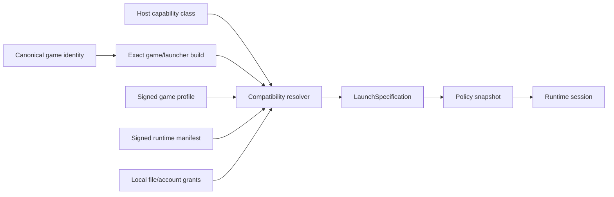
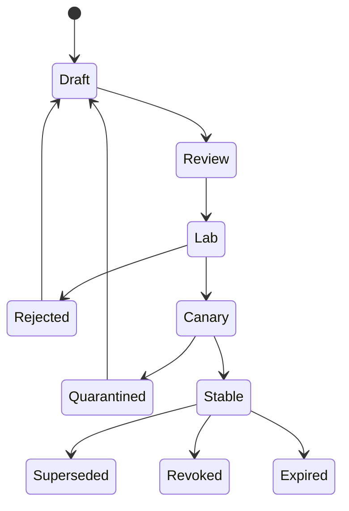

# Alloy Runtime Profile and Manifest Specification

**Version:** 1.0  
**Status:** Proposed normative companion  
**Date:** 20 July 2026  
**Owners:** Compatibility Platform and Runtime Platform  
**Schemas:** [`game-profile.schema.json`](../schemas/game-profile.schema.json) · [`runtime-manifest.schema.json`](../schemas/runtime-manifest.schema.json)  
**Example:** [`example-game-profile.yaml`](../examples/example-game-profile.yaml)  
**Related:** [Technical architecture](04_TECHNICAL_ARCHITECTURE.md) · [Certification](07_COMPATIBILITY_CERTIFICATION_SPEC.md)

---

## 1. Purpose

This document defines the declarative contracts that turn compatibility knowledge into a reproducible launch:

- **Game Profile:** title/build selectors, host selectors, runtime generation, process policies, dependencies, filesystem/registry policy, health checks, telemetry policy, and certification record.
- **Runtime Manifest:** the immutable component set, host requirements, build provenance, activation ring, and rollback relationship.
- **LaunchSpecification:** the locally compiled, immutable, session-specific output produced by resolving an exact game build, host class, signed profile, runtime manifest, and local grants.
- **Policy Snapshot:** the read-only per-session representation consumed before normal Windows process initialization.

Profiles are data, not imperative setup scripts. A stable profile cannot execute arbitrary shell commands or fetch mutable unsigned content.

## 2. Normative language

MUST, MUST NOT, SHOULD, SHOULD NOT, and MAY are requirement terms.

The JSON Schemas are normative for structural validation. This document is normative for resolution, signing, lifecycle, and semantic rules not expressible in JSON Schema.

## 3. Object model



Of these four contract objects, only the signed game profile and signed runtime manifest are signed interchange objects with versioned JSON Schemas in v1.x. LaunchSpecification and the policy snapshot are locally derived artifacts compiled by the resolver and loader, not signed payloads; see §18 and §19 for their status and where their canonical structure is defined.

## 4. Identifiers

Identifiers are opaque stable strings. They must not encode mutable display names.

| Identifier | Example | Purpose |
| --- | --- | --- |
| `game_id` | `game_01J...` | Canonical title across storefronts |
| `store_binding_id` | `sb_01J...` | One storefront/app/branch binding |
| `game_build_id` | `gb_01J...` | Exact discovered payload identity |
| `launcher_build_id` | `lb_01J...` | Exact launcher identity |
| `host_class_id` | `hc_01J...` | Stable host capability digest |
| `profile_id` | `studio.game.steam.arm64` | Logical profile family |
| `profile_revision` | `42` | Monotonic revision |
| `runtime_generation_id` | `rtg_...` | Immutable runtime composition |
| `test_plan_id` | `tp_...` | Versioned certification plan |
| `matrix_digest` | `sha256:...` | Evidence matrix identity |
| `launch_spec_id` | `ls_...` | Exact local launch resolution |
| `session_id` | `ses_...` | One execution session |
| `workaround_id` | `wa_...` | Scoped compatibility deviation |

## 5. Signed envelope

Production profiles and manifests are carried in a typed signed envelope. The payload is canonicalized before signing.

Conceptual shape:

```json
{
  "payloadType": "application/vnd.alloy.game-profile+json;version=1",
  "payload": "<base64 canonical JSON>",
  "signatures": [
    {
      "keyId": "profiles-stable-2026q3",
      "signature": "<base64>"
    }
  ]
}
```

Requirements:

- `payloadType` binds the signature to the object type and version.
- JSON is canonicalized using the project-approved deterministic encoding.
- Signatures are verified through the update metadata trust chain.
- The envelope may carry multiple signatures during rotation.
- Stable profiles require an authorized profile-release role.
- Publisher approval, when contractually required, is evidence associated with release, not a substitute for Alloy signing.
- Development profiles use a separate local or lab trust root and cannot be represented as stable.

## 6. Game build identity

A build selector may use:

- storefront branch and manifest/depot identifier;
- publisher version identifier;
- required file path, size, PE metadata, and SHA-256;
- executable/module fingerprint set;
- launcher version;
- install-recipe revision.

At least one selector dimension must be exact enough to prevent a materially different build from inheriting certification.

### 6.1 Fingerprint rules

1. Normalize Windows paths using the runtime’s Windows path rules.
2. Do not hash mutable saves, logs, caches, screenshots, or user configuration.
3. Prefer storefront manifest identity when trustworthy and stable.
4. Hash a minimal discriminating set of binaries/data rather than an entire large game when startup latency would be excessive.
5. A file selector includes path and digest; path alone is insufficient.
6. Detect executable replacement after update or repair.
7. Fingerprint evaluation is recorded with algorithm version.
8. A build may have multiple equivalent selectors for different storefront packaging.

### 6.2 Match outcome

- **Exact:** all required selectors match.
- **Compatible alias:** an explicitly signed alias maps an equivalent packaging build to the same evidence.
- **Stale:** prior profile matched an earlier build.
- **Unknown:** no profile selector applies.
- **Conflict:** multiple profiles with equal precedence disagree; Certified launch is blocked.

## 7. Host capability class

Host selection uses capabilities, not marketing model names.

Required dimensions include:

- ARM64 architecture;
- macOS semantic version and exact build;
- Apple GPU family and relevant Metal feature capabilities;
- unified-memory size class;
- display/HDR/refresh capabilities when title-critical;
- address-wait/synchronization capability;
- supported native media, input, and storage services;
- runtime entitlement/support constraints.

The capability digest is generated from a stable normalized structure. Volatile values such as current free memory, connected controller, or display resolution are session inputs rather than host-class identity unless certification specifically binds them.

### 7.1 `host_class_id` format and registry

`host_class_id` (§4) is the opaque, versioned identifier assigned to a normalized host capability digest. It is a control-plane-assigned string matching a documented pattern (for example, an `hc_` prefix followed by an opaque revisioned token) and is never constructed, parsed, or inferred by a client. The host-class registry — the authoritative mapping from a capability digest to its `host_class_id` and associated capability metadata — is owned by the control plane's catalog service (see doc 06) per NFR-EVO-004. A client resolves its local host to a `host_class_id` by querying or caching this registry; it must not mint its own identifier.

## 8. Runtime manifest

A runtime manifest lists immutable component objects:

- native host runtime;
- Wine runtime;
- CPU provider;
- graphics providers;
- native service providers;
- shader/compiler components;
- dependency layers;
- diagnostic/symbol metadata where distributed separately;
- policy compiler version.

Each component contains:

- name and semantic/build version;
- content digest and size;
- media type;
- source revision;
- license identity;
- SBOM digest;
- symbols digest where applicable.

A runtime generation never points to a mutable “latest” component.

A normative example runtime manifest is a pending companion artifact; unlike the game profile, it is not yet published alongside `example-game-profile.yaml`.

## 9. Profile selectors and precedence

The resolver evaluates candidates in this order:

1. signature, expiry, and schema validity;
2. exact canonical game/storefront binding;
3. exact game build selector;
4. exact launcher selector when present;
5. host architecture;
6. allowed/denied macOS build;
7. GPU capability/family;
8. memory class;
9. other feature requirements;
10. release ring and client eligibility (§21.7).

When more than one profile remains, choose:

1. highest selector specificity;
2. highest approved certification level;
3. highest profile revision within the same logical profile;
4. explicit supersession relationship;
5. stable release over canary for non-canary clients.

If ambiguity remains, Certified Mode fails closed with a profile-conflict error. It must not choose by filesystem order, download order, or timestamp alone.

## 10. Process policy

A process policy contains:

- stable rule ID;
- priority;
- match expression;
- execution provider choices;
- capability mask;
- DLL overrides;
- environment;
- working directory;
- network policy;
- native service choices;
- diagnostics policy;
- optional resource limits;
- rationale/workaround references.

### 10.1 Process identity inputs

Available match inputs include:

- normalized executable path;
- executable SHA-256;
- PE machine type;
- product/company metadata;
- command-line pattern;
- parent policy ID;
- signer information where meaningful;
- loaded-module fingerprint;
- storefront process role;
- process depth/group;
- optional launch token issued by the session agent.

Path glob or product name alone is not sufficient for a security-sensitive rule that expands access.

### 10.2 Resolution timing

Policy is selected before normal DLL imports and before the process can initialize the wrong graphics, synchronization, media, or networking path. Loader integration obtains a policy token and immutable snapshot from the session agent.

### 10.3 Rule precedence

1. deny/security restrictions compose and cannot be weakened by a lower-priority rule;
2. exact executable digest beats path/product match;
3. exact parent+child relationship beats generic child path;
4. higher explicit priority wins within equal specificity;
5. conflicting provider assignments at equal precedence fail closed in Certified Mode;
6. inheritance is explicit; absence does not mean unrestricted access;
7. unknown processes receive the profile’s conservative default.

### 10.4 Provider values

Representative provider identifiers:

```text
CPU
- fex-arm64ec
- native-arm64ec
- rosetta-x64-bootstrap

Graphics
- metal12
- dxmt
- moltenvk

Synchronization
- adaptive
- wait-address
- mach-semaphore
- conservative

Native services
- xaudio-coreaudio-vN
- wasapi-coreaudio-vN
- mf-videotoolbox-vN
- xinput-gamecontroller-vN
- hid-iokit-vN
- presentation-metal-vN
```

Identifiers are versioned logical providers. The runtime manifest resolves them to exact component digests. Legacy providers (`d3d9on11-dxmt`, `native-opengl`, `wined3d`) were removed from the contract by ADR-0011.

## 11. Feature masks and virtual adapter presets

A feature mask controls guest-visible capability and scoped behavior. It may define:

- D3D feature levels;
- shader model;
- descriptor/root-signature limits;
- ray tracing, mesh shader, VRS, sparse-resource support;
- format and sample-count support;
- swap-chain and HDR capabilities;
- memory budget and virtual adapter identity;
- queue/timestamp behavior;
- known game-specific feature-query deviations.

Rules:

- Never expose a feature merely because the host API has a similarly named capability.
- Masks are additive only within the provider’s proven capability ceiling.
- A title-specific deviation requires a workaround record and tests.
- A mask is immutable and independently identifiable.
- Changing a mask invalidates relevant shader/PSO cache epochs and certification evidence.

## 12. Workaround record

Every non-default compatibility behavior has:

```yaml
id: wa_example_001
owner: graphics-team
reason: "Game assumes capability X implies behavior Y."
scope:
  gameBuild: "gb_..."
  processPolicy: "game"
introducedInProfileRevision: 42
testEvidence:
  - "test_result_digest"
review:
  expiresAt: "2026-10-01T00:00:00Z"
  removalCondition: "Remove after upstream issue ABC is fixed and certified."
risk:
  userVisible: false
  performance: "May reduce async compute overlap."
```

A stable release rejects workarounds with missing owner, reason, scope, or evidence.

## 13. Filesystem policy

Drive mappings name explicit logical targets:

- read-only runtime;
- storefront-managed game payload;
- persistent saves;
- persistent settings;
- disposable cache;
- session temp;
- user-granted path.

Certified Mode requirements:

- no implicit `Z:` mapping to host root;
- canonicalize before authorization;
- defend against symlink/hard-link/path traversal;
- apply Windows case and sharing semantics through the filesystem provider;
- enforce read-only status even if the underlying host path is writable;
- scope user grants to game and purpose;
- record grant IDs, not raw personal paths, in cloud data.

## 14. Registry and environment policy

Stable profiles may contain declarative set/delete operations against allowed registry hives and typed values. They may not run arbitrary `.reg`, shell, PowerShell, or batch content at launch.

Environment variables:

- use explicit allowlists for host-derived values;
- redact secrets from diagnostics;
- prohibit a profile from changing security-sensitive host variables outside documented keys;
- resolve templates at LaunchSpecification compilation;
- store final values only in the local encrypted/session snapshot when sensitive.

## 15. Dependencies

A dependency entry states:

- logical ID and version;
- source category;
- content digest when distributable;
- install mode: immutable layer, controlled first run, or launcher-managed;
- license/redistribution gate;
- silent-install arguments only when reviewed and deterministic;
- resulting fingerprint;
- rollback behavior.

Dependencies must not be fetched from arbitrary profile URLs. Downloads are authorized by signed metadata or an explicit user-directed publisher/storefront flow.

## 16. Health checks

Health checks are declarative observations, for example:

- process started;
- expected module loaded;
- window created;
- first frame presented;
- log pattern emitted;
- network endpoint reached;
- save written;
- clean exit.

Each includes:

- target;
- deadline or observation window;
- severity;
- scope: launch, candidate health, certification, or support;
- false-positive guidance.

Health checks do not inject gameplay logic or bypass protection. A lab test plan may use richer automation than a production client profile.

## 17. Certification record

The profile references certification evidence:

- level;
- test date;
- test-plan ID/version;
- evidence matrix digest;
- exact host/build selectors;
- known limitations;
- expiration;
- optional publisher/anti-cheat approval scope;
- benchmark thresholds and pass/fail summary.

The profile does not embed large traces or screenshots. It binds to immutable evidence stored in the control plane.

## 18. LaunchSpecification

LaunchSpecification is a locally derived artifact, not a signed interchange object. Its canonical structural definition is deferred to the runtime implementation and the API contracts specification (doc 06); only the game profile and runtime manifest carry versioned JSON Schemas in v1.x (§2).

The resolver produces a local object such as:

```json
{
  "schemaVersion": "1.0",
  "launchSpecId": "ls_01...",
  "gameId": "game_01...",
  "gameBuildId": "gb_01...",
  "launcherBuildId": "lb_01...",
  "hostClassId": "hc_01...",
  "runtimeGenerationId": "rtg_...",
  "profile": {
    "id": "example.steam.123456.macos-arm64",
    "revision": 42,
    "payloadDigest": "sha256:..."
  },
  "policyCompiler": {
    "version": "1.3.0",
    "snapshotDigest": "sha256:..."
  },
  "volumes": {
    "runtime": "local-object-or-view-id",
    "game": "scoped-install-id",
    "saves": "volume-id",
    "settings": "volume-id",
    "cache": "cache-epoch-id",
    "temp": "session-volume-id"
  },
  "grants": ["grant_..."],
  "certification": {
    "level": "certified",
    "matrixDigest": "sha256:..."
  },
  "createdAt": "2026-07-20T00:00:00Z"
}
```

The LaunchSpecification is immutable for the session. A late-changing condition, such as a disconnected controller, is a runtime event—not a mutation of component identity.

## 19. Policy snapshot format

The policy snapshot is a locally derived artifact, not a signed interchange object. Its canonical structural definition is deferred to the runtime implementation and the API contracts specification (doc 06); only the game profile and runtime manifest carry versioned JSON Schemas in v1.x (§2).

The snapshot is optimized for startup:

- binary or memory-mappable;
- deterministic;
- read-only;
- indexed by executable digest/path and parent policy;
- contains resolved component/provider IDs;
- contains precompiled path/network/security rules;
- contains human-readable reason IDs separately from hot-path data;
- signed or bound by digest to the signed profile and LaunchSpecification;
- versioned independently from source profile schema.

The loader must reject an unsupported snapshot version rather than guess.

## 20. Caches and compatibility epochs

Caches are derived data and include every input that can affect correctness:

### Shader/PSO cache key

```text
game build
+ executable/module fingerprint
+ graphics provider digest
+ shader compiler digest
+ feature mask
+ Apple GPU capability class
+ macOS/Metal compatibility epoch
+ relevant title workaround revision
```

### CPU translation cache key

```text
guest binary digest
+ CPU provider digest
+ guest CPU feature preset
+ host architecture feature class
+ JIT/ABI compatibility epoch
```

A mismatch creates a new cache namespace. Stable operation never “repairs” a cache by using data from an incompatible epoch.

## 21. Profile lifecycle



### 21.1 Draft

Authored in source control with issue/workaround links and schema tests.

### 21.2 Review

Compatibility, owning subsystem, security where relevant, and legal/licensing where dependency behavior changes.

### 21.3 Lab

Runs required scenarios on the impact matrix and Windows reference.

### 21.4 Canary

Restricted client cohort and local candidate health windows.

### 21.5 Stable

Signed for the stable role and available to eligible clients.

### 21.6 Superseded/expired/revoked

- **Superseded:** newer valid profile exists.
- **Expired:** evidence age or external change requires retest.
- **Revoked:** security or severe correctness reason; client must stop selecting it.
- **Rejected:** failed Lab evaluation; returns to Draft with recorded findings before re-review.
- **Quarantined:** candidate not eligible for new stable selection.

### 21.7 Lifecycle-to-release-ring mapping

Lifecycle states (§21) are control-plane workflow states that govern authoring, review, and promotion of a profile. They are not fields of the signed object: a signed game profile or runtime manifest carries only its `revision` (or `generationId`) and validity window (`certification.expiresAt`, envelope signature validity), never a lifecycle-state field.

Distribution and client eligibility instead use the release-ring vocabulary defined by `runtime-manifest.schema.json`'s `activation.releaseRing` enum. The control plane maps each lifecycle state to release-ring exposure as follows:

| Lifecycle state | Release ring exposure |
| --- | --- |
| Draft | development |
| Review | development |
| Lab | lab |
| Canary | canary |
| Stable | stable |
| Rejected | quarantined |
| Quarantined | quarantined |
| Superseded | withdrawn from all rings |
| Expired | withdrawn from all rings |
| Revoked | withdrawn from all rings |

A lifecycle transition takes effect when the control plane republishes release-ring eligibility metadata; it never mutates a previously signed payload.

## 22. Schema evolution

- Major version changes may break compatibility.
- Minor additive changes require clients to ignore explicitly ignorable fields or reject unknown required capabilities.
- A `requiredFeatures` mechanism may declare semantics that an older client cannot ignore.
- Profile compiler and schema versions are recorded independently.
- Stable clients support a bounded schema window.
- Migration is performed in source/control plane; clients do not silently reinterpret old semantics.
- Golden fixtures verify equivalent compilation across patch releases.

## 23. Validation pipeline

Every profile change runs:

1. JSON Schema validation;
2. canonicalization and deterministic digest test;
3. static security policy checks;
4. license/dependency checks;
5. selector ambiguity checks;
6. rule precedence/conflict checks;
7. provider/runtime existence checks;
8. cache-epoch impact calculation;
9. unit and golden policy compilation;
10. required lab plan;
11. certification evidence binding;
12. signing and release-ring promotion.

## 24. Example process routing

```yaml
processPolicies:
  - id: launcher
    priority: 100
    match:
      pathGlob: "**/Launcher.exe"
    execution:
      graphicsProvider: dxmt
      syncProvider: conservative
      networkPolicy: allow
    services:
      media: mf-videotoolbox-v2

  - id: game
    priority: 200
    match:
      pathGlob: "**/Game/Binaries/Win64/Game.exe"
      sha256: "<exact digest>"
    execution:
      cpuProvider: fex-arm64ec
      graphicsProvider: metal12
      syncProvider: wait-address
      featureMask: "metal12.apple9.game.rev7"
    services:
      audio: xaudio-coreaudio-v3
      input: xinput-gamecontroller-v2
      presentation: hdr-vrr-v4

  - id: crash-reporter
    priority: 150
    match:
      pathGlob: "**/CrashReporter.exe"
    execution:
      graphicsProvider: dxmt
      networkPolicy: deny
      debugPolicy: verbose
```

The root session does not have one bottle-wide backend. Each process receives exactly the provider behavior it needs.

## 25. Security invariants

- A profile cannot grant more host access than the user and product policy allow.
- A lower-trust profile cannot supersede stable metadata.
- Unsigned local changes force Custom or Developer Mode.
- No profile may disable core artifact verification.
- No profile may claim competitive certification without signed vendor scope.
- No profile may introduce an arbitrary executable from an unverified source.
- Secret values never appear in signed public profile payloads.
- Revocation takes precedence over cached stable selection, subject to safe offline policy defined by security response.

## 26. Review checklist

Before stable promotion, reviewers confirm:

- selectors match only intended builds;
- host coverage equals tested evidence;
- every process has an intentional policy;
- unknown-process default is safe;
- provider versions exist in the runtime generation;
- feature mask does not over-report;
- filesystem and network grants are minimal;
- caches have correct invalidation;
- dependencies have provenance and legal approval;
- workarounds have owner/evidence/review;
- health checks are reliable;
- limitations are accurate and user-readable;
- certification is current;
- rollback generation exists;
- signature and release metadata are valid.
