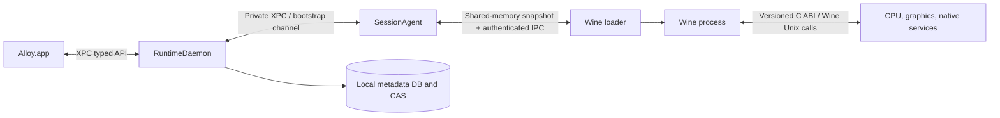

# Alloy API and Data Contracts

**Version:** 1.0  
**Status:** Proposed  
**Date:** 20 July 2026  
**Owners:** Runtime Platform, Control Plane, Data Platform  
**Related:** [Technical architecture](04_TECHNICAL_ARCHITECTURE.md) · [Profile specification](05_RUNTIME_PROFILE_AND_MANIFEST_SPEC.md) · [Security](09_SECURITY_PRIVACY_THREAT_MODEL.md)

---

## 1. Scope

This document defines the service and data boundaries needed to implement Alloy:

- local client-to-daemon API;
- daemon-to-session-agent protocol;
- loader/policy lookup protocol;
- provider ABIs;
- control-plane APIs;
- artifact delivery;
- certification orchestration;
- telemetry and diagnostic events;
- publisher APIs;
- stable identifiers, errors, idempotency, and schema evolution.

It is not a complete source-code interface definition. Protobuf, Swift, Rust, C/C++, and OpenAPI definitions must be generated from reviewed machine-readable contracts in the implementation repository.

## 2. Protocol principles

1. **Local launch does not depend on cloud availability.**
2. **Mutating operations are idempotent.**
3. **Every response carries stable machine-readable status.**
4. **Signed metadata, not API transport trust alone, authorizes artifacts and profiles.**
5. **Guest-controlled inputs never deserialize directly into privileged process memory without validation.**
6. **Large artifacts use content-addressed transfer, not API JSON payloads.**
7. **Schemas are explicitly versioned.**
8. **Sensitive fields are classified and redacted at source.**
9. **Provider hot paths use stable low-overhead ABIs; control paths favor typed IPC.**
10. **Unknown required fields fail closed; unknown optional fields are preserved or ignored per contract.**

## 3. Local service topology



## 4. Local API envelope

Conceptual request:

```json
{
  "apiVersion": "1.0",
  "requestId": "req_01...",
  "idempotencyKey": "idem_01...",
  "method": "LaunchGame",
  "payload": {}
}
```

Conceptual response:

```json
{
  "apiVersion": "1.0",
  "requestId": "req_01...",
  "status": {
    "code": "OK",
    "domain": "alloy.runtime",
    "messageKey": "runtime.launch.accepted",
    "retryable": false,
    "supportCode": "RT-LAUNCH-0000"
  },
  "payload": {},
  "operationId": "op_01..."
}
```

Transport-level success does not imply operation success. Long-running work returns an operation ID and publishes state changes.

## 5. Stable error model

An error contains:

| Field | Meaning |
| --- | --- |
| `domain` | Owning subsystem, such as catalog, profile, runtime, wine, cpu, graphics, storefront, security |
| `code` | Stable symbolic code |
| `messageKey` | Localizable player/support text key |
| `retryable` | Whether an identical retry may succeed |
| `safeAction` | Retry, grant permission, repair cache, rollback, update, unsupported, contact support |
| `supportCode` | Short copyable identifier |
| `causes` | Nested machine-readable causal chain |
| `context` | Redacted identifiers safe for logs |
| `sessionId` / `operationId` | Correlation |

Example:

```json
{
  "domain": "alloy.profile",
  "code": "PROFILE_BUILD_SELECTOR_MISMATCH",
  "messageKey": "compatibility.update_under_test",
  "retryable": false,
  "safeAction": "VIEW_COMPATIBILITY_STATUS",
  "supportCode": "CP-BUILD-1004",
  "context": {
    "gameBuildId": "gb_...",
    "lastCertifiedBuildId": "gb_..."
  }
}
```

Free-text upstream errors may be attached as redacted diagnostic evidence but never become the primary programmatic code.

## 6. Core local APIs

### 6.1 Catalog

```text
ListGames(filter, pageToken) -> GameSummary[]
GetGame(gameId) -> GameDetails
DiscoverInstallations(scope) -> Operation
RefreshBuildFingerprint(installId) -> Operation
GetCompatibility(gameId, installId, hostClassId) -> CompatibilityResolution
```

### 6.2 Installation and storage

```text
PlanInstall(gameId, installId, options) -> InstallPlan
StartInstall(planId, idempotencyKey) -> Operation
PauseOperation(operationId)
ResumeOperation(operationId)
CancelOperation(operationId)
RepairInstallation(installId, repairClass) -> Operation
PlanUninstall(gameId, selection) -> UninstallPlan
StartUninstall(planId, idempotencyKey) -> Operation
GetStorageInventory() -> StorageInventory
CollectGarbage(policy) -> Operation
```

`InstallPlan` includes object digests, byte estimates, temporary/rollback space, grants, dependencies, and expected resulting generation.

### 6.3 Runtime and launch

```text
ResolveLaunch(gameId, installId, requestedMode) -> LaunchPreview
LaunchGame(launchPreviewId, idempotencyKey) -> SessionHandle
StopSession(sessionId, mode)
GetSession(sessionId) -> SessionState
ListSessions(filter) -> SessionSummary[]
RollbackRuntime(gameId, generationId, idempotencyKey) -> Operation
SetReleaseRing(gameId, ring)
```

`ResolveLaunch` performs no irreversible mutation. `LaunchGame` revalidates the preview’s digests and expiry before creating the session.

`ring` accepts the control-plane release-ring vocabulary — `development`, `lab`, `canary`, `stable`, `quarantined` — matching the runtime manifest schema's `releaseRing` enum. A profile's internal authoring workflow (Draft/Review/Lab/Canary/Stable/Rejected/Superseded/Expired/Revoked) is a separate control-plane workflow state that maps onto this ring vocabulary per [05 §21.7](05_RUNTIME_PROFILE_AND_MANIFEST_SPEC.md); `Superseded`/`Expired`/`Revoked` withdraw a profile from all rings rather than mapping to one. `SetReleaseRing` operates on the ring value, never the lifecycle state directly.

### 6.4 Saves and settings

```text
GetSaveStatus(gameId) -> SaveStatus
CreateSaveBackup(gameId, reason) -> Operation
RestoreSaveBackup(gameId, backupId) -> Operation
OpenSaveLocation(gameId) -> ScopedURL
ResetSettings(gameId, selection) -> Operation
```

Restore is never implicit during runtime rollback.

### 6.5 Permissions

```text
ListGrants() -> Grant[]
RequestFolderGrant(purpose, gameId) -> GrantResult
RevokeGrant(grantId) -> Operation
ValidateGrant(grantId) -> GrantStatus
```

The cloud sees grant identifiers and scope metadata, not raw local paths.

### 6.6 Diagnostics

```text
GetFailureSummary(sessionId) -> FailureSummary
CreateDiagnosticBundle(sessionId, privacyLevel) -> Operation
PreviewDiagnosticBundle(bundleId) -> BundleManifest
ExportDiagnosticBundle(bundleId, destinationGrant) -> Operation
UploadDiagnosticBundle(bundleId, consentToken) -> Operation
DeleteDiagnosticBundle(bundleId)
```

### 6.7 Custom Mode

```text
CreateCustomEnvironment(gameId, sourceGenerationId) -> Operation
UpdateCustomSettings(customId, patch) -> Operation
LaunchCustom(gameId, customId) -> SessionHandle
ResetToCertified(gameId) -> Operation
ExportCustomSettings(customId) -> Document
ImportCustomSettings(gameId, document) -> ValidationResult
```

Custom APIs cannot alter signed Certified Mode objects.

## 7. Operation model

Long-running operations use:

```json
{
  "operationId": "op_...",
  "kind": "INSTALL_RUNTIME",
  "state": "RUNNING",
  "stage": "VERIFYING_OBJECTS",
  "progress": {
    "completedUnits": 42,
    "totalUnits": 100,
    "bytesCompleted": 123,
    "bytesTotal": 456
  },
  "canPause": true,
  "canCancel": true,
  "createdAt": "...",
  "updatedAt": "...",
  "error": null
}
```

State machine:

```text
QUEUED → RUNNING ↔ PAUSED → SUCCEEDED
                     └────→ FAILED
                     └────→ CANCELLING → CANCELLED
```

Requirements:

- state transitions are journaled;
- terminal states are immutable;
- retry creates a new attempt linked to the prior operation;
- cancellation states whether partial verified objects are retained;
- progress stages use stable codes;
- operations survive UI restart and daemon restart.

## 8. Session model

```json
{
  "sessionId": "ses_...",
  "gameId": "game_...",
  "gameBuildId": "gb_...",
  "launchSpecId": "ls_...",
  "mode": "CERTIFIED",
  "state": "RUNNING",
  "phase": "GAMEPLAY",
  "rootProcessId": "gpid_...",
  "startedAt": "...",
  "certificationLevel": "certified",
  "activeGenerationId": "rtg_...",
  "profileRevision": 42,
  "health": {
    "state": "HEALTHY",
    "checks": []
  }
}
```

Process identifiers exposed across IPC are logical guest-process IDs, not trusted raw host PIDs alone.

## 9. SessionAgent protocol

The daemon supplies the agent:

- LaunchSpecification digest and local path/handle;
- policy snapshot;
- materialized volume handles;
- user grant handles;
- session secrets;
- allowed provider component identities;
- diagnostics configuration;
- health checks.

The LaunchSpecification and policy snapshot exchanged here are locally derived, implementation-defined artifacts; only the signed game profile and runtime manifest carry versioned interchange schemas in v1.x (05 §18–§19).

The agent reports:

- process creation/exit;
- policy match result;
- module/provider load;
- window/frame/audio/input milestones;
- health results;
- crash/hang/device-loss;
- redacted logs and metrics;
- clean shutdown and outstanding writes.

The channel is authenticated per session and invalid after termination.

## 10. Loader policy lookup

Hot-path lookup request:

```c
typedef struct {
    uint32_t abi_version;
    uint8_t executable_sha256[32];
    const char *normalized_path;
    const char *command_line;
    uint64_t parent_policy_token;
    uint16_t pe_machine;
} alloy_process_identity_v1;
```

Response:

```c
typedef struct {
    uint32_t abi_version;
    uint64_t policy_token;
    uint32_t cpu_provider_id;
    uint32_t graphics_provider_id;
    uint32_t sync_provider_id;
    uint32_t service_set_id;
    uint32_t feature_mask_id;
    uint32_t security_policy_id;
    uint32_t diagnostics_policy_id;
} alloy_process_policy_v1;
```

The actual ABI must avoid raw cross-process pointers and define ownership, encoding, alignment, and maximum lengths. The loader verifies the snapshot digest and session token before use.

## 11. Provider ABI principles

### 11.1 Common

Every provider exports:

- ABI major/minor;
- provider ID and exact build digest;
- capability query;
- initialization with immutable configuration;
- structured event callback;
- shutdown;
- optional capture/diagnostic hooks.

Major mismatch is fatal. Minor extensions use size-prefixed structures.

### 11.2 CPU provider

Responsibilities:

- create guest execution context;
- map/unmap guest memory;
- execute guest entry point;
- handle exceptions and signal/unwind translation;
- invalidate code ranges;
- expose translated-code metrics;
- manage persistent cache compatibility.

It does not make filesystem, network, or title policy decisions.

### 11.3 Graphics provider

Responsibilities:

- expose the selected Windows graphics API surface;
- create virtual adapter/device;
- compile shaders/pipelines;
- manage resources, queues, fences, presentation;
- emit device-loss and validation diagnostics;
- identify cache epochs.

Provider selection is fixed per process after graphics initialization.

### 11.4 Native service provider

Service interfaces cover input, audio, media, networking, filesystem, storage, and presentation. Each interface defines thread, callback, lifetime, and real-time constraints.

## 12. Local metadata database

Suggested normalized entities (`host_classes` is a local cache of the control-plane host-class registry — the authoritative digest-to-`host_class_id` mapping; 05 §7.1):

```text
games
store_bindings
installations
game_builds
launcher_builds
host_classes
runtime_generations
profiles
profile_selections
operations
objects
object_references
materializations
volumes
grants
sessions
processes
health_results
save_backups
diagnostic_bundles
release_preferences
```

### 12.1 Integrity constraints

- active generation references only verified/materialized objects;
- one active Certified generation per game/install/host selection;
- saves cannot cascade-delete with runtime generations;
- object collection requires zero live references and no active operation lease;
- session references preserve historical identities even after object collection;
- profile selection records digest, revision, and reason;
- account secrets are never stored in the general metadata database.

## 13. Cloud API style

External client and publisher APIs may use HTTPS with JSON/Protobuf. Internal high-volume services may use gRPC. Every endpoint has:

- authenticated subject;
- tenant and role;
- request ID;
- idempotency key for mutations;
- explicit API version;
- rate and size limits;
- audit classification;
- privacy/data-class annotation.

## 14. Client control-plane APIs

### Metadata

```text
GET /v1/catalog/snapshot
POST /v1/compatibility:resolve
GET /v1/profiles/{profileId}/revisions/{revision}
GET /v1/runtime-generations/{generationId}
GET /v1/update-metadata/{role}
```

Responses containing signed objects return the envelope and digest. The client verifies signatures independently.

### Health and telemetry

```text
POST /v1/events:batch
POST /v1/crashes:initiateUpload
PUT  /v1/uploads/{uploadId}/parts/{part}
POST /v1/uploads/{uploadId}:complete
DELETE /v1/uploads/{uploadId}
```

Upload initiation returns a scoped, expiring destination. Diagnostic content is encrypted in transit and at rest according to policy.

## 15. Artifact protocol

Artifacts are addressed by digest:

```text
sha256:<64 lowercase hex characters>
```

Client flow:

1. obtain signed target metadata;
2. verify authorized digest, size, media type, and expiry;
3. check local CAS;
4. download with range/resume from an authorized mirror;
5. write to a temporary object;
6. verify size and digest;
7. fsync as required;
8. atomically publish to CAS;
9. record verification metadata.

The server never asks a client to trust a filename or mutable URL as identity.

## 16. Certification orchestration API

```text
CreateTestPlan(definition)
ScheduleCertification(buildId, profileRevision, hostMatrix, testPlanId)
GetCertificationRun(runId)
CancelCertificationRun(runId)
SubmitRunnerResult(runId, scenarioId, signedResult)
CompareReference(runId, scenarioId)
PromoteEvidence(runId)
```

A runner result binds:

- runner identity and attestation;
- hardware and OS;
- exact game/launcher/runtime/profile;
- scenario version;
- input seed;
- outputs and metrics;
- artifact digests;
- pass/fail and reasons;
- timestamps and clock quality.

## 17. Publisher API

Tenant-scoped operations:

```text
CreateTitle
BindStorefront
CreateBuildSubmission
UploadSymbols
GrantBuildAccess
DefinePrivateTestAccountReference
SchedulePrivateEvaluation
GetCompatibilityReport
ReviewProposedProfile
AcknowledgeRelease
ConfigureNotifications
DeletePrivateBuild
```

Private test-account credentials use a dedicated secret system and are never returned after submission.

## 18. Event schema

Common envelope:

```json
{
  "schemaVersion": "1.0",
  "eventId": "evt_...",
  "eventType": "runtime.process.policy_selected",
  "occurredAt": "...",
  "monotonicNs": 123456,
  "clientInstanceId": "rotating-pseudonymous-id",
  "operationId": "op_...",
  "sessionId": "ses_...",
  "gameId": "game_...",
  "gameBuildId": "gb_...",
  "hostClassId": "hc_...",
  "runtimeGenerationId": "rtg_...",
  "profileRevision": 42,
  "privacyClass": "ESSENTIAL",
  "payload": {}
}
```

### 18.1 Event classes

- lifecycle;
- compatibility resolution;
- process policy;
- provider initialization;
- health;
- performance;
- failure/crash/hang;
- storage;
- security;
- user remediation;
- diagnostic consent/upload;
- lab/certification;
- release/signing/audit.

### 18.2 Cardinality rules

Do not place unrestricted paths, command lines, shader hashes, stack strings, or exception messages in metric labels. High-cardinality data belongs in sampled events or diagnostic artifacts with retention controls.

## 19. Privacy classification

| Class | Examples | Default handling |
| --- | --- | --- |
| Public | game ID, published profile revision | May appear in public status |
| Operational | component versions, result codes, host capability class | Essential or sampled telemetry |
| Diagnostic | process/module list, redacted paths, stacks | Local; upload by consent |
| Sensitive | account ID, exact personal path, IP, private publisher build ID | Minimize, tokenize, restricted access |
| Secret | credentials, tokens, encryption keys | Never log; dedicated secret storage |
| Content | saves, chat, screenshots, game assets | Excluded unless a separate explicit feature and consent exists |

## 20. Idempotency

- Client supplies an idempotency key for every user-initiated mutation.
- Server/local daemon stores result by authenticated scope and operation type for a bounded period.
- Repeating with the same key and semantically different payload is an error.
- Artifact uploads use content digest and upload ID.
- Certification scheduling deduplicates exact build/profile/matrix/test-plan combinations unless forced with a reason.
- Signing operations require a unique release intent and reject duplicate conflicting payloads.

## 21. Pagination and consistency

- Collection APIs use opaque continuation tokens.
- Catalog snapshots are versioned and internally consistent.
- Compatibility resolution returns the snapshot/profile/runtime metadata versions used.
- Clients may cache immutable objects indefinitely by digest.
- Mutable indexes use ETag/revision.
- Strong consistency is required for signing, revocation, profile promotion, and active local generation references.
- Event analytics may be eventually consistent.

## 22. Versioning

### APIs

- URI or protocol major version for breaking changes;
- additive optional fields within major;
- client advertises supported features;
- server returns required-client version for unsupported semantics.

### Provider ABIs

- major mismatch: reject;
- minor mismatch: size/capability negotiation;
- side-by-side loading where process isolation permits.

### Events

- immutable event type semantics;
- new version for semantic change;
- raw retained events may be reprocessed with versioned transformations.

### Schemas

Follow [05_RUNTIME_PROFILE_AND_MANIFEST_SPEC.md](05_RUNTIME_PROFILE_AND_MANIFEST_SPEC.md).

## 23. Authentication and authorization

### Local

- code-signing requirement and XPC connection validation;
- per-session capability tokens;
- no trust based solely on PID;
- file grants represented by secure handles/bookmarks;
- guest process cannot call broad daemon methods directly.

### Cloud

- user/device auth separated from publisher/employee auth;
- short-lived access tokens;
- workload identities for services/runners;
- tenant and role enforcement;
- step-up authorization for signing, revocation, private builds, and secrets;
- complete audit for privileged actions.

## 24. Rate and resource limits

Define limits for:

- profile size and number of process rules;
- command-line/path lengths;
- diagnostic bundle size;
- event batch count/bytes;
- concurrent artifact downloads;
- operations per client;
- publisher build/symbol retention;
- lab jobs per tenant;
- shader/media parser input;
- IPC queue depth and shared-memory buffers.

Exceeding a limit returns a stable code and cannot crash a privileged service.

## 25. Compatibility and contract testing

Required test suites:

- generated client/server conformance;
- golden API/error fixtures;
- old-client/new-server and new-client/old-server matrix;
- malformed and oversized payload fuzzing;
- idempotency replay;
- authorization matrix;
- network interruption and resume;
- artifact tamper/replay/freeze;
- provider ABI side-by-side loading;
- event privacy scanning;
- local daemon restart during operations;
- publisher tenant-isolation tests.

## 26. Open API decisions

- XPC serialization technology for Swift/Rust boundaries;
- protobuf versus FlatBuffers/custom binary for policy snapshots;
- public REST versus gRPC-web for publisher portal;
- attestation model for physical lab runners;
- event ingestion transport and offline queue limits;
- exact canonical JSON/signature envelope standard;
- artifact chunking and peer/local network sharing;
- whether selected local APIs are exposed to third-party launchers or remain private;
- SDK boundary for publisher optimization adapters.
