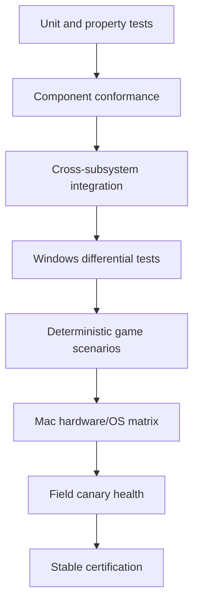

# Alloy Test and Quality Strategy

**Version:** 1.0  
**Status:** Proposed  
**Date:** 20 July 2026  
**Owner:** Quality Engineering / Compatibility Lab  
**Related:** [Architecture](04_TECHNICAL_ARCHITECTURE.md) · [Certification](07_COMPATIBILITY_CERTIFICATION_SPEC.md) · [Operations](10_OBSERVABILITY_OPERATIONS_AND_RELEASE.md)

---

## 1. Quality mission

Alloy must prove more than “the process did not crash.” Quality means the exact game-visible behavior is sufficiently correct, performance is stable, saves are safe, runtime changes are reversible, and support can reproduce failure.

Testing is designed around five questions:

1. Does the Windows behavior match what the game expects?
2. Does the Mac implementation remain correct under load, time, updates, and pressure?
3. Can the exact state be recreated?
4. Can a bad change be contained and rolled back?
5. Does the product describe its evidence honestly?

## 2. Quality model



No layer replaces another. A game test cannot substitute for descriptor-heap property tests; a conformance suite cannot substitute for a 60-minute game endurance run.

## 3. Test taxonomy

| Test class | Primary purpose | Typical cadence |
| --- | --- | --- |
| Unit | Local semantics and edge cases | Every change |
| Property/model | State-machine invariants, randomized sequences | Every change/nightly |
| Contract | API/schema/ABI compatibility | Every change |
| Conformance | Win32, CPU, D3D, shader, services | Every change/nightly |
| Integration | Cross-component lifecycle | Every change/nightly |
| Differential | Compare with native Windows behavior | Nightly/change impact |
| Game scenario | Real title journey | Change impact/daily |
| Performance | Frame time, stalls, translation, memory | Scheduled and release |
| Endurance | Long-session leak/reliability | Nightly/weekly/release |
| Fuzz | Untrusted parsers and state machines | Continuous |
| Chaos/fault | Power/process/network/disk failures | Nightly/release |
| Security | Trust boundaries and adversarial behavior | Continuous/release |
| Accessibility | Native client usability | Every UI release |
| Canary | Real-world severe regression detection | Before stable promotion |

## 4. Test environments

### 4.1 Developer

- local unit/component tests;
- deterministic fixtures;
- mock storefront and services;
- optional Windows reference VM/machine;
- validation-enabled providers;
- unsigned development trust root.

### 4.2 Continuous integration

- ARM64 macOS builders/testers;
- Linux/build workers where host-neutral;
- Windows reference workers;
- sanitizer variants where supported;
- schema/API compatibility matrix;
- reproducible build comparison.

### 4.3 Physical compatibility lab

Representative Macs are grouped by capability:

- minimum supported Apple GPU generation;
- current mainstream base chip;
- Pro/Max/Ultra classes where behavior differs;
- 16/24/32/64+ GB certified memory classes (16 GB certified floor, ADR-0011); an 8 GB device may appear only for Experimental/Custom-mode observation, never Certified evidence;
- current and prior supported macOS releases/builds (rolling window, ADR-0011);
- SDR/HDR and 60/120/VRR displays;
- controller and audio device classes.

The matrix expands when data shows that an equivalence assumption is invalid.

### 4.4 Windows reference fleet

- supported Windows versions required by target games;
- representative discrete GPU vendors/features;
- deterministic settings and driver versions;
- capture instrumentation;
- isolated storefront/test accounts;
- versioned images and runner provenance.

The Windows fleet is a behavioral oracle, not a performance-equivalence oracle.

## 5. Source and change gates

Every code change declares impacted components and expected test sets. Automated impact analysis adds tests based on dependency graph:

```text
profile change → policy golden + affected game scenarios
Wine change → Win32 differential + impacted games
CPU provider → ISA/ABI/exception + all smoke titles
shader compiler → corpus + D3D scenarios + visual matrix
descriptor/barrier change → conformance + graphics stress + games
native input change → controller matrix + affected games
runtime storage change → fault/recovery + every install path
security policy change → adversarial suites + sign-off
```

Developers cannot manually omit mandatory release gates.

## 6. Runtime composition tests

### 6.1 Content-addressed store

Test:

- digest verification;
- partial/resumed downloads;
- duplicate object deduplication;
- malicious size mismatch;
- temporary-object cleanup;
- concurrent references;
- garbage collection leases;
- corrupted local object quarantine;
- APFS clone/materialization behavior;
- low disk space;
- daemon death at every journal boundary.

### 6.2 Generation activation

Property:

> At every recoverable crash point, exactly one of the previous or candidate generation is active; active references never point to an unverified partial generation.

Test:

- atomic reference switch;
- rollback;
- candidate health;
- multiple games sharing layers;
- concurrent launch and update;
- client/daemon restart;
- rollback-object retention;
- schema/version incompatibility.

### 6.3 Saves and settings

Test:

- runtime update and rollback;
- uninstall defaults;
- backup/restore;
- cloud/local conflicts;
- interrupted write;
- symlink/path attacks;
- multiple users;
- schema migration;
- game writing outside declared save paths;
- settings reset without save deletion.

## 7. Profile and policy tests

### 7.1 Schema

- valid/invalid corpus;
- size and recursion limits;
- unknown required fields;
- version window;
- canonicalization;
- signature envelope;
- expiry/revocation.

### 7.2 Selector

- exact storefront/build match;
- alias;
- stale build;
- ambiguous profile;
- host class boundaries;
- denied macOS build;
- memory/GPU equivalence;
- launcher mismatch.

### 7.3 Process policy

- path/digest/parent specificity;
- priority and conflict;
- unknown child;
- security restriction composition;
- launcher/game split provider;
- environment/registry overlay;
- network/filesystem restriction;
- policy before imports;
- byte-identical compiled snapshot.

Use model-based tests to generate process trees and compare the compiler with a simpler reference implementation.

## 8. Wine and Windows API tests

### 8.1 Upstream suites

Run relevant Wine test suites on every rebase and downstream patch.

### 8.2 Differential harness

Execute small Windows programs on native Windows and Alloy. Compare:

- return values and errors;
- process/thread behavior;
- synchronization ordering;
- filesystem sharing/case semantics;
- registry;
- COM;
- networking;
- time and locale;
- window/input messages;
- media/audio contracts.

### 8.3 Downstream patch rule

Every downstream Wine patch requires:

- minimal reproducer;
- test failing before and passing after;
- affected title/profile link;
- upstream submission or written reason;
- owner;
- rebase conflict policy;
- removal/review trigger.

## 9. CPU translation testing

### 9.1 ISA corpus

- integer, floating point, x87, SSE/AVX subset exposed;
- flags and corner cases;
- atomics and memory ordering;
- self-modifying code;
- page crossing;
- unaligned access;
- exceptions and signals;
- CPUID feature preset.

Compare registers, flags, memory, and exceptions with native x86/x64 reference.

### 9.2 ABI and ARM64EC

- native/translated call boundaries;
- stack alignment;
- variadic calls;
- callbacks;
- thread-local storage;
- structured exceptions;
- unwind/backtrace;
- setjmp/longjmp;
- mixed modules;
- WoW64 transitions (helpers only, ADR-0011 — auxiliary launcher/installer/DRM-helper processes, never gameplay certification evidence).

### 9.3 Memory/JIT

- W^X assertions;
- map/unmap/protect;
- guard pages;
- execute-after-write invalidation;
- cache key correctness;
- concurrent translation;
- cache corruption;
- low-memory behavior;
- code-signing/JIT entitlement requirements.

### 9.4 Performance

Microbenchmarks are useful for diagnosis but release gates require real game workloads:

- translated instruction rate;
- hot-block tiering;
- host/guest transition count;
- exception cost;
- synchronization interaction;
- CPU cache size/hit rate;
- frame-thread time attribution.

## 10. Synchronization and timing tests

- `WaitOnAddress` semantics;
- SRW locks and condition variables;
- events/semaphores/mutexes;
- timeouts and alertable waits;
- abandoned mutex;
- wake-one/wake-all;
- spurious wake handling;
- high contention;
- fairness/starvation;
- thread priority/QoS;
- clock monotonicity and conversion;
- suspend/resume;
- adaptive provider choice.

Seeded concurrency tests run under schedule perturbation. Long-running stress catches rare missed wakeups.

## 11. Graphics test strategy

### 11.1 D3D API front end

- COM identity/lifetime;
- adapter and feature queries;
- object creation validation;
- descriptor/root signature limits;
- resource formats;
- swap chains;
- queries/predication;
- device removal/errors.

### 11.2 Shader compiler

Corpus includes:

- DXBC/DXIL parsing;
- control flow;
- precision and NaN behavior;
- derivatives;
- texture/sampler operations;
- atomics;
- wave/subgroup operations;
- resource arrays and bindless patterns;
- UAV hazards;
- tessellation/geometry;
- mesh/ray features where supported;
- malformed/adversarial shaders;
- compiler determinism;
- debug/source mapping.

Compare selected outputs with a software/reference path or native Windows result where possible.

### 11.3 Descriptors and root signatures

Property/model tests generate:

- heap create/destroy;
- copy/update;
- wrap and page rollover;
- in-flight reuse;
- dynamic indexing;
- root descriptors/constants;
- multiple command lists and queues;
- descriptor lifetime races.

The model detects use-after-recycle and incorrect table mapping before game testing.

### 11.4 Resource and memory

- committed/placed/reserved resources;
- aliasing;
- subresources;
- map/unmap;
- upload/readback;
- heaps and alignment;
- sparse/tiled mappings;
- virtual addresses;
- eviction and pressure;
- 16/24/32/64 GB certified policies (ADR-0011), plus an 8 GB check limited to Experimental/Custom-mode graceful-degradation behavior;
- monotonic growth;
- cache trimming;
- device loss under pressure.

### 11.5 Barriers and queues

Randomized command streams compare a conservative reference state tracker with optimized output:

- transitions;
- UAV barriers;
- alias barriers;
- split/enhanced barriers if supported;
- cross-queue ownership;
- fences;
- redundant barrier elimination;
- missing synchronization;
- deadlock;
- query/timestamp ordering.

### 11.6 Pipeline and shader cache

- cold and warm compile;
- asynchronous prewarm;
- binary archive compatibility;
- cache invalidation after any key change;
- corrupted cache;
- concurrent compile;
- failed compiler helper;
- PSO variants;
- startup and in-game stutter.

### 11.7 Presentation

- windowed/fullscreen-like modes;
- resize;
- display move;
- occlusion;
- minimize/restore;
- SDR/HDR;
- 60/120/VRR;
- frame pacing;
- tearing policy;
- color-space conversion;
- screenshot/reference capture;
- device/display change.

### 11.8 Visual comparison

Use:

- exact masks for deterministic UI regions;
- perceptual image metrics;
- temporal flicker/artifact detection;
- depth/normal/debug renders where instrumented;
- human review for borderline results.

Store reference images with game/build/settings/scene/camera provenance.

## 12. Native service testing

### Input

- XInput/GameInput-class controllers, Raw Input, HID (certified scope); DirectInput-era input remains whatever upstream Wine provides and is exercised only as best-effort, permanently uncertified (ADR-0011);
- controller discovery and mapping;
- hot plug;
- rumble/haptics;
- dead zones;
- gyro/adaptive triggers where supported;
- keyboard layouts;
- IME;
- relative mouse capture;
- high polling rates;
- focus changes;
- controller-first UI.

### Audio

- XAudio2/WASAPI behavior;
- sample rates/formats;
- channel layouts;
- device switch;
- Bluetooth;
- underrun;
- spatial audio where supported;
- capture/microphone permission;
- voice-chat timing;
- suspend/resume.

### Media

- Media Foundation enumeration;
- codec capability (H.264/AAC via VideoToolbox/AudioToolbox plus game-bundled codecs such as Bink; no legacy WMV/VC-1 pipeline, per ADR-0011);
- timestamp/seek;
- cutscene playback;
- hardware decode;
- protected/unsupported media error;
- windowed/fullscreen;
- audio/video synchronization;
- malformed media fuzzing.

### Filesystem/registry

- case insensitivity;
- sharing/locking;
- rename/delete semantics;
- symlink/traversal;
- long paths;
- Unicode normalization;
- drive grants;
- registry types/views;
- concurrent access;
- persistence and rollback.

### Networking

- Winsock semantics;
- DNS;
- IPv4/IPv6;
- TLS through application libraries;
- proxy/VPN conditions;
- connection loss;
- publisher-only policy;
- firewall prompts;
- voice/matchmaking scenarios.

## 13. Storefront and launcher testing

For each adapter:

- install discovery;
- ownership and account state;
- login/logout;
- two-factor flow;
- offline mode;
- launcher self-update;
- game update;
- verify/repair;
- multiple libraries;
- moved install;
- embedded browser;
- protocol/deep link;
- child process tree;
- crash/restart;
- account secret redaction.

Use test accounts governed by security and publisher/storefront terms.

## 14. Game scenario automation

### 14.1 Determinism techniques

- fixed save/checkpoint;
- fixed camera/input script;
- stable graphics settings;
- fixed/random seed where possible;
- local deterministic server or mock for network features;
- time-bounded scenario markers;
- OCR avoided unless necessary; prefer API/window/image anchors;
- video only in controlled lab evidence.

### 14.2 Scenario result

Each run yields:

- state-transition log;
- screenshots/selected frame artifacts;
- frame-time trace;
- memory and pressure;
- provider metrics;
- audio/input checks;
- save hashes/semantic checks;
- crash/hang data;
- comparison result;
- environment and all component digests.

## 15. Performance methodology

### 15.1 Repeatability

- fixed power mode and thermal preconditioning;
- no unrelated foreground work;
- defined background services;
- multiple repetitions;
- confidence interval and outlier policy;
- cold and warm cache separated;
- exact display/settings;
- OS and firmware recorded.

### 15.2 Frame-time reporting

Report:

- p50/p95/p99/p99.9;
- stutter count above title threshold;
- longest stall;
- shader/PSO stall contribution;
- CPU and GPU bounded frames;
- queue idle;
- input-to-present where available;
- session segment, not only aggregate.

### 15.3 Regression rules

A regression gate may use absolute and relative thresholds. Small statistically significant changes are not release-blocking unless player-material. Severe rare stalls can block even when average improves.

## 16. Endurance and soak

At minimum for Certified candidates:

- repeated launch/exit loop;
- 60-minute representative gameplay for normal titles;
- longer title-specific streaming/open-world scenarios;
- save/load cycles;
- controller/audio changes;
- memory-pressure observation;
- cache growth;
- handle/object/thread growth;
- thermal behavior;
- post-session cleanup.

Track slope, not only peak. Monotonic growth is investigated even if the run has not yet exhausted memory.

## 17. Fault and chaos testing

Inject:

- process death at every transaction boundary;
- network loss and CDN corruption;
- stale/replayed metadata;
- disk full;
- read-only filesystem;
- permission revocation;
- corrupted cache/object;
- shader compiler crash;
- graphics device loss;
- controller/audio removal;
- daemon restart;
- macOS sleep/wake;
- clock change;
- control-plane outage;
- bad candidate and emergency revocation.

Expected behavior is defined before injection.

## 18. Security testing

- threat-model review per subsystem;
- static analysis and dependency scanning;
- fuzzing guest-controlled parsers;
- path and IPC penetration;
- signature/update attacks;
- JIT W^X;
- secret scans;
- tenant isolation;
- privilege validation;
- Custom/Certified boundary;
- anti-cheat integrity scope;
- red-team exercises before GA.

Detailed controls are in [09_SECURITY_PRIVACY_THREAT_MODEL.md](09_SECURITY_PRIVACY_THREAT_MODEL.md).

## 19. Client UX quality

Automated:

- view/state snapshot tests;
- accessibility identifiers;
- keyboard focus;
- localization expansion;
- error-code mapping;
- operation recovery;
- offline states.

Manual:

- one-click task studies;
- support-status comprehension;
- save/destructive-action comprehension;
- VoiceOver;
- controller navigation;
- permission and privacy consent;
- diagnostic preview.

## 20. Defect severity and triage

| Severity | Example | Release treatment |
| --- | --- | --- |
| S0 | Security compromise, credential exposure, runtime-caused save loss | Stop release; incident |
| S1 | Certified title cannot install/launch, frequent crash, severe corruption | Block/rollback |
| S2 | Major stutter, broken input/audio/media, long-session leak | Block certification or downgrade |
| S3 | Limited feature/mode issue with safe workaround | May ship disclosed |
| S4 | Cosmetic/minor | Track |

Every game-specific defect records exact build, host, runtime, profile, scenario, and evidence.

## 21. Release gates

### Pull request

- affected unit/component/contract tests;
- no new sanitizer/static critical issue;
- profile/schema validation;
- license/provenance check for dependency change.

### Nightly

- broader Wine/CPU/graphics conformance;
- smoke catalog;
- fuzz corpus;
- performance sentinels;
- installation fault suite.

### Candidate

- impacted title matrix;
- cold/warm performance;
- endurance;
- rollback;
- security and privacy gates;
- accessibility for client changes;
- signed artifact/provenance validation.

### Stable

- certification evidence signed;
- canary health;
- no open S0/S1;
- rollback retained;
- release notes and limitations;
- operations/support readiness.

## 22. Test data governance

- game assets remain under storefront/publisher terms;
- private builds and symbols are access controlled;
- save fixtures are synthetic or approved and contain no personal data;
- test accounts use dedicated secret management;
- diagnostic samples are redacted;
- retention is tied to evidence and legal policy;
- no production customer save is copied into general regression fixtures without explicit exceptional consent and sanitization.

## 23. Quality metrics

- escaped defects by severity and component;
- flaky test rate;
- mean time to reproduce;
- scenario automation coverage;
- host-matrix coverage;
- profile change failure rate;
- rollback success;
- conformance pass trend;
- performance regression rate;
- fuzz coverage and unique crashes;
- save-integrity failures;
- support bundle reproduction rate;
- certification freshness.

## 24. Initial quality deliverables

Before MVP:

- profile/policy golden harness;
- CAS/activation fault suite;
- save lifecycle suite;
- Win32 differential harness;
- CPU ISA/ABI corpus;
- D3D11 conformance subset;
- shader/compiler corpus;
- controller/audio/media harness;
- Windows reference runner;
- deterministic scenario runner;
- evidence record format;
- seeded regression/bisection demo;
- privacy-safe diagnostic bundle tests;
- release-gate dashboard.
