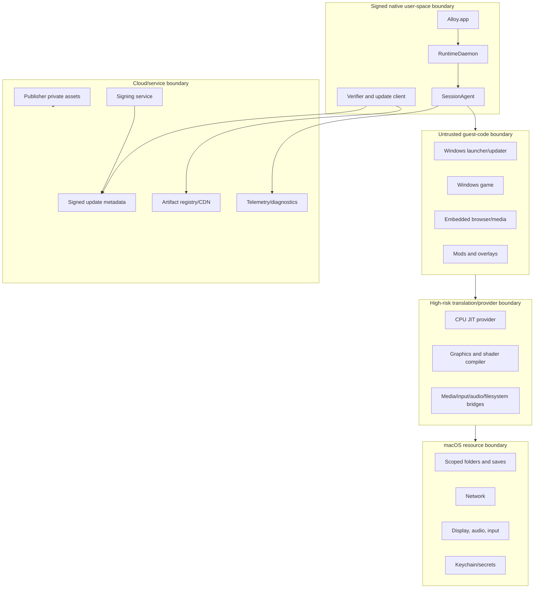

# Alloy Security, Privacy, and Threat Model

**Version:** 1.0  
**Status:** Proposed  
**Date:** 20 July 2026  
**Owners:** Product Security and Privacy  
**Related:** [Architecture](04_TECHNICAL_ARCHITECTURE.md) · [API contracts](06_API_AND_DATA_CONTRACTS.md) · [Operations](10_OBSERVABILITY_OPERATIONS_AND_RELEASE.md)

---

## 1. Security objective

Alloy intentionally executes untrusted Windows code, performs dynamic instruction and shader translation, parses complex guest-controlled data, integrates with storefront accounts, and distributes executable runtime components. Security is therefore a primary architecture constraint.

The product must:

- prevent guest code from becoming equivalent to unrestricted native host code;
- keep compatibility policy and runtime artifacts authentic and rollback-safe;
- minimize privileges and filesystem exposure;
- preserve W^X for dynamic code;
- protect storefront and publisher secrets;
- isolate Certified and Custom state;
- collect only the data necessary for operation and support;
- support rapid revocation and recovery;
- avoid creating undocumented anti-cheat or DRM bypass mechanisms.

## 2. Security assumptions

- The Windows game, launcher, updater, embedded browser, mods, and media content may be malicious or compromised.
- The user controls their Mac account and may intentionally modify files.
- The macOS kernel and platform security are trusted within the supported baseline, while OS vulnerabilities remain possible.
- The cloud control plane, build pipeline, signing service, artifact registry, CDN, and lab runners are security-critical.
- Storefront and publisher services can be unavailable or compromised outside Alloy control.
- Network transport can be observed, blocked, replayed, or modified.
- A local administrator can subvert many user-mode guarantees; Competitive Certified integrity is scoped and cannot claim protection against an owner with arbitrary kernel/hardware control.
- Signed game binaries are not automatically safe.
- Compatibility behavior is not permission to bypass protection policy.

## 3. Protected assets

| Asset | Required properties |
| --- | --- |
| User saves and settings | Integrity, availability, confidentiality where applicable |
| Storefront credentials/tokens | Confidentiality, limited use, revocability |
| Runtime/profile signing keys | Strong confidentiality, integrity, auditability |
| Runtime artifacts and metadata | Authenticity, integrity, rollback/freeze resistance |
| Native client/daemon/session agent | Code integrity and least privilege |
| JIT/code caches | Integrity, compatibility-key correctness, W^X |
| Publisher pre-release builds/symbols | Confidentiality, tenant isolation, retention control |
| Certification evidence | Integrity, provenance, non-repudiation |
| Diagnostics/telemetry | Data minimization, consent, access control |
| Anti-cheat integrity measurements | Authenticity, freshness, scope accuracy |
| Local grants/bookmarks | Confidentiality, purpose limitation |
| Build pipeline/SBOM/provenance | Integrity and auditability |

## 4. Trust boundaries



Each arrow is a validation and authorization boundary.

## 5. Threat actors

- malicious game/mod/launcher author;
- attacker compromising a legitimate update channel;
- local unprivileged process;
- local user attempting to forge Certified state;
- network attacker;
- compromised employee or service identity;
- malicious/compromised publisher tenant;
- supply-chain attacker targeting open-source dependencies or build systems;
- attacker exploiting shader/media/file parsers;
- fraud actor attempting to abuse telemetry, lab, CDN, or publisher resources;
- anti-cheat evader seeking to disguise modifications.

## 6. STRIDE threat register

| ID | Threat | Boundary | Primary controls | Residual risk |
| --- | --- | --- | --- | --- |
| T-01 | Spoofed runtime/profile | Update chain | Role-separated signed metadata, content digest, expiry, rollback/freeze protection | Signing key compromise |
| T-02 | Tampered local artifact | CAS/materialization | Verify before publish/use, immutable permissions, revalidation, quarantine | Local admin can tamper and force Custom/unknown |
| T-03 | Guest escapes filesystem scope | Guest→host files | Brokered drives, canonicalization, secure handles, no host-root mapping, traversal tests | Kernel/filesystem bugs |
| T-04 | Guest abuses daemon API | Guest→native IPC | No broad guest API, authenticated per-session channel, code-sign validation, capability tokens | Provider or agent bug |
| T-05 | Shader/media parser RCE | Guest→provider | Process isolation where practical, fuzzing, bounds, sandbox-like restrictions, least privilege | Complex parser zero-days |
| T-06 | JIT writable/executable pages | CPU/GFX JIT | W^X, supported JIT mappings, assertions, cache verification | Platform/JIT implementation flaw |
| T-07 | Credential leakage to logs | Storefront/diagnostics | Dedicated secret storage, redaction at source, secret scanning, restricted fields | Upstream launcher logging |
| T-08 | Save deletion/corruption | Runtime lifecycle | Separate volume, backups, transactional operations, no cascade deletion | Game itself corrupts save |
| T-09 | Certified state forged | Local integrity | Signed objects, measured component digests, separate Custom state, vendor freshness challenge | Local admin/kernel adversary |
| T-10 | Replay/freeze old vulnerable metadata | Client update | Version counters, expiry, timestamp/snapshot roles, revocation | Long offline periods |
| T-11 | Malicious profile grants access | Profile→runtime | Static policy checks, signer roles, least-privilege ceiling, review, no imperative scripts | Authorized signer mistake |
| T-12 | Publisher tenant data leak | Cloud | Tenant isolation, scoped storage/keys, audit, private runner pools if required | Cloud/admin compromise |
| T-13 | Telemetry re-identification | Client→cloud | Pseudonymous rotation, minimization, aggregation, retention, access policy | Rare event fingerprinting |
| T-14 | Diagnostic upload contains personal content | Client→cloud | Preview, manifest, redaction, explicit consent, encrypted upload | Upstream log embeds content |
| T-15 | CDN/resource exhaustion | Artifact delivery | Signed size, quotas, resume, rate limit, digest dedup | Large legitimate releases |
| T-16 | Malicious lab result | Lab→certification | Runner identity/attestation, signed result, artifact provenance, independent review | Physical runner compromise |
| T-17 | Anti-cheat bypass feature abused | Guest/runtime | No covert circumvention, vendor-approved hooks, integrity state, security/legal review | External misuse of open components |
| T-18 | Mods contaminate Certified state | Custom boundary | Separate volumes/generation, immutable certified layers, visible integrity state | Game content stored in mutable publisher path |
| T-19 | Symlink/race bypass | File broker | Handle-based authorization, no check-then-use path, canonicalization, race tests | Filesystem/platform edge cases |
| T-20 | Compromised dependency/build | Supply chain | Pin source/digest, hermetic builds, SBOM, provenance, review, reproducibility | Upstream compromise before review |

## 7. Native process architecture

### 7.1 Alloy.app

- user-facing;
- no broad privileged helper role;
- communicates with RuntimeDaemon through authenticated XPC;
- receives only scoped data;
- never parses untrusted shader/media formats.

### 7.2 RuntimeDaemon

- per-user LaunchAgent or equivalent;
- manages CAS, metadata, operations, generation references, and session creation;
- no root requirement;
- validates client identity;
- does not execute arbitrary profile scripts;
- stores secrets only through dedicated service/keychain references.

### 7.3 SessionAgent

- one per game session or tightly scoped session group;
- owns guest process lifecycle and policy;
- has only session grants;
- invalidates session tokens on exit;
- terminates children and releases resources reliably.

### 7.4 Compiler/parser helpers

High-risk shader/media processing should be isolated where performance permits:

- separate process;
- minimal file/network access;
- bounded memory/CPU;
- explicit IPC schema;
- crash containment;
- input digest and result provenance;
- no storefront credentials.

## 8. Filesystem security

### 8.1 Certified drive model

Default mappings:

- runtime: read-only;
- game payload: read or read-write only as storefront requires;
- saves: read-write scoped;
- settings: read-write scoped;
- cache/temp: read-write disposable;
- user-granted folder: explicit.

No default host-root drive exists.

### 8.2 Authorization

- represent access with secure host handles/bookmarks;
- resolve/canonicalize components without following untrusted path escapes;
- validate final target and each sensitive operation;
- protect against symlink, hard-link, mount, Unicode normalization, case, and rename races;
- translate Windows sharing and path semantics without weakening host authorization;
- distinguish read-only at broker level, not only guest convention.

### 8.3 Save protection

- runtime delete cannot include save root;
- backup before migrations/destructive repair;
- preserve both sides of cloud conflict;
- journal metadata updates;
- optionally checksum critical save fixtures;
- display exact destructive scope to user.

## 9. Network security

Per-process policy supports:

- allow;
- deny;
- publisher/storefront-only allowlist where technically/contractually suitable;
- diagnostic upload only by native client;
- Custom Mode policy.

Considerations:

- hard-coded IP allowlists are brittle; use signed domain/service metadata where possible;
- TLS remains end-to-end in the guest application unless a reviewed integration requires otherwise;
- do not silently intercept credentials;
- log connection metadata only at privacy-approved granularity;
- distinguish network denial from upstream outage;
- anti-cheat/vendor endpoints follow approved scope.

## 10. JIT and executable memory

### 10.1 Invariants

- no production page simultaneously writable and executable;
- generated code transitions through approved JIT APIs/mappings;
- write access is thread-scoped where supported;
- cache contents are data until verified and mapped executable;
- code cache key includes provider/ABI/host features/source digest;
- self-modifying guest code invalidates translated blocks correctly;
- diagnostics never dump executable memory by default.

### 10.2 Entitlements and signing

- use minimum required macOS dynamic-code/JIT entitlement;
- document why each entitlement exists;
- production Hardened Runtime remains enabled;
- helper executables/frameworks are signed consistently;
- notarization and runtime validation are release gates.

## 11. Update and supply-chain security

Adopt a TUF-style role model:

- **root:** offline, rarely used;
- **targets:** delegates by artifact/profile class;
- **snapshot:** binds metadata versions;
- **timestamp:** freshness;
- **emergency/revocation:** narrow operational role as designed.

Requirements:

- threshold/offline protection for root and critical roles;
- online signing isolated from general application services;
- hardware-backed keys where practical;
- short-lived metadata appropriate to role;
- rollback and freeze protection;
- key rotation rehearsal;
- artifact digest/size/media type;
- SBOM and source/build provenance;
- separate development, lab, canary, and stable trust scopes;
- audit trails;
- emergency target/profile revocation;
- safe behavior during metadata outage or expiry.

## 12. Profile security

Profiles are powerful configuration and therefore code-adjacent.

Stable profiles must not:

- run arbitrary scripts;
- download arbitrary URLs;
- disable verification;
- grant host-root access;
- inject unrestricted native libraries;
- alter system-wide settings;
- claim anti-cheat approval without vendor evidence;
- hide Custom modifications;
- expose secrets.

Static policy analysis enforces ceilings independent of profile signer. High-risk permissions require additional signer role or are unavailable in Certified Mode.

## 13. Certified versus Custom integrity

### Certified Mode

- signed profile/runtime;
- verified component digests;
- policy locked;
- modification state known;
- optional integrity measurement;
- eligible for strongest support and vendor-approved paths.

### Custom Mode

- separate local state;
- user changes permitted within host safety boundaries;
- clearly labeled;
- not eligible for Certified claims;
- anti-cheat/vendor behavior follows policy;
- can reset to Certified without save loss.

The system must not imply that Custom Mode is insecure to the host by definition; it is simply not the same controlled compatibility state.

## 14. Anti-cheat and DRM

### 14.1 Hard boundary

Alloy does not load Windows kernel drivers or covertly bypass anti-cheat/DRM.

### 14.2 Approved enablement

A vendor integration may use:

- documented runtime identity;
- signed provider/profile/component measurements;
- freshness challenge;
- declared mod/custom state;
- protected IPC;
- approved user-mode compatibility path;
- vendor-specific test and revocation.

### 14.3 Claims

- no “universal anti-cheat support”;
- no competitive badge without signed scope;
- no guarantee against publisher policy changes;
- a vendor rejection is surfaced clearly;
- security research involving protection systems receives legal and responsible-disclosure review.

## 15. Secret management

Secret types:

- user/storefront tokens;
- publisher test accounts;
- signing keys;
- service credentials;
- diagnostic encryption keys;
- lab device credentials.

Controls:

- Keychain or dedicated secret manager;
- least-privilege workload access;
- short-lived credentials;
- no secrets in profile or general database;
- no command-line secrets when avoidable;
- redaction at creation;
- rotation and revocation;
- access audit;
- synthetic test credentials in fixtures.

## 16. Publisher and lab isolation

- tenant-scoped object namespaces;
- per-tenant encryption/access policy;
- no cross-tenant query by default;
- private builds excluded from public catalog;
- runner job receives only required build, symbols, account reference, and scenario;
- post-job cleanup verified;
- symbols are never sent to clients;
- employee access requires role and audit;
- retention and deletion are contract-driven;
- optional dedicated hardware for high-sensitivity partners.

## 17. Telemetry privacy

### 17.1 Data minimization

Essential telemetry may include:

- product/component versions;
- signed metadata result;
- stable error code;
- coarse host capability class;
- game/profile identifiers;
- severe crash/device-loss/rollback outcome;
- pseudonymous rotating client identifier.

It does not require:

- save content;
- chat/voice;
- gameplay video;
- screenshots;
- full home paths;
- credentials;
- unrelated process/file inventory.

### 17.2 Consent levels

- **Off:** local operation/diagnostics only, except narrowly necessary security/update requests defined by policy.
- **Essential:** update security and coarse product health.
- **Diagnostic:** sampled detailed runtime metrics/events.
- **Lab:** internal/partner systems only, high-detail traces.

The UI explains each level. Changes are revocable and do not disable local support tools.

### 17.3 Retention

Each event field has:

- purpose;
- legal basis/consent;
- retention;
- access role;
- deletion/aggregation;
- export applicability.

Raw high-detail diagnostics have short default retention. Aggregated non-identifying metrics may have longer retention.

## 18. Diagnostic bundle privacy

Before export/upload:

- generate locally;
- enumerate files and data classes;
- redact usernames, home prefixes, tokens, cookies, chat, URLs/query strings where sensitive;
- truncate/bound logs;
- exclude save/game content;
- encrypt in transit and at rest;
- display retention/support case link;
- allow local-only export;
- allow user deletion where applicable.

Automated scanners seed secrets and personal paths to verify redaction.

## 19. Security logging

Security events include:

- signature verification failure;
- revoked/expired/replayed metadata;
- artifact digest mismatch;
- profile policy violation;
- unauthorized XPC/IPC attempt;
- path/grant denial;
- W^X assertion failure;
- unexpected provider/library load;
- Certified/Custom state transition;
- signing/release privileged action;
- publisher asset access;
- secret access;
- anti-cheat integrity result.

Logs themselves are protected and minimized. Sensitive raw values are not required to prove an event occurred.

## 20. Security development lifecycle

Every subsystem follows:

1. architecture/threat-model review;
2. secure coding requirements;
3. dependency/license/provenance review;
4. static analysis;
5. unit/property tests;
6. fuzzing for untrusted parsers;
7. security code review;
8. penetration/adversarial test;
9. release checklist;
10. monitoring and response ownership.

High-risk changes include JIT, loader, signing, filesystem broker, profile policy, shader/media parser, secret handling, and anti-cheat integration.

## 21. Vulnerability management

- inventory all components via SBOM;
- monitor upstream advisories;
- triage by exploitability and shipped exposure;
- define emergency patch/revocation objective;
- coordinate disclosure with upstream/vendors;
- preserve safe rollback;
- communicate player impact without exposing exploit details prematurely;
- maintain security contact and reporting policy;
- reward external research when program maturity permits.

## 22. Incident response

Incident classes:

- signing key compromise;
- malicious/tampered artifact;
- remote code execution;
- credential exposure;
- save deletion/corruption;
- publisher private-build exposure;
- telemetry privacy breach;
- anti-cheat integrity failure;
- severe platform regression.

Response phases:

```text
Detect → Contain → Revoke/rollback → Preserve evidence
→ Notify required parties → Remediate → Recover → Post-incident review
```

The organization rehearses:

- key rotation;
- artifact/profile revocation;
- emergency client update;
- safe offline behavior;
- publisher notification;
- user notification and save recovery;
- forensic access controls.

## 23. Security release gates

MVP:

- no root daemon/kernel extension;
- signed/notarized native code;
- signed profile/artifact verification;
- no host-root mapping;
- filesystem traversal suite;
- W^X assertions;
- secret management and scans;
- diagnostic redaction/preview;
- dependency inventory/license review;
- no unresolved critical finding.

Beta:

- role-separated secure update metadata;
- fuzzing coverage for guest parsers;
- Custom/Certified isolation;
- revocation/key-rotation drill;
- incident playbooks;
- privacy retention/access controls;
- publisher tenant isolation if portal exists.

GA:

- mature provenance/SBOM/reproducibility;
- external penetration test;
- red-team exercise;
- Competitive integrity review where offered;
- disaster recovery for signing/control plane;
- security response SLOs;
- legal/privacy launch review by region.

## 24. Residual risks

Even with these controls:

- a game runs with the user’s authority and may access its granted files/network;
- parser/JIT vulnerabilities are possible;
- local administrators can tamper with user-mode software;
- anti-cheat vendors can change policy;
- storefront launchers may collect/log data outside Alloy control;
- Apple security/platform behavior may change;
- compatibility sometimes requires native libraries with their own risk;
- no system can guarantee save integrity against a malicious or defective game itself.

The product must describe these boundaries accurately.

## 25. Open security decisions

- exact macOS sandbox/hardened-runtime process model;
- compiler helper isolation mechanism and performance cost;
- update metadata framework/implementation;
- device integrity/attestation options for vendor integrations;
- local database encryption scope;
- pseudonymous identifier rotation period;
- diagnostic encryption and support-access workflow;
- acceptable offline metadata expiry behavior;
- bug bounty timing;
- private publisher runner isolation tiers;
- policy for third-party overlays, injectors, and accessibility tools;
- regional consent and child-account requirements.
