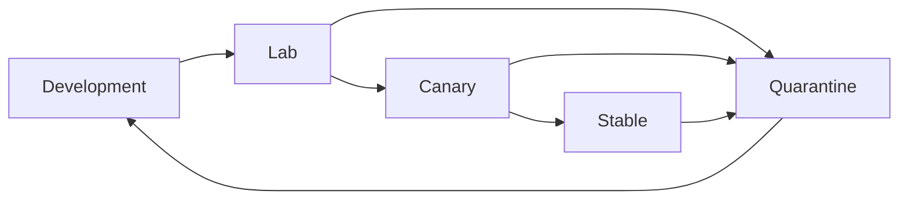

# Alloy Observability, Operations, and Release Plan

**Version:** 1.0  
**Status:** Proposed  
**Date:** 20 July 2026  
**Owners:** SRE, Release Engineering, Runtime Operations, Support  
**Related:** [Architecture](04_TECHNICAL_ARCHITECTURE.md) · [Security](09_SECURITY_PRIVACY_THREAT_MODEL.md) · [Test strategy](08_TEST_AND_QUALITY_STRATEGY.md)

---

## 1. Operational objective

Alloy must remain dependable despite constant external change. The operating model is built around:

- local launch resilience;
- precise component/session identity;
- independent profile and runtime release rings;
- continuous certification;
- automatic containment and rollback;
- privacy-preserving diagnostics;
- actionable ownership by subsystem;
- secure, auditable promotion.

The installed game must not become unusable merely because the Alloy cloud is temporarily unavailable.

## 2. Service map

### Local

- Alloy.app;
- RuntimeDaemon;
- SessionAgent;
- content-addressed store;
- local metadata database;
- runtime/profile verifier;
- Wine and execution providers;
- graphics and native-service providers;
- local diagnostics and operation journal.

### Cloud

- API gateway;
- catalog and build metadata;
- profile service;
- artifact registry/CDN;
- signing/release service;
- certification orchestrator;
- lab scheduler/runners;
- evidence store;
- telemetry/crash ingest;
- analysis and bisection;
- publisher portal;
- support tools.

## 3. Availability principle

The cloud participates in:

- discovering new metadata;
- downloading verified components;
- receiving optional health/diagnostics;
- certification and release.

The cloud is not required to:

- validate already cached signatures within their accepted offline policy;
- materialize already installed objects;
- create a local LaunchSpecification from cached valid metadata;
- start a locally installed game;
- access local saves.

Third-party storefront authentication may still require network access.

## 4. Environments

| Environment | Purpose | Trust/data policy |
| --- | --- | --- |
| Developer | Local iteration | Development keys, synthetic data |
| CI | Automated build/test | No production secrets |
| Lab | Compatibility/certification | Controlled game accounts/builds, high diagnostics |
| Staging | Cloud integration | Production-like, synthetic/redacted data |
| Canary production | Restricted real clients | Production trust, small cohort |
| Stable production | General clients | Production trust and SLOs |
| Quarantine | Withdrawn artifacts/profiles | No new selection; retained for forensics/rollback policy |
| Publisher private | Confidential partner work | Tenant-isolated access and retention |

Production signing must not be available in developer/CI environments.

## 5. Observability model

Every event is correlated by:

```text
request_id
operation_id
session_id
game_id / build_id
host_class_id
runtime_generation_id
profile_id / revision
process_policy_id
provider build digests
test_plan / scenario / runner
release ring
```

### 5.1 Signals

**Logs:** structured causal events, bounded and redacted.

**Metrics:** service health, client outcomes, frame-time/performance summaries, operation durations, artifact/cache behavior, security and release health.

**Traces:** control-plane requests, local operation spans, selected lab/runtime traces.

**Artifacts:** crashes, hangs, shader/compiler diagnostics, visual comparisons, benchmark traces, support bundles.

### 5.2 Golden signals

Cloud services:

- request rate;
- error rate;
- latency;
- saturation;
- queue age;
- data freshness.

Runtime/product:

- certified launch success;
- first-frame success;
- crash-free sessions;
- device loss;
- severe memory pressure;
- rollback rate/success;
- save lifecycle failures;
- certification freshness;
- artifact verification failure;
- unknown process rate;
- support-bundle reproducibility.

## 6. Proposed SLOs

These are initial operational objectives and must be revised from measured baselines.

| Capability | Proposed SLO |
| --- | --- |
| Installed certified local orchestration | 99.9% monthly, excluding third-party/game availability |
| Compatibility metadata API | 99.95% monthly |
| Verified artifact download | 99.95% successful completion with retries/resume |
| Artifact integrity | 100% accepted object digest correctness |
| Telemetry ingest | 99.9%; gameplay never depends on it |
| Signing correctness | Zero unauthorized/incorrect stable signatures |
| Certification job dispatch | 99% within scheduled queue objective by priority |
| Canary severe-regression detection | Within configured sample/time threshold |
| Automatic rollback | 99.9% success without save impact |
| Save preservation by runtime lifecycle | Zero known deletion |
| Diagnostic symbolication | 95% supported native frames/known modules when symbols exist |
| Revocation publication | Security-severity-dependent, measured from authorization |

## 7. Service-level indicators

### Client/runtime

```text
launch_success =
  sessions reaching configured healthy gameplay milestone
  / eligible certified launch attempts
```

Exclude only explicitly classified third-party outages; exclusions are audited.

```text
rollback_success =
  rollback operations that activate and launch the retained healthy generation
  / attempted automatic rollbacks
```

```text
save_safety =
  lifecycle operations without runtime-attributable save loss/corruption
  / lifecycle operations
```

### Control plane

- availability by endpoint and tenant;
- p50/p95/p99 latency;
- stale catalog/profile age;
- artifact CDN success and retry bytes;
- event drop/backlog;
- certification queue latency;
- evidence processing latency;
- signing/release lead time.

## 8. Alerts and ownership

Alerts must identify owner and player impact.

### Page immediately

- unauthorized signing or metadata integrity failure;
- widespread certified launch failure;
- runtime-caused save loss/corruption;
- critical security exploit;
- stable artifact digest mismatch;
- rollback failure at scale;
- publisher private-data exposure;
- control-plane state that can distribute unsafe metadata.

### Urgent, not necessarily page

- certification freshness backlog for top catalog;
- elevated crash/device-loss for one title;
- artifact CDN degradation with working retries;
- telemetry lag;
- lab runner capacity/health;
- symbolication degradation;
- cache/storage regression.

### Ticket/report

- isolated unsupported title failure;
- non-material performance drift;
- flaky scenario;
- low-rate custom-mode problem.

## 9. Release units

Independently releasable:

- native client;
- RuntimeDaemon/SessionAgent;
- Wine generation;
- CPU provider;
- graphics provider;
- shader compiler;
- native service provider;
- game profile;
- capability/feature mask;
- test plan;
- catalog metadata;
- publisher portal/cloud service.

Independent units avoid a monolithic global runtime upgrade.

## 10. Release rings



### Development

Unsigned or development-signed, validation enabled, no user claim.

### Lab

Signed for lab, exact automated matrix, high diagnostics.

### Canary

Production-signed, restricted cohort/title/host selectors, rollback retained.

### Stable

Eligible certified clients.

### Quarantine

Not selected for new launches. Retention depends on security and rollback needs.

## 11. Promotion policy

A release candidate includes:

- immutable artifact digests;
- source/build provenance and SBOM;
- compatibility impact set;
- required test/evidence set;
- security/license review status;
- rollback target;
- release notes;
- canary selector and thresholds;
- owner and incident contact.

Promotion is automated only after required approvals/evidence. High-risk components require separation between author, approver, and signer.

## 12. Client update strategy

The native client and daemon update:

- outside active game sessions;
- atomically;
- with compatibility checks for installed generations;
- with last-known-good rollback where practical;
- without deleting old provider/runtime objects until references are safe;
- under notarized/signed distribution;
- with explicit minimum client version only when metadata semantics require it.

A new client may support old installed generations through provider side-by-side compatibility.

## 13. Runtime/profile rollout

The resolver selects by exact title/host and release eligibility.

Canary dimensions may include:

- title;
- host GPU/memory class;
- macOS build;
- geography only where legally/operationally necessary;
- opt-in beta cohort;
- percentage hash of pseudonymous device ID.

Profile and provider rollouts can be decoupled. A profile can pin the previous provider while another title canaries a new provider.

## 14. Candidate health window

Local signals:

- root/game process start;
- first expected window/frame;
- no early crash/device loss;
- no severe memory pressure;
- save path available;
- clean or acceptable exit.

Aggregate signals compare candidate and control:

- launch success;
- crash-free duration;
- device loss;
- severe stutter/memory events;
- rollback;
- support issue rate.

A local severe failure can immediately mark the candidate unhealthy for that game without waiting for cloud aggregate.

## 15. Automatic rollback

Triggers:

- candidate fails fatal local health check;
- signed revocation/quarantine;
- severe aggregate threshold;
- component initialization failure;
- corrupt/incompatible cache after safe rebuild;
- known OS/host deny rule.

Rollback steps:

1. stop new candidate selection;
2. preserve session diagnostics;
3. atomically activate retained generation;
4. invalidate candidate-derived caches if needed;
5. keep saves/settings;
6. communicate in user language;
7. emit audit/health event;
8. schedule bisection.

Rollback does not downgrade a storefront game build unless a separate approved mechanism exists.

## 16. Incident management

### Severity

| Severity | Example | Coordination |
| --- | --- | --- |
| SEV-0 | Active compromise, credential/private-build exposure, save loss at scale | Executive + security incident command |
| SEV-1 | Top catalog widespread unplayable regression, failed rollback | Incident commander + subsystem leads |
| SEV-2 | Major title-specific degradation, service outage with workaround | Owning team + product/support |
| SEV-3 | Limited issue or backlog | Normal team process |

### Lifecycle

```text
Declare → Assign incident commander → Contain
→ Establish player-safe state → Diagnose → Remediate
→ Verify → Communicate → Review/actions
```

### Required artifacts

- timeline;
- affected exact identities;
- player impact and data impact;
- containment/rollback;
- causal change;
- why detection/gates failed;
- corrective actions with owners/dates;
- public/partner communication decision.

## 17. Security response operations

Maintain runbooks for:

- signing-key compromise;
- malicious artifact/profile;
- client/daemon vulnerability;
- publisher secret/private-build exposure;
- telemetry breach;
- anti-cheat/vendor revocation;
- dependency vulnerability.

The release system supports narrow target revocation so one title/provider does not unnecessarily disable unrelated offline games.

## 18. Disaster recovery

### Data classes

| Data | Recovery objective |
| --- | --- |
| Signed metadata source/audit | Highest durability; multi-region/offline backup |
| Artifact registry | Replicated; rebuild from verified release store where possible |
| Profiles/source | Source-control and release archive |
| Certification evidence | Durable and immutable by digest |
| Telemetry raw | Loss-tolerant within declared window |
| Aggregates | Rebuildable from retained raw data |
| Publisher private assets | Contract-specific encrypted backup |
| Signing keys | Offline recovery/rotation; never ordinary backup only |
| Local saves | User/storefront responsibility plus optional local backup; never cloud-ingested by default |

Perform recovery drills, not just backup checks.

## 19. Capacity planning

### Compatibility lab

Plan by:

```text
number of supported titles
× update frequency
× required scenarios
× host classes
× repetitions
× cold/warm/endurance duration
```

Use risk-based scheduling:

- top active catalog;
- recent changes;
- high-risk provider components;
- new OS/GPU;
- severe field signals;
- publisher deadlines.

### Cloud

Budget:

- artifact storage/CDN;
- telemetry event volume;
- crash/diagnostic artifacts;
- evidence images/traces;
- build/symbol retention;
- analysis compute;
- bisection job fan-out.

Every service has quotas and backpressure.

## 20. Cost controls

- content-addressed artifact deduplication;
- client delta/range downloads where verified;
- telemetry sampling by event class;
- short raw diagnostic retention;
- tiered evidence storage;
- aggregate before long retention;
- lab scenario impact selection rather than full matrix for every change;
- per-tenant publisher quotas;
- bisection compute budget;
- local cache quotas;
- unused object garbage collection.

Cost reduction cannot weaken signature verification or save safety.

## 21. Support operations

### Support intake

Collect:

- support code;
- game/build;
- host class;
- session/operation ID;
- user description;
- optional diagnostic bundle.

### Triage taxonomy

- game/launcher update;
- storefront/account;
- profile resolution;
- runtime lifecycle/storage;
- Wine/Win32;
- CPU translation;
- graphics/shader/presentation;
- input/audio/media;
- permissions/filesystem;
- network;
- anti-cheat/DRM unsupported;
- macOS/driver/platform;
- Custom Mode.

### Escalation

Support can:

- identify known issue;
- recommend safe remediation;
- trigger/offer rollback;
- request consented bundle;
- link exact session to engineering cluster;
- never ask for broad home-directory archives or credentials.

## 22. Operational dashboards

### Executive/product

- Certified Successful Play Hours;
- active certified catalog;
- top title health;
- severe regression/MTTR;
- save/security incidents;
- support volume;
- publisher pipeline.

### Runtime engineering

- launch phases and failure codes;
- provider init failures;
- crash/hang/device loss;
- CPU translation cost;
- shader/PSO stalls;
- memory pressure;
- synchronization waits;
- cache behavior.

### Compatibility lab

- queue age;
- matrix coverage;
- stale certifications;
- flaky scenarios;
- Windows/Mac comparison failures;
- bisection success;
- runner health.

### Release/security

- artifacts by ring;
- provenance/SBOM status;
- signatures;
- revocations;
- canary health;
- key age/rotation;
- privileged audit events.

## 23. Runbook inventory

Required before beta:

- client install/update failure;
- corrupt CAS/object;
- stuck operation;
- permission/grant failure;
- game update invalidation;
- launcher update;
- profile conflict;
- provider initialization failure;
- shader compiler crash;
- graphics device loss;
- memory pressure;
- automatic rollback;
- save backup/restore/conflict;
- control-plane outage;
- artifact CDN failure;
- signing metadata failure;
- telemetry backlog;
- publisher private-build incident;
- anti-cheat rejection;
- macOS release regression.

## 24. Change management

Every production change has:

- owner;
- risk level;
- impact set;
- test evidence;
- release ring;
- rollback;
- observability;
- customer/partner communication;
- security/privacy review when applicable.

Emergency changes still produce a retrospective record.

## 25. Operational readiness review

A new service/provider/title feature must answer:

- What fails?
- How is failure detected?
- Who is paged?
- Can the player still launch a safe generation?
- Is save data protected?
- What data is logged?
- What is the rollback?
- What is the capacity limit?
- What is the dependency outage behavior?
- What security key/secret/permission is involved?
- How is it tested?
- What runbook exists?

## 26. Initial operational deliverables

Before MVP:

- stable error/correlation model;
- operation journal and recovery;
- local health and rollback;
- artifact/profile verification dashboard;
- release manifest and SBOM pipeline;
- lab scheduler and evidence store;
- crash/diagnostic ingest with consent;
- top title health dashboard;
- incident severity/runbooks;
- support taxonomy;
- signing/revocation drill.

Before GA:

- multi-region critical metadata/artifact strategy;
- mature bisection and impact graph;
- publisher tenant operations;
- external security response process;
- cost governance;
- disaster recovery exercise;
- measured SLOs and error budgets.
