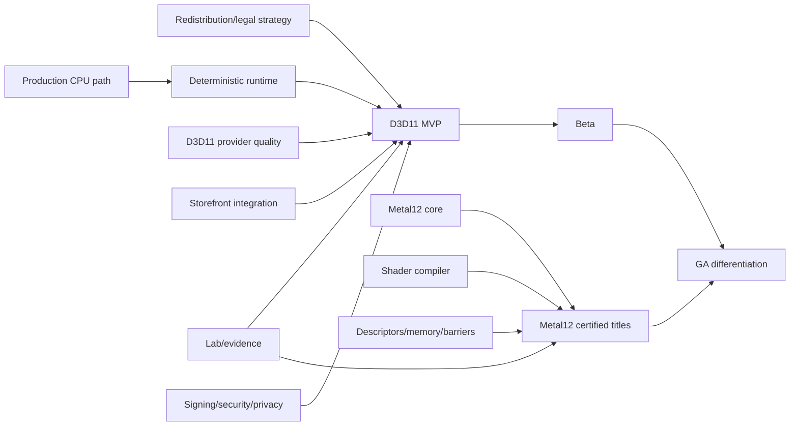

# Alloy Roadmap, Team, and Delivery Plan

**Version:** 1.0  
**Status:** Planning baseline  
**Date:** 20 July 2026  
**Owners:** CEO, CTO, Head of Product, Program Management  
**Related:** [PRD](02_PRD.md) · [Architecture](04_TECHNICAL_ARCHITECTURE.md) · [Open questions and spikes](16_OPEN_QUESTIONS_AND_TECHNICAL_SPIKES.md)

---

## 1. Planning approach

This roadmap is a sequencing and staffing baseline, not a promise of calendar delivery. The unknowns in CPU translation, Metal12, redistribution/licensing, storefront behavior, and game-specific compatibility are large enough that milestones must have evidence-based exit criteria.

The plan assumes:

- Apple-silicon-only;
- a thin Wine fork;
- a FEX/ARM64EC-oriented production CPU path;
- a D3D10/11 Metal-native starting point;
- a lab/reference-only bootstrap D3D12 path while Metal12 matures (commercial redistribution is not available; SPIKE-LEGAL-001);
- one initial storefront;
- a curated catalog;
- physical Mac and Windows lab capacity;
- simultaneous product, runtime, graphics, and control-plane work.

## 2. Program outcomes

The program is complete only when it produces all three:

1. **A product:** native library, install, launch, status, diagnostics, storage, rollback, and support.
2. **A runtime platform:** deterministic generations, per-process policy, CPU/Wine/graphics/native services.
3. **A compatibility operation:** lab, evidence, certification, release rings, update detection, and incident response.

A graphics demo without product/runtime operations is not an MVP. A polished client using an opaque global runtime is not the intended company.

## 3. Workstreams

| Workstream | Scope |
| --- | --- |
| Product and client | Native macOS app, UX, storage, permissions, diagnostics, Custom Mode |
| Runtime platform | Daemon, session agent, CAS, generations, policy, saves, lifecycle |
| Wine and Windows APIs | Thin fork, ARM64 native model, loader hooks, Win32 correctness |
| CPU translation | FEX macOS adaptation, ARM64EC, exceptions, JIT, caches, profiling |
| D3D10/11 | DXMT-derived provider, conformance, performance, game fixes |
| Metal12 | D3D12 front end, descriptors, memory, barriers, queues, shaders, PSO, presentation |
| Native services | Input, audio, media, filesystem, networking, display, storage |
| Compatibility lab | Mac/Windows runners, scenarios, evidence, comparison, bisection |
| Control plane | Catalog, profiles, artifacts, release, telemetry, publisher portal |
| Security/release | Signing, provenance, threat model, privacy, incident, notarization |
| Storefront/publisher | Discovery, handoff and build-identity adapters (installation, sign-in and updates stay in the storefront's own client — doc 18 §9), partner integration, anti-cheat |
| Quality/program | Test strategy, release gates, requirements/ADR governance |

## 4. Phase 0 — Foundational validation

**Indicative duration:** 8–12 weeks  
**Indicative team:** 8–12 senior engineers plus product/design/security/legal support

### Objectives

Reduce existential risk before scaling the team.

### Deliverables

- native ARM64 host process launches x64 Windows test binaries through the selected bootstrap and candidate production execution paths;
- Wine ARM64EC/WoW64 architecture proof;
- D3D11 game scene through Metal-native provider;
- D3D12 bootstrap reference scene (lab/reference-only) and Metal12 micro-prototypes;
- per-process launcher/game backend split proof;
- content-addressed runtime and atomic reference prototype;
- first storefront install/fingerprint proof;
- save separation proof;
- Windows/Mac deterministic test-runner proof;
- legal memo on Wine/FEX/DXMT/GPTK/codec/redistributable/storefront constraints;
- game shortlist and test-scenario feasibility;
- threat-model draft.

### Exit criteria

- no known fundamental macOS JIT/entitlement blocker;
- CPU path runs representative x64 Windows code with correct exceptions and acceptable initial performance;
- D3D11 path renders at least two representative games/scenes;
- per-process policy is demonstrably early enough to select different graphics providers;
- transactional runtime prototype survives injected termination;
- one exact game build can be fingerprinted and reproduced in lab;
- leadership accepts the bootstrap D3D12 lab/reference-only scope and Metal12's resulting strategic weight (SPIKE-LEGAL-001);
- Metal12 descriptor/barrier/shader spikes show a credible path;
- remaining existential risks have owners and deadlines.

### Kill/review gate

Do not hire a large execution team until this phase passes. If CPU, distribution, or Metal viability is weak, narrow or pivot.

## 5. Phase 1 — Deterministic runtime foundation

**Indicative duration:** months 3–8  
**Indicative team:** 18–28

### Objectives

Build the reusable local platform and internal developer experience.

### Deliverables

- Alloy.app skeleton and local XPC API;
- RuntimeDaemon and operation journal;
- CAS, verified artifact download, layer format, materialization;
- save/settings/cache/scratch volumes;
- signed development profile and runtime manifest;
- profile compiler and process policy snapshot;
- Wine loader/session-agent integration;
- first CPU provider integration;
- D3D11 provider packaging;
- native input/audio/filesystem/windowing minimum;
- structured events, crash capture, diagnostic bundle;
- lab scheduler, Mac/Windows runner, evidence schema;
- secure build/sign/notarize pipeline;
- 3–5 internal game scenarios.

### Exit criteria

- exact LaunchSpecification reproducible on another machine;
- launcher and game use different provider policies in one session;
- runtime update/rollback is atomic and save-safe;
- client restart/daemon crash/power-interruption fault suite passes;
- no host-root mapping or root helper;
- first/second launch, save/load, and clean exit automated for internal titles;
- support bundle identifies exact state and seeded failure.

## 6. Phase 2 — D3D11 curated MVP

**Indicative duration:** months 7–13  
**Indicative team:** 30–45

### Objectives

Ship a controlled external developer preview around reliability, not breadth.

### Deliverables

- production-quality first storefront adapter;
- 8–12 certified or clearly tiered titles;
- D3D10/11 conformance subset and performance work;
- production CPU provider on supported title paths;
- essential media and embedded-browser behavior;
- compatibility status and limitations UI;
- install/storage/permissions/rollback UX;
- signed metadata and artifact chain;
- privacy controls and support upload;
- candidate health window;
- compatibility update detector;
- support playbooks.

### Exit criteria

- all P0/MVP PRD requirements pass;
- defined launch-success/crash-free targets in controlled cohort;
- zero runtime-caused save-loss issue;
- update and rollback demonstrated with real title/runtime regression;
- external users complete one-click tasks without compatibility help;
- legal/security launch review passes;
- no title labeled above its evidence.

## 7. Phase 3 — Private beta and compatibility operations

**Indicative duration:** months 12–18  
**Indicative team:** 45–65

### Objectives

Prove that the organization can maintain a growing catalog through upstream change.

### Deliverables

- 25–40 quality-gated titles;
- second storefront;
- expanded Mac host matrix;
- continuous impact scheduling;
- visual and API differential comparison;
- performance/endurance gates;
- automatic rollback and quarantine;
- Custom Mode isolation;
- mature controller/audio/media/HDR paths;
- regression clustering and early bisection;
- beta accessibility/localization;
- measured SLOs and cost model.

### Exit criteria

- game/launcher updates automatically invalidate and schedule testing;
- top-catalog severe regression mitigation meets target repeatedly;
- canary catches seeded and real regressions;
- support reproduction rate reaches planned threshold;
- lab throughput and cost support catalog plan;
- Custom Mode cannot contaminate Certified state.

## 8. Phase 4 — Metal12 vertical slices

**Indicative duration:** begins in Phase 0; title certification months 12–24+  
**Indicative dedicated team:** 10–18 graphics/compiler engineers, scaling with scope

Metal12 is a continuous strategic workstream rather than a late phase.

### Vertical slice A — Core compute/render

- D3D12 device/adapter;
- command lists/queues/fences;
- committed resources;
- basic root signatures/descriptors;
- DXIL ingestion and shader lowering;
- basic PSO;
- swap chain/presentation;
- validation and captures.

**Exit:** selected SDK samples and simple games/scenes render correctly.

### Vertical slice B — Production binding/memory

- descriptor paging and in-flight safety;
- placed resources/heaps/aliasing;
- virtual GPU addresses;
- resource states/barriers;
- unified-memory budget/residency;
- upload/readback;
- cache persistence.

**Exit:** representative modern engine workloads run without corruption or unbounded growth.

### Vertical slice C — Performance and compatibility

- asynchronous PSO compile and binary archives;
- prewarming;
- queue overlap and barrier optimization;
- advanced shader semantics;
- HDR/VRR/frame pacing;
- device loss;
- title feature masks;
- game trace/replay.

**Exit:** first 3–5 D3D12 titles reach Playable/Certified gates.

### Vertical slice D — Advanced features

- sparse/tiled resources;
- mesh shaders;
- ray tracing where host capability and business value justify it;
- VRS or emulation policy;
- MetalFX/title adapters;
- DirectStorage-oriented path.

**Exit:** capability-specific certification, not blanket API claims.

## 9. Phase 5 — Public beta

**Indicative duration:** months 18–26  
**Indicative team:** 65–90

### Objectives

Validate customer scale, platform trust, and breadth without relaxing quality.

### Deliverables

- 75–150 tiered supported titles, based on evidence and team capacity;
- stable update/release rings;
- production telemetry/privacy;
- stronger automated bisection;
- self-service diagnostics;
- mature storage/cache management;
- two or more storefront integrations;
- publisher pilot portal;
- early Metal12 production titles;
- customer support operations;
- subscription/entitlement implementation if validated.

### Exit criteria

- measured user retention/willingness to pay;
- control-plane and lab SLOs;
- predictable support burden;
- severe-regression escape rate within budget;
- stable cost per active certified title/user;
- no unresolved critical security/privacy issue;
- Metal12 timeline supports GA differentiation.

## 10. Phase 6 — General availability

**Indicative duration:** months 24–36+, evidence-dependent  
**Indicative team:** 80–120 for a broad commercial platform; a narrower catalog can launch with less

### Required outcomes

- declared Metal12 D3D12 subset and certified catalog;
- mature D3D11 path;
- exact public support matrix;
- production SLOs, rollback, incident, security, and privacy;
- publisher pre-release workflow;
- secure update/provenance;
- support organization;
- reliable future macOS/GPU intake;
- defensible commercial metrics.

Competitive Certified multiplayer remains title/vendor-specific and may follow GA.

## 11. Critical path

The two longest technical paths are CPU execution and Metal12. The longest operational path is the compatibility lab/evidence system. All start immediately.

## 12. Team topology

### Executive/product

- CEO / business development;
- CTO / chief architect;
- Head of Product;
- Head of Compatibility/Quality;
- Head of Publisher Partnerships;
- security/privacy leadership;
- program management.

### Engineering teams

#### Runtime Platform

6–10 engineers at MVP scale:

- daemon/session lifecycle;
- CAS/materialization;
- policy engine;
- saves/settings/cache;
- local IPC and diagnostics.

#### Wine/Windows Compatibility

4–8:

- Wine fork/upstream;
- loader/wineserver;
- Win32 APIs;
- storefront/dependency behavior.

#### CPU Translation

5–10:

- FEX/macOS adaptation;
- ARM64EC;
- JIT/memory/exceptions;
- cache/performance.

#### D3D10/11

4–7:

- provider integration;
- D3D11 correctness;
- graphics debugging/performance.

#### Metal12

10–18+:

- D3D front end;
- descriptors/bindings;
- memory/barriers/queues;
- shader compiler;
- PSO/cache;
- presentation/advanced features;
- tools/conformance.

#### Native Services

5–9:

- input;
- audio;
- media/browser;
- filesystem/network/window/display/storage.

#### Client

5–8:

- Swift/AppKit/SwiftUI;
- UX/accessibility;
- storage/permissions;
- diagnostics/support.

#### Compatibility Lab/Data

8–15:

- runner automation;
- Windows reference;
- visual/performance analysis;
- evidence;
- bisection;
- data platform.

#### Control Plane/SRE/Release

7–12:

- catalog/profile/artifact;
- certification orchestration;
- signing/provenance;
- telemetry;
- SRE.

#### Security

2–5 dedicated plus embedded champions.

Compatibility engineers/test authors scale with catalog: approximately one engineer can own a bounded portfolio only after automation is mature.

## 13. Hiring order

### First 10–12

- chief architect/runtime lead;
- senior Wine/Windows engineer;
- two CPU/JIT engineers;
- two graphics engineers, including shader/compiler;
- macOS runtime/security engineer;
- compatibility automation lead;
- native client/product engineer;
- SRE/release/security generalist;
- product/design lead.

### Next 15–25

- expand runtime, D3D11, Metal12, native services;
- lab/control plane;
- compatibility engineers;
- dedicated security and QA;
- storefront integration.

### Scale stage

- publisher platform;
- support operations;
- more title certification;
- advanced graphics;
- data/analysis;
- regional/commercial operations.

Hire senior domain experts early. This project is unusually sensitive to architectural mistakes and low-level correctness.

## 14. RACI

Legend: **A** accountable, **R** responsible, **C** consulted, **I** informed.

| Decision/deliverable | Product | Runtime | Graphics | Compat Lab | Security | SRE/Release | Partnerships |
| --- | --- | --- | --- | --- | --- | --- | --- |
| PRD and catalog promise | A/R | C | C | C | C | I | C |
| Local architecture | C | A/R | C | C | C | C | I |
| CPU provider | I | A/R | C | C | C | I | I |
| D3D11 provider | C | C | A/R | C | C | I | I |
| Metal12 | C | C | A/R | C | C | I | C |
| Game profile | C | C | C | A/R | C | I | C |
| Certification level | A | C | C | R | C | C | C |
| Stable promotion | I | C | C | C | C | A/R | I |
| Security release gate | I | C | C | C | A/R | C | I |
| Anti-cheat claim | C | C | C | C | A | C | R |
| Incident command | I | C | C | C | A for security | A/R operational | I |
| Publisher private build | C | I | C | R | C | C | A |

## 15. Planning increments

Use 6-week increments:

- week 1: plan and architecture/risk review;
- weeks 2–5: implementation and continuous validation;
- week 6: integrated demo, metrics, exit evidence, documentation, and replan.

Every increment produces a runnable integrated system, not only isolated component progress.

## 16. Milestone evidence

A milestone is complete only with:

- source and reproducible artifact;
- automated tests;
- exact supported scope;
- performance/correctness measurements;
- security/privacy review;
- diagnostics;
- rollback/failure behavior;
- updated architecture/ADR;
- named owner and operational runbook;
- demonstrated end-to-end scenario.

“Code complete” is not a milestone.

## 17. Dependency management

External dependencies receive:

- owner;
- pinned revision;
- license/redistribution status;
- upstream relationship;
- replacement/contingency;
- security monitoring;
- update cadence;
- impact tests.

Critical dependencies cannot remain “latest main branch” in stable generations.

## 18. Program governance

### Weekly

- integrated build and title health;
- blockers and risks;
- top regressions;
- security and licensing;
- Metal12/CPU critical path;
- lab capacity.

### Per increment

- PRD/architecture change review;
- ADR decisions;
- requirements traceability;
- quality and SLO dashboard;
- staffing/runway;
- game catalog review.

### Quarterly or major milestone

- strategy and kill criteria;
- commercial evidence;
- platform changes;
- publisher pipeline;
- build-versus-reuse decisions;
- security/incident readiness.

## 19. Definition of done

A feature is done when:

- requirement and acceptance criterion are linked;
- implementation is integrated;
- telemetry/diagnostics exist;
- failure and rollback are defined;
- unit/contract/integration tests pass;
- affected game scenarios pass;
- performance impact is measured;
- security/privacy and accessibility are reviewed;
- documentation and runbook are updated;
- release unit and owner are clear.

## 20. Budget categories

A financial plan should model:

- senior engineering compensation;
- physical Mac and Windows hardware refresh;
- game/storefront/test-account costs;
- cloud artifact/telemetry/evidence storage;
- lab automation and CI;
- signing/security tooling;
- legal/licensing;
- publisher development;
- customer support;
- marketing and community;
- contingency for platform changes.

Hardware and cloud are meaningful but engineering runway dominates.

## 21. Near-term 90-day plan

### Days 0–30

- finalize architecture and ADRs;
- recruit critical leads;
- select 10 candidate games and first storefront;
- legal dependency review;
- set up source/build/signing skeleton;
- CPU and Wine ARM64EC spike;
- D3D11 provider spike;
- Metal12 descriptor/shader/barrier spike;
- runtime CAS/activation prototype;
- test runner prototype.

### Days 31–60

- execute representative game binaries;
- launcher/game per-process routing;
- exact build fingerprint;
- first native client launch flow;
- first save-separated runtime generation;
- Windows/Mac scenario capture;
- artifact/profile signing development chain;
- threat model and fuzz targets.

### Days 61–90

- two integrated title demos;
- fault-injected update/rollback;
- basic diagnostics;
- measured CPU/D3D11 performance;
- Metal12 vertical-slice evidence;
- legal go/no-go;
- phase-1 staffing and budget;
- external design-partner plan.

## 22. Roadmap uncertainty policy

Unknowns are not hidden inside optimistic estimates. Each high-uncertainty item must have:

- hypothesis;
- test;
- owner;
- deadline;
- measurable pass/fail;
- fallback;
- effect on product scope and runway.

The canonical list is [16_OPEN_QUESTIONS_AND_TECHNICAL_SPIKES.md](16_OPEN_QUESTIONS_AND_TECHNICAL_SPIKES.md).
