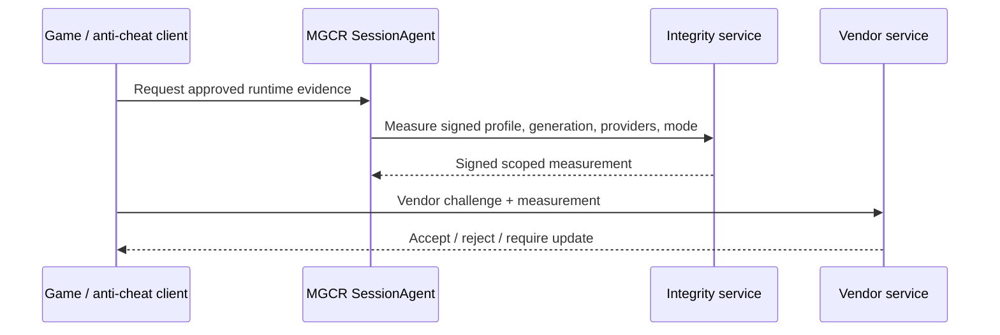

# MGCR Publisher and Anti-Cheat Integration Specification

**Version:** 1.0  
**Status:** Proposed GA-track capability  
**Date:** 20 July 2026  
**Owners:** Publisher Partnerships, Compatibility Engineering, Product Security  
**Related:** [PRD](02_PRD.md) · [Certification](07_COMPATIBILITY_CERTIFICATION_SPEC.md) · [Security](09_SECURITY_PRIVACY_THREAT_MODEL.md)

---

## 1. Purpose

The publisher program turns MGCR from an unsupported consumer compatibility tool into a controlled Mac release and validation channel. It gives publishers precise evidence without requiring an immediate native Mac port, while preserving confidentiality, protection policy, and final publisher authority over online support.

The program does not guarantee that every Windows build can be certified. It identifies blockers early and provides scoped technical options.

## 2. Partner value

A publisher receives:

- exact Mac compatibility results for an existing Windows build;
- performance and frame-pacing evidence across representative Apple-silicon classes;
- visual and API differential findings;
- launcher, media, input, audio, save, and network results;
- causal subsystem classification;
- proposed feature masks and compatibility workarounds;
- pre-release regression testing;
- public certification metadata when approved;
- a path to vendor-approved anti-cheat integrity where technically and contractually possible;
- optional native optimization adapters.

## 3. Engagement tiers

### Evaluation

- public or partner-provided build;
- predefined standard scenarios;
- compatibility report;
- no public certification commitment.

### Certification partner

- private build access;
- symbols/test accounts;
- publisher-reviewed scenarios;
- profile/workaround review;
- release schedule integration;
- public support status.

### Optimization partner

- title-specific engineering;
- engine/test hooks;
- precompiled shader/PSO metadata;
- native service adapters;
- performance targets;
- launch co-marketing.

### Competitive integrity partner

- publisher plus anti-cheat/vendor;
- signed runtime measurement;
- approved compatibility path;
- multiplayer test matrix;
- incident and revocation procedures.

## 4. Publisher onboarding

1. Execute confidentiality, data-processing, and technical terms.
2. Create tenant, users, roles, and retention policy.
3. Register canonical title and storefront bindings.
4. Define build submission method.
5. Configure test accounts through secret management.
6. Upload symbols/debug metadata if available.
7. Define player journey, graphics presets, modes, save fixtures, and known protection.
8. Select host matrix and delivery deadline.
9. Run initial evaluation.
10. Review findings and decide certification/optimization scope.

## 5. Build ingestion

Supported models:

- publisher uploads encrypted build artifact;
- publisher grants access to a private storefront branch;
- lab runner obtains build through approved publisher/storefront account;
- publisher supplies delta/manifest plus base access.

Requirements:

- exact digest/manifest identity;
- malware/security scan appropriate to untrusted code;
- tenant isolation;
- no public catalog visibility;
- access audit;
- retention/deletion date;
- geographic/data-location constraints;
- source is never required unless a separate optimization agreement calls for it.

## 6. Symbols and debug data

Accepted forms may include:

- PDBs;
- map files;
- symbol servers;
- shader source/debug mappings;
- engine logs;
- build IDs;
- source-link equivalents under contract.

Controls:

- separate encrypted storage;
- least-privilege access;
- no client distribution;
- use only for approved title/build;
- retention and deletion;
- audit;
- report may cite symbolicated findings without exposing symbol content.

## 7. Test account handling

- dedicated non-personal accounts;
- stored in secret manager;
- runner receives short-lived scoped access;
- MFA process agreed;
- no credentials in profile, logs, scripts, or diagnostic artifacts;
- account region/entitlement documented;
- publisher can rotate/revoke;
- no production player account reuse.

## 8. Test-plan collaboration

Publisher provides:

- expected launcher and first-run behavior;
- representative save/checkpoint;
- scripted gameplay path;
- supported graphics presets;
- expected online/offline modes;
- known middleware;
- update cadence;
- cutscene/media path;
- input requirements;
- anti-cheat/DRM details;
- expected error/rejection behavior.

MGCR converts these into versioned automated/manual scenarios. Publisher-specific hooks must degrade safely when absent from retail builds.

## 9. Report format

### Executive summary

- result level by build/host;
- launch and gameplay status;
- key limitations;
- top performance findings;
- protection/multiplayer status;
- recommended next actions.

### Technical findings

Each finding contains:

```text
finding ID
severity
exact build/runtime/host/scenario
observed behavior
Windows reference behavior
suspected causal subsystem
trace/evidence links
reproduction reliability
recommended MGCR fix
recommended publisher fix or optional hook
workaround/capability impact
owner and target
```

### Performance

- settings/resolution;
- frame-time percentiles and stutters;
- shader/PSO stalls;
- CPU translation;
- GPU queue/synchronization;
- memory peak/slope/pressure;
- input/presentation latency where measured;
- comparison across Apple host classes.

## 10. Publisher-facing compatibility controls

Publishers may review:

- feature masks;
- virtual adapter identity;
- known limitations;
- supported settings/modes;
- launcher/game process rules;
- media/input/presentation provider selection;
- integrity/mod policy;
- public support copy.

Publishers cannot directly ship unsigned arbitrary profile code into Certified Mode. MGCR remains responsible for profile safety, signing, and accuracy.

## 11. Optional publisher SDK

A later SDK may expose:

- runtime detection and capability query;
- structured test/scene markers;
- save/checkpoint automation;
- shader/PSO manifest export;
- MetalFX or reconstruction adapter;
- media/input/storage integration;
- crash annotation;
- anti-cheat/vendor approved integrity call.

Principles:

- optional; existing Windows build still receives useful evaluation;
- versioned and documented;
- no undocumented process injection;
- safe fallback on native Windows and unsupported environments;
- no collection of proprietary source without agreement.

## 12. Metal12 collaboration

Publisher assistance can reduce compatibility uncertainty through:

- known D3D12 feature use;
- engine source insight without broad disclosure;
- trace captures;
- shader/PSO corpus;
- reserved/sparse resource patterns;
- custom allocator information;
- device-removed diagnostics;
- deterministic scene markers;
- recommended performance preset.

MGCR must still implement correct general semantics rather than encode one title as the API definition.

## 13. Shader and pipeline prewarming

Potential partner artifact:

```text
game build
+ scene/content version
+ shader/PSO identity metadata
+ graphics provider/compiler epoch
+ host capability family
```

Publisher may provide:

- PSO discovery manifest;
- precompile/loading screen hook;
- stable shader identifiers;
- engine pipeline library export.

The client receives only legally redistributable derived metadata/artifacts. Cache identity and invalidation remain controlled by MGCR.

## 14. Native optimization adapters

### Media

- provide codec/source characteristics;
- use a validated Media Foundation bridge or optional native path;
- preserve timing, localization, captions, and protection policy.

### Input

- explicit controller glyph and advanced-feature mapping;
- gyro/adaptive trigger support where available;
- Steam Input coexistence.

### Audio

- channel/layout expectations;
- device change;
- spatial/voice paths.

### Storage

- optional bulk-read/decompression path;
- avoid Windows discrete-VRAM assumptions;
- correctness fallback.

### Upscaling/frame generation

Only with validated inputs and licensing. No claim that proprietary APIs are automatically interchangeable.

## 15. Anti-cheat integration principles

As of mid-2026, EAC and BattlEye each offer a developer opt-in program for Linux/Proton but no macOS/Wine equivalent; enabling either vendor for MGCR requires a direct vendor agreement negotiated per title, consistent with the partner-enabled-only principles below.

1. No Windows kernel driver execution.
2. No hidden bypass or patch that defeats vendor checks.
3. Explicit publisher and vendor authorization.
4. Exact game, anti-cheat, runtime, and mode scope.
5. Certified/Custom state distinction.
6. Fresh integrity result, not static self-assertion.
7. Minimal disclosed runtime hooks.
8. Clear rejection and revocation.
9. Privacy review.
10. Ban-risk communication and incident contact.

## 16. Conceptual integrity protocol

This is a design concept subject to vendor agreement.



Measurement may include:

- runtime generation and component digests;
- profile revision;
- Certified/Custom state;
- modification/overlay policy;
- client version;
- freshness nonce;
- host/platform claims within scope.

It must not expose user files or general process inventories.

## 17. Integrity threat model limitations

The protocol can establish that:

- an approved signed user-space runtime/profile is selected;
- known component files match;
- Custom state is declared;
- measurement is fresh within the protocol.

It cannot honestly prove that:

- a hostile local administrator or compromised kernel/hardware is absent;
- all external devices or network systems are trustworthy;
- the game itself has no vulnerability;
- an unsupported vendor accepts the runtime indefinitely.

Claims are negotiated with the vendor.

## 18. Multiplayer certification

Scenarios include:

- sign-in;
- anti-cheat initialization;
- matchmaking;
- lobby;
- full match;
- reconnect;
- voice/chat;
- region/network variants;
- update;
- Custom/mod rejection;
- expired/revoked runtime;
- abnormal exit and restart;
- false-positive support process.

Competitive Certified is revoked or downgraded immediately when vendor scope no longer applies.

## 19. Release coordination

For a partnered title:

- publisher shares release candidate by agreed lead time;
- MGCR runs impact matrix;
- findings have joint severity/ownership;
- profile/runtime candidate is prepared;
- publisher reviews public limitations;
- evidence and approvals are signed;
- coordinated public status is scheduled;
- post-release canary and field monitoring operate;
- emergency contacts are active.

Day-zero support is a service level requiring capacity and contract, not an assumed default.

## 20. Confidentiality and data boundaries

Public:

- title and public build;
- certification level;
- host scope;
- limitations approved for publication.

Confidential:

- private builds;
- unreleased features;
- symbols;
- test accounts;
- traces;
- security/protection details;
- performance targets before publication;
- contract terms.

The report system enforces field-level/publication classification.

## 21. Publisher portal requirements

- SSO/MFA;
- tenant roles;
- build/symbol upload status;
- test-plan configuration;
- live job status;
- results and comparisons;
- finding comments/assignment, including comments on proposed workarounds and capability masks (§10);
- profile/public-copy review;
- approvals;
- audit log;
- retention/delete;
- notifications, including post-release update-regression alerts when a live title's certification is invalidated or measured performance degrades (PUB-006; post-GA);
- API/export.

No publisher tenant can access another tenant’s existence or data.

## 22. Commercial packaging hypotheses

Potential offerings:

- fixed-price evaluation;
- annual certification/maintenance;
- per-release day-zero service;
- engineering optimization engagement;
- competitive-integrity integration;
- private dedicated lab capacity;
- portfolio agreement.

Certification outcome cannot be purchased. Payment buys testing and engineering capacity, not a guaranteed badge.

## 23. Partner acceptance criteria

A design-partner pilot is successful when:

- onboarding and private build access pass security review;
- the report identifies at least one actionable issue or confirms readiness with credible evidence;
- publisher engineers find root-cause detail useful;
- a release candidate can be retested within agreed time;
- public status scope is mutually understood;
- no secret/private artifact leaks;
- the process can repeat without bespoke manual infrastructure.

## 24. Open partner decisions

- first target publishers/engines;
- contractual ownership of profile fixes and derived caches;
- evidence/report retention;
- day-zero lead times and service levels;
- liability and support boundaries;
- public benchmark approval;
- test account and region coverage;
- anti-cheat vendor attestation interface;
- whether publisher SDK is open, partner-only, or licensed;
- co-marketing and storefront discovery.
