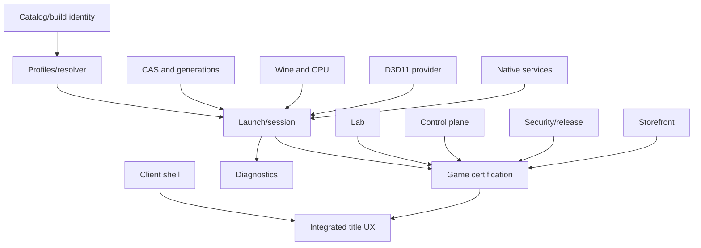

# Alloy MVP Epics and Initial Backlog

**Version:** 1.0  
**Status:** Planning baseline  
**Date:** 20 July 2026  
**Owners:** Product and Program Management  
**Related:** [PRD](02_PRD.md) · [Roadmap](11_ROADMAP_TEAM_AND_DELIVERY.md) · [Traceability](12_REQUIREMENTS_TRACEABILITY_MATRIX.md)

---

## 1. Purpose

This document translates the MVP requirements into integrated delivery epics. It is not a substitute for repository issues or sprint planning. Stories remain outcome-oriented and must link to requirement IDs, tests, and evidence.

## 2. MVP definition

Authoritative scope is [PRD](02_PRD.md) §9.1; this list is a delivery-planning restatement for epic sequencing, not a competing source of truth.

The MVP is a controlled external developer preview with:

- Apple-silicon native client/runtime;
- one storefront with storefront-managed installs (standalone wizard installers out of scope per ADR-0011);
- 8–12 tiered titles, primarily D3D11;
- deterministic immutable runtime generations;
- per-process policy before imports;
- production-candidate CPU provider;
- D3D11 Metal-native provider;
- essential native services;
- signed profiles/artifacts;
- local diagnostics;
- physical Mac and Windows reference lab;
- atomic rollback and save protection;
- honest certification status.

## 3. Epic dependency map

## 4. EPIC-001 — Native client shell

**Outcome:** A native macOS application presents library, game details, downloads, diagnostics, and settings.

**Requirements:** UX-001, UX-002, UX-010, CAT-003, CAT-004.

**Stories:**

- implement navigation and state model;
- local XPC connection and operation subscription;
- library cards and game details;
- install/launch/download surfaces;
- offline and daemon-restart recovery;
- accessibility foundations;
- technical details disclosure;
- error/support-code rendering.

**Acceptance:**

- seeded catalog states render accurately;
- client restart preserves operations;
- keyboard and VoiceOver reach primary actions;
- no compatibility internals required for supported flow.

**Dependencies:** Local API contracts.

## 5. EPIC-002 — Catalog, installation discovery, and build identity

**Outcome:** The platform knows which exact game and launcher build is present.

**Requirements:** CAT-001, CAT-002, CAT-005, CAT-006.

**Stories:**

- canonical game/store binding model;
- installation discovery;
- path grants;
- storefront manifest ingestion;
- file/PE fingerprint engine;
- launcher fingerprint;
- update watcher;
- host capability identity;
- support-resolution UI model.

**Acceptance:**

- exact build mismatch invalidates certification;
- same title across bindings remains one canonical game;
- fingerprint result is reproducible in lab.

## 6. EPIC-003 — Content-addressed runtime and lifecycle

**Outcome:** Runtime objects install transactionally, deduplicate, activate atomically, and roll back.

**Requirements:** INS-002, INS-003, INS-004, INS-005, INS-007, INS-009.

**Stories:**

- CAS object format;
- secure artifact downloader;
- operation journal;
- layer materializer;
- generation metadata;
- active/rollback references;
- object leases and garbage collection;
- save/settings/cache/scratch volumes;
- disk planning;
- uninstall planning;
- fault-injection harness.

**Acceptance:**

- every injected termination leaves previous or complete candidate active;
- saves remain byte-identical;
- duplicate layers share storage;
- corrupt objects never activate.

## 7. EPIC-004 — Signed profiles, manifests, and resolver

**Outcome:** Exact build/host input resolves to one signed deterministic LaunchSpecification.

**Requirements:** CMP-001, CMP-002, CMP-003, CMP-007, CMP-010, RUN-001.

**Stories:**

- JSON Schema validation;
- canonical signed envelope;
- runtime manifest;
- host selector;
- game/launcher selector;
- conflict/precedence algorithm;
- feature-mask registry;
- workaround records;
- policy compiler;
- golden snapshots;
- stale/expired/revoked handling.

**Acceptance:**

- identical inputs compile byte-identical snapshot;
- unsigned/ambiguous/stale states fail or degrade exactly as policy;
- profile cannot exceed security ceilings.

## 8. EPIC-005 — Session supervisor and per-process policy

**Outcome:** A game session starts under exact policy and is contained/recoverable.

**Requirements:** RUN-002, RUN-006, CMP-008, DIA-001, RUN-012.

**Stories:**

- RuntimeDaemon session creation;
- SessionAgent;
- loader bootstrap;
- process identity;
- pre-import policy lookup;
- child process tree;
- provider initialization;
- unknown default;
- health checks;
- stop/cleanup/watchdog;
- session correlation.

**Acceptance:**

- launcher and game use different providers;
- unknown child has conservative access;
- session terminates all children;
- no root/kernel dependency.

## 9. EPIC-006 — ARM64 Wine and CPU execution

**Outcome:** Representative x64 Windows game code executes through a production-candidate provider.

**Requirements:** RUN-003, RUN-004, RUN-005, SEC-003.

**Stories:**

- ARM64 Wine build;
- ARM64EC/mixed-module integration;
- FEX macOS host adaptation;
- exception/unwind;
- memory map/protect;
- W^X JIT;
- CPU feature preset;
- code cache;
- metrics;
- upstream/rebase process.

**Acceptance:**

- agreed ISA/ABI corpus passes;
- two representative game scenes run;
- crash stacks correlate;
- no simultaneous W+X pages;
- downstream patch inventory is bounded.

**Gate:** Phase-0 go/no-go.

## 10. EPIC-007 — D3D10/11 Metal provider

**Outcome:** MVP catalog renders correctly with stable frame pacing.

**Requirements:** RUN-006, RUN-007, RUN-010, DIA-006.

**Stories:**

- provider packaging/ABI;
- adapter/feature masks;
- D3D11 contexts/resources;
- shader compiler/cache;
- presentation;
- memory budget;
- validation/capture;
- conformance corpus;
- title fixes/profiles;
- performance telemetry.

**Acceptance:**

- selected conformance subset passes;
- two titles reach Certified candidate;
- cold/warm and endurance gates pass;
- cache invalidation correct.

## 11. EPIC-008 — Essential native services

**Outcome:** Certified scenarios have working input, audio, media, filesystem, networking, and windowing.

**Requirements:** RUN-011, UX-003, UX-004, UX-005.

**Stories:**

- XInput/Raw Input/HID;
- relative mouse/focus;
- CoreAudio XAudio/WASAPI;
- basic Media Foundation path;
- embedded browser prerequisites;
- Windows filesystem semantics;
- registry overlay;
- scoped network;
- CAMetalLayer/window/display;
- save path discovery.

**Acceptance:**

- title-specific controller/mouse, audio, cutscene, save/load, and window paths pass;
- permissions are scoped and recoverable;
- service provider identity appears in diagnostics.

## 12. EPIC-009 — Diagnostics and privacy

**Outcome:** Users receive actionable failures and support can reproduce seeded issues.

**Requirements:** DIA-001–DIA-010, SEC-004, UX-002.

**Stories:**

- structured error domains;
- logs and metrics;
- native/guest crash capture;
- hang snapshot;
- policy explainability;
- bundle builder;
- redaction scanner;
- privacy preview;
- encrypted upload;
- support issue clustering.

**Acceptance:**

- seeded failures classify correctly;
- bundle contains exact runtime identity;
- credentials/personal paths are redacted;
- upload is consented;
- local diagnostics work offline.

## 13. EPIC-010 — Compatibility lab and Windows oracle

**Outcome:** Exact scenarios run reproducibly on physical Macs and Windows references.

**Requirements:** CMP-004, CMP-005, DIA-010.

**Stories:**

- runner image/provisioning;
- Mac capability inventory;
- Windows reference runner;
- test plan/scenario DSL;
- input automation;
- frame/visual capture;
- performance trace;
- evidence record;
- retry/flaky model;
- seeded regression;
- lab scheduler.

**Acceptance:**

- one game run repeats within defined variance;
- Windows/Mac evidence links;
- seeded visual/performance defect is detected;
- runner and artifact provenance are complete.

## 14. EPIC-011 — Compatibility control plane

**Outcome:** Profiles, runtimes, catalog, evidence, and release state are distributed safely.

**Requirements:** CMP-004, CAT-006, SEC-001, NFR-OPS-002.

**Stories:**

- catalog/profile services;
- artifact registry/CDN;
- compatibility resolve API;
- certification orchestrator;
- evidence store;
- telemetry ingest;
- impact graph;
- release rings;
- canary selection;
- revocation/quarantine.

**Acceptance:**

- client verifies signed objects independently;
- cloud outage does not block cached launch;
- profile/runtime promote independently;
- impacted test is scheduled after seeded change.

## 15. EPIC-012 — Secure build, signing, and compliance

**Outcome:** Shipped code and metadata have provenance, licenses, signatures, and incident controls.

**Requirements:** SEC-001, SEC-007, SEC-009, SEC-010, NFR-SEC-001–004.

**Stories:**

- hermetic/reproducible builds;
- SBOM;
- third-party intake;
- Developer ID/notarization;
- update metadata roles;
- signing isolation;
- key rotation;
- notices/source package;
- vulnerability scan;
- revocation drill;
- security checklists.

**Acceptance:**

- every manifest component has approved record;
- tamper/replay/freeze tests pass;
- key rotation/revocation drill succeeds;
- no critical finding.

## 16. EPIC-013 — First storefront adapter

**Outcome:** Read-only library discovery, build identity, and user-driven handoff
to the official client work for one storefront. Ownership, installation, updates,
repair and sign-in stay inside the storefront's own application, which is what
INS-008 already requires and what [doc 18 §9](18_LEGAL_OPEN_SOURCE_AND_DISTRIBUTION.md)
binds us to.

**Requirements:** INS-001, INS-008, CAT-001, CMP-011.

**Stories:**

- library discovery by reading local manifests without modifying them;
- multiple library locations;
- manifest/build identity;
- game update **detection** — the storefront performs the update, we notice it;
- user-initiated handoff to the official client for install, update, repair and sign-in;
- offline mode;
- process roles;
- secret redaction.

**Acceptance:**

- an existing install is discovered without a single write to the library,
  proven by `spikes/STORE-001/steam-readonly/steam-automation-gate.sh`;
- a game or launcher update performed by the storefront invalidates exact selectors;
- no automated account interaction: no background depot tooling, no stored or
  relayed credentials, no simulated input or process control against the client.
  Absence of credential interception on its own does **not** satisfy this — SSA
  §4.C is a separate prohibition and the pre-counsel verdict says so explicitly;
- second launch/offline path works where storefront permits.

## 17. EPIC-014 — MVP title certification

**Outcome:** 8–12 titles have honest tiered evidence and maintained profiles.

**Requirements:** CAT-003, CAT-004, CMP-004, CMP-007, CMP-012.

**Stories per title:**

- exact build/store binding;
- install recipe;
- process tree/policies;
- feature mask/workarounds;
- gameplay scenario;
- save fixture;
- controller/input/audio/media;
- performance and endurance;
- limitations;
- certification evidence;
- rollback;
- update watcher.

**Acceptance:**

- title meets its displayed level;
- no unowned workaround;
- evidence is signed/current;
- user scope and limitations are clear.

## 18. EPIC-015 — Integrated external preview

**Outcome:** An external tester completes the full product journey safely.

**Requirements:** all P0/MVP requirements.

**Stories:**

- onboarding;
- library discovery;
- install preflight;
- one-click launch;
- update/stale messaging;
- failure/rollback;
- save/storage;
- telemetry settings;
- diagnostic upload;
- support workflow;
- release notes.

**Acceptance:**

- release gate in PRD §19.1 passes;
- usability target passes;
- incident/support ownership active;
- exact documentation and known limitations published.

## 19. Non-MVP parallel epic — Metal12 vertical slices

Metal12 starts immediately but does not block the D3D11 MVP. D3D12 distribution depends on Metal12 rather than a commercial bootstrap path (bootstrap D3D12 is lab/reference-only; SPIKE-LEGAL-001).

Stories:

- D3D12 COM/front end;
- virtual adapter;
- root signatures/descriptors;
- shader ingestion/lowering;
- PSO;
- resources/heaps/GPU VA;
- barriers;
- queues/fences;
- presentation;
- memory budget;
- capture/replay;
- title vertical slice.

Each story has a conformance and real-workload exit test.

## 20. Backlog hygiene

Every implementation issue includes:

- requirement IDs;
- epic;
- owner;
- architecture/ADR;
- acceptance test;
- diagnostics/metrics;
- failure and rollback;
- security/privacy;
- target game/scenario where applicable;
- release ring;
- documentation update.

## 21. MVP cut rules

May cut from MVP:

- second storefront;
- broad HDR/VRR;
- advanced controller features;
- Custom Mode;
- automatic full bisection;
- publisher portal;
- competitive anti-cheat;
- advanced Metal12 features.

(The 32-bit catalog is no longer a cut decision: 32-bit game executables are permanently out of scope per ADR-0011.)

Cannot cut without redefining the product:

- exact build identity;
- immutable per-title generations;
- per-process policy;
- save separation;
- signed profile/artifacts;
- safe rollback;
- honest status;
- local diagnostics;
- production CPU path evidence;
- lab/evidence system;
- no root/kernel dependency.
